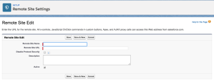

# Install Adobe Workfront for Salesforce

To install the app before it becomes available in the Salesforce AppExchange, see [Installing Workfront for Salesforce before It Becomes Available in the AppExchange Marketplace](#install-before-available-in-appexchange).

As a Salesforce and Adobe Workfront administrator, you can install Workfront for Salesforce to allow your Salesforce users to submit Workfront requests and automatically create projects without ever leaving Salesforce.

For a general understanding about what you can expect by installing Workfront for Salesforce, see [Adobe Workfront for Salesforce overview](../../workfront-integrations-and-apps/using-workfront-with-salesforce/workfront-for-salesforce-overview.md).

* [Prerequisites for Installing and Using Workfront for Salesforce](#prerequisites) 
* [Installing Workfront for Salesforce](#installing-the-app)

## Access requirements

You must have the following access to use the functionality described in this article:

<table cellspacing="0"> 
 <col> 
 <col> 
 <tbody> 
  <tr> 
   <td role="rowheader">Adobe Workfront plan*</td> 
   <td> 
Pro or higher
 </td> 
  </tr> 
  <tr> 
   <td role="rowheader">Adobe Workfront license*</td> 
   <td> 
Plan
 </td> 
  </tr> <!--
   <tr data-mc-conditions="QuicksilverOrClassic.Draft mode"> 
    <td role="rowheader">Access level configurations*</td> 
    <td> 
[Insert any access level configurations needed] <!--
       <MadCap:conditionalText data-mc-conditions="QuicksilverOrClassic.Draft mode">
        Example: Edit access to Documents
       </MadCap:conditionalText>
      -->
 
Note: If you still don't have access, ask your Workfront administrator if they set additional restrictions in your access level. For information on how a Workfront administrator can modify your access level, see <a href="../../administration-and-setup/add-users/configure-and-grant-access/create-modify-access-levels.md" class="MCXref xref">Create or modify custom access levels</a>.
 <!--
      
You must be a Workfront administrator. For information on Workfront administrators, see <a href="../../administration-and-setup/add-users/configure-and-grant-access/grant-a-user-full-administrative-access.md" class="MCXref xref">Grant a user full administrative access</a>.

     --> <!--
      
You must be a group administrator. For more information on group administrators, see <a href="../../administration-and-setup/manage-groups/group-roles/group-administrators.md" class="MCXref xref">Group administrators</a>.

     --> </td> 
   </tr>
  --> <!--
   <tr data-mc-conditions="QuicksilverOrClassic.Draft mode"> 
    <td role="rowheader">Object permissions</td> 
    <td> 
[Insert permissions needed and specify the object] <!--
       <MadCap:conditionalText data-mc-conditions="QuicksilverOrClassic.Draft mode">
        Example: View access or higher on Documents
       </MadCap:conditionalText>
      -->
 
For information on requesting additional access, see <a href="../../workfront-basics/grant-and-request-access-to-objects/request-access.md" class="MCXref xref">Request access to objects in Adobe Workfront</a>.
 </td> 
   </tr>
  --> 
 </tbody> 
</table>

&#42;To find out what plan, license type, or access you have, contact your Workfront administrator.

## Prerequisites for Installing and Using Workfront for Salesforce

* You must have a Salesforce instance with access to a system administrator account in order to install the app.
* You must have a Workfront instance with access to a system administrator account in order to configure the integration.
* Salesforce users must have a Workfront account in order to be able to

   * Create Workfront requests from Salesforce or
   * View Workfront requests or projects in Salesforce.

## Installing Workfront for Salesforce

You must be a Salesforce and a Workfront system administrator to install and configure Workfront for Salesforce.&nbsp;

The following subsections describe how to install Workfront for your Salesforce Production environment. You can follow the same steps to install Workfront for your Salesforce Sandbox environment.

* [Installing Workfront for Salesforce before It Becomes Available in the AppExchange Marketplace](#install-before-available-in-appexchange) 
* [Installing Workfront for Salesforce in the Salesforce Classic Framework](#installing-the-app-classic) 
* [Installing Workfront for Salesforce in the Salesforce Lightning Experience Framework](#installing-the-app-lightning-experience)

### Installing Workfront for Salesforce before It Becomes Available in the AppExchange Marketplace

<!--

This section needs to be removed when our app is accepted by Salesforce and added to their store.

-->

Workfront for Salesforce will be available in the Salesforce AppExchange soon.

To install the app before it's available:

1. In your Production environment, go to

   https://login.salesforce.com/packaging/installPackage.apexp?p0=04t4K000002aUZY

   In your Sandbox environment, go to

   https://test.salesforce.com/packaging/installPackage.apexp?p0=04t4K000002aUZY

1. Check the **Yes, grant access to these third-party web sites** box.

   

   A loading screen displays and the installation might take a while.

1. Click **Done** when the installation completes.  

1. Navigate to **Setup>Security Controls>Remote Site Settings**.
1. (Conditional) If you do not see your Workfront URL listed in the **All Remote Sites** list, click **New Remote Site**.

1. Specify the **Remote Site Name**.

   For example, *Workfront*.

1. Specify the **Remote Site URL**.

   For example, *yourDomain.my.workfront.com*.

1. Click **Save**.

   The Workfront app is now installed on your Salesforce instance and the **WorkfrontOpportunities** and **WorkfrontAccounts** Visualforce Pages have been created in your environment.

   Salesforce users can use the app once you add the Workfront section to their Opportunity or Account page layouts.  
   For information about configuring the Workfront section for users, see [Configure the Adobe Workfront section for Salesforce users](../../workfront-integrations-and-apps/using-workfront-with-salesforce/configure-wf-section-for-salesforce-users.md).

### Installing Workfront for Salesforce in the Salesforce Classic Framework

1. Log in to Salesforce as a system administrator.
1. Go to **Setup.**
1. In the**Build**section, click **AppExchange Marketplace**.

1. In the **Search AppExchange Apps** box, type **Workfront**. 

1. Click the app when you find it, then click **Get It Now**. 
1. Click **Install in Production**to install the Workfront app in your Salesforce Production environment.&nbsp;(recommended) 
1. Select the **I have read and agree to the terms and conditions** field after you have read and agreed with the terms and conditions. 
1. Click **Confirm and Install**. 
1. Select **Install for All Users** (recommended), then click **Install**.&nbsp;

1. (Conditional) If asked if you want to approve a third party access, you must select&nbsp;**Yes, grant access to these third-party web sites**, then click **Continue**.&nbsp; 

1. Click **Done** when the installation completes.&nbsp;

   The Workfront app is listed under **Installed Packages**.

   

1. Navigate to **Setup>Security Controls>Remote Site Settings**.
1. (Conditional) If you do not see your Workfront URL listed in the **All Remote Sites** list, click **New Remote Site**.  
   

1. Specify the **Remote Site Name**.   
   For example,&nbsp;*Workfront*.

1. Specify the **Remote Site URL**.  
   For example, *yourDomain.my.workfront.com*.

1. Click **Save**.  
   The Workfront app is now installed on your Salesforce instance and the **WorkfrontOpportunities** and **WorkfrontAccounts** Visualforce Pages have been created in your environment.  
   Salesforce users cannot yet use the app until you add the Workfront section to their Opportunity or Account page layouts.  
   For information about configuring the Workfront section for users, see [Configure the Adobe Workfront section for Salesforce users](../../workfront-integrations-and-apps/using-workfront-with-salesforce/configure-wf-section-for-salesforce-users.md).

### Installing Workfront for Salesforce in the Salesforce Lightning Experience Framework

1. Log in to Salesforce as a system administrator.
1. Click the&nbsp;**Setup icon**, then click **Setup**.

1. In the**PLATFORM TOOLS**section, expand **Apps.**

1. Click **AppExchange Marketplace**.
1. In the **Search AppExchange Apps** box, type **Workfront**. 

1. Click the app when you find it, then click **Get It Now**. 
1. Click **Open Login Screen**.  
   You must sign in with your Workfront administrator account for Salesforce. 

1. Click **Allow**. 
1. In the **Install in This Org** box, click **Install Here**to install Workfront in your Salesforce Production environment.&nbsp;(recommended) 

1. Select the **I have read and agree to the terms and conditions** field after you have read and agreed with the terms and conditions. 
1. Click **Confirm and Install**. 
1. Select **Install for All Users** (recommended), then click **Install**.&nbsp;

1. (Conditional) If asked if you want to approve a third party access, you must select **Yes, grant access to these third-party web sites**, then click **Continue**. 

1. Click **Done** when the installation completes.&nbsp;

   The Workfront app is listed under **Installed Packages**.

   &nbsp; 

1. Navigate to **Setup.**
1. In the **SETTINGS**section, expand**Security.**

1. Click **Remote Site Settings**.
1. (Conditional) If you do not see your Workfront URL listed in the **All Remote Sites** list, click **New Remote Site**.

   

1. Specify the **Remote Site Name**.

   For example,&nbsp;*Workfront*.

1. Specify the **Remote Site URL**.

   For example, *yourDomain.my.workfront.com*.

1. Click **Save**.

   The Workfront app is now installed on your Salesforce instance, and the **Workfront** component is now added to your environment.

   Salesforce users can use the Workfront app once you add the Workfront section to their Opportunity or Account page layouts.  
   For information about configuring the Workfront section for users, see [Configure the Adobe Workfront section for Salesforce users](../../workfront-integrations-and-apps/using-workfront-with-salesforce/configure-wf-section-for-salesforce-users.md).&nbsp;

