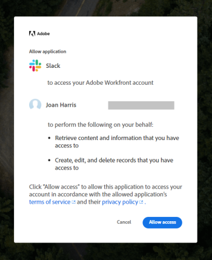

# Configure [!DNL Adobe Workfront] for Slack

Integrating [!DNL Adobe Workfront] with [!DNL Slack] allows you to do the following:

* Access your [!DNL Workfront] work items, approvals, favorites, recent items from Slack.
* Subscribe for, approve, assign work from Slack.
* Create tasks and issues from Slack.
* Receive some [!DNL Workfront] notifications in Slack.

Depending on how your Slack environment is configured, you can install and configure [!DNL Workfront] for Slack yourself, or your [!DNL Workfront] administrator must install and configure it first before you can configure it for yourself.&nbsp;

When you integrate your Slack instance with [!DNL Workfront] users can use [!DNL Workfront] while collaborating within their Slack channels. The integration can be used from any Slack environment, including the Slack mobile app.&nbsp;

## Access requirements

You must have the following:

<table style="table-layout:auto"> 
 <col> 
 </col> 
 <col> 
 </col> 
 <tbody> 
  <tr> 
   <td role="rowheader"><a href="https://www.workfront.com/plans" target="_blank">[!DNL Adobe Workfront plan]</a>*</td> 
   <td> 
[!UICONTROL Pro] or higher
 </td> 
  </tr> 
 </tbody> 
</table>

&#42;To find out what plan, license type, or access you have, contact your [!DNL Workfront] administrator.\

## Prerequisites for using [!DNL Workfront] with [!DNL Slack]

* You must have a Slack instance.&nbsp;
* Your Slack system administrator must allow all Slack users to install [!DNL Workfront] for Slack.
* You must have a Workfrontlicense to be able to use the integrated features in Workfront.

   >[!NOTE]
   >
   >Users with any Workfrontlicense type can access Workfrontfrom Slack. The actions that you can perform from Slack are limited to your Workfrontlicense and permission levels.

For more information about managing apps in [!DNL Slack], see [Manage Apps for Your Workspace.](https://get.slack.help/hc/en-us/articles/222386767-Manage-apps-for-your-workspace)

## Install [!DNL Workfront] for [!DNL Slack]

Each Slack user must install the [!DNL Workfront] app themselves in order to use [!DNL Workfront] from Slack.

You can install the app in the following ways:

* [Install the [!DNL Workfront] app outside [!DNL Slack]](#install-the-workfront-app-outside-slack)
* [Install the [!DNL Workfront] app within [!DNL Slack]](#install-the-workfront-app-within-slack)

### Install the [!DNL Workfront] app outside [!DNL Slack] {#install-the-workfront-app-outside-slack}

Follow the steps below to run the installation process and authorize [!DNL Workfront] for Slack on your Slack instance.&nbsp;

>[!IMPORTANT]
>
>When a new version of [!DNL Workfront] for Slack is released, you must re-authorize the app in order to continue using it.&nbsp;

1. Click the [!UICONTROL following] button to begin the installation process.

   

1. Sign in to your workspace by specifying your Slack URL and clicking **Continue**.\
   

1. Examine the access that Slack is requesting. If you agree to this access, click **[!UICONTROL Allow Access]** to authorize the [!DNL Workfront] app.

   

You can now access Workfront from Slack, as described in the [[!UICONTROL Access Workfront from Slack]](../../workfront-integrations-and-apps/using-workfront-with-slack/access-workfront-from-slack.md#viewing-all-available-commands) section in [Access Adobe Workfront from Slack](../../workfront-integrations-and-apps/using-workfront-with-slack/access-workfront-from-slack.md).

### Install the [!DNL Workfront] app within [!DNL Slack] {#install-the-workfront-app-within-slack}

You can install the [!DNL Workfront] app directly from the Slack application:

1. Navigate to your Slack URL.

   For example: *`<YourTeamName>`.slack.com/apps*.

   Or

   Click the **[!UICONTROL Add Apps]** icon in your Slack instance.

   

1. Start typing *[!DNL Workfront]* in the search field.
1. Press Enter.
1. Select the **[!DNL Workfront]** app.
1. Click **Settings**.

   The App Directory page is displayed.

1. Click **Visit App Site**.
1. Click **Add to Slack**.
1. Follow the steps to finish the installation.&nbsp;
1. When the installation completes, you can access Workfront from Slack, as described in the [[!UICONTROL Access Workfront from Slack]](../../workfront-integrations-and-apps/using-workfront-with-slack/access-workfront-from-slack.md#viewing-all-available-commands) section in [Access Adobe Workfront from Slack](../../workfront-integrations-and-apps/using-workfront-with-slack/access-workfront-from-slack.md).
