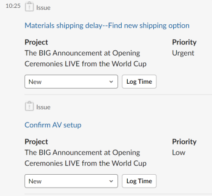
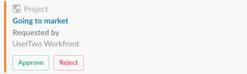

# Manage your work and approvals from Slack

After you have installed Adobe Workfront for Slack, you can do the following:

* Access lists of your Home items from Slack
* Review and accept to work on tasks and issues from Slack
* Review and make decisions on approvals from Slack

For more information about configuring Workfront with Slack, see [Configure Adobe Workfront for Slack](../../workfront-integrations-and-apps/using-workfront-with-slack/configure-workfront-for-slack.md).

## Access requirements

You must have the following:

<table cellspacing="0"> 
 <col> 
 <col> 
 <tbody> 
  <tr> 
   <td role="rowheader"><a href="https://www.workfront.com/plans" target="_blank">Adobe Workfront plan</a>*</td> 
   <td> <p>Pro or higher</p> </td> 
  </tr> <!--
   <tr data-mc-conditions="QuicksilverOrClassic.Draft mode"> 
    <td role="rowheader"><a href="../../administration-and-setup/add-users/access-levels-and-object-permissions/wf-licenses.md" class="MCXref xref">Adobe Workfront licenses overview</a>*</td> 
    <td> <p>Plan</p> </td> 
   </tr>
  --> 
 </tbody> 
</table>

&#42;To find out what plan, license type, or access you have, contact your Workfront administrator.\

## Prerequisites

Before you can manage your work and approvals from Slack, you must

* Configure Workfront for Slack  
  For instructions on configuring Workfront for Slack, see [Configure Adobe Workfront for Slack](../../workfront-integrations-and-apps/using-workfront-with-slack/configure-workfront-for-slack.md).

## Manage your work from Slack

1. Log in to your Slack instance and log in to Workfront from Slack.  
   For more information about logging in to Workfront from Slack, see the "Logging In to Workfront from Slack" section in [Access Adobe Workfront from Slack](../../workfront-integrations-and-apps/using-workfront-with-slack/access-workfront-from-slack.md).

1. From any channel, start typing the following command in the message field:&nbsp;

   ```
   /workfront home
   ```

   >[!NOTE]
   >
   >
   >   
   >   
   >   * Commands are case sensitive. 
   >   * You can start your command with /   >   
   >   
   >     ```   >   
   >     wf
   >     ```   >   
   >   
   >     instead of    >   
   >   
   >     ```   >   
   >     /workfront
   >     ```   >   
   >   
   >     .
   >   
   >   
   >

   The buttons from which you can access lists of your tasks, issues, and approvals display. Clicking one of the buttons displays the first 20 items of each list in Slack.  
   &nbsp;

1. (Optional) Click **Tasks**&nbsp;to display all your tasks.

   For more information about managing tasks in Slack, see [Managing Your Tasks from Slack](#manage-your-tasks-from-slack).

1. (Optional) Click **Issues** to display all your issues.

   For more information about managing issues in Slack, see [Managing Your Issues from Slack](#manage-your-issues-from-slack).

1. (Optional) Click **Approvals** to display all the approvals waiting for your decision.  
   For more information about managing your approvals in Slack, see [Manage your approvals from Slack](#manage-your-approvals-from-slack).

## Manage your tasks from Slack {#manage-your-tasks-from-slack}

1. Log in to your Slack instance and log in to Workfront from Slack.  
   For information about logging in to Workfront from Slack, see the "Logging In to Workfront from Slack" section in [Access Adobe Workfront from Slack](../../workfront-integrations-and-apps/using-workfront-with-slack/access-workfront-from-slack.md).

1. From any channel, start typing either of the following commands in the message field:&nbsp;  
   *

   ```
   /workfront home
   ```

   ,&nbsp;*then click **Tasks**

   Or

   ```
   /workfront tasks
   ```

   >[!NOTE]
   >
   >
   >   
   >   
   >   * Commands are case sensitive.
   >   * You can start your command with '/wf' instead of '/workfront.'
   >   
   >

   The first 20 tasks on your list display.  
   

1. Click **+<remaining number> more**&nbsp;to display additional tasks.
1. Consider reviewing the following information about your work items:

   * **Name** 
   * **Project Name** or **Parent Object Name**
   
   * **Planned Completion Date** of the work item.
   * **Assigned By Name**: this is the name of the user who assigned the task to you.
   * **Status**

1. (Optional) Click the name of an item to open it in Workfront in a separate browser tab.
1. (Optional) In the **Status** field, select a new Status.
1. (Optional) Click **Log Time**, then select an **Hour Type** and an hour amount to log time on the item.

   >[!NOTE]
   >
   >
   >   
   >   
   >   * You can only log hours in increments of a full or half hour, up to 12 hours and 30 minutes.
   >   * The hours you log have an Entry Date of today. You cannot log time for a passed or future date from Slack.
   >   
   >

   You receive a confirmation that the time has been logged.

1. (Optional) Click **Work on it** to accept to work on a task. The Work on it button disappears.

## Manage your issues from Slack {#manage-your-issues-from-slack}

1. Log in to your Slack instance and log in to Workfront from Slack.  
   For more information about logging in to Workfront from Slack, see the [Logging In to Workfront from Slack](../../workfront-integrations-and-apps/using-workfront-with-slack/access-workfront-from-slack.md#logging-in-to-workfront) section in [Access Adobe Workfront from Slack](../../workfront-integrations-and-apps/using-workfront-with-slack/access-workfront-from-slack.md).

1. From any channel, start typing either of the following commands in the message field:&nbsp;  
   *

   ```
   /workfront home
   ```

   ,&nbsp;*then click **Issues** 
   Or

   ```
   /workfront issues
   ```

   >[!NOTE]
   >
   >Commands are case sensitive. You can start your command with    >
   >
   >```   >
   >/wf
   >```   >
   >
   >instead of    >
   >
   >```   >
   >/workfront
   >```   >
   >
   >.

   The first 20 issues in your list display.  
     

1. Click **+ remaining <number> more** to display additional items.
1. Consider reviewing the following information about your work items:

   * **Name**
   * **Project** Name or Parent Object Name
   * **Due on** Date: This is the Planned Completion Date of the work item.
   * **Requested by** Name: This is the Primary Contact (for issues) or the user who made the assignment (for tasks).&nbsp;

1. (Optional) Click the name of the issue to open it in Workfront in a separate browser tab.
1. (Optional) Click **Work on it** to start working on issues you have not accepted yet.

   The Work on it button disappears.

## Manage your approvals from Slack {#manage-your-approvals-from-slack}

1. Log in to your Slack instance and log in to Workfront from Slack.  
   For more information about logging in to Workfront from Slack, see the "Logging In to Workfront from Slack" section in [Access Adobe Workfront from Slack](../../workfront-integrations-and-apps/using-workfront-with-slack/access-workfront-from-slack.md).

1. From any channel, start typing either of the following commands in the message field:&nbsp;  
   *

   ```
   /workfront home
   ```

   ,&nbsp;*then click **Approvals**&nbsp;  
   Or

   ```
   /workfront approvals
   ```

   >[!NOTE]
   >
   >
   >   
   >   
   >   * Commands are case sensitive. 
   >   * You can start your command with    >   
   >   
   >     ```   >   
   >     /wf
   >     ```   >   
   >   
   >     instead of    >   
   >   
   >     ```   >   
   >     /workfront
   >     ```   >   
   >   
   >     . 
   >   
   >   
   >

   The first 20 items on your **Approvals** list display. Additional information about the items also displays, like the name of the user who requested it or the name of the project the item belongs to.&nbsp;

1. Click **+ remaining <number> more** to display additional items.

   <!--
   
   -->

     
    

1. Consider managing approvals for the following objects:&nbsp;

   * **Projects** 
     Click **Approve** or **Reject** to accept or reject the status change of a project.
   
   * **Tasks** 
     Click **Approve** or **Reject** to accept or reject the status change of a task.
   
   * **Issues** 
     Click **Approve** or **Reject** to accept or reject the status change of an issue.
   
   * **Documents** 
     Click **Approve** to approve a document, **Reject** to reject it, or **Changes** to indicate that you approve it, but that the document needs additional changes.  
     (Optional) Mouse over the document thumbnail to click the magnifying glass and preview the document.&nbsp;
   
   * **Proofs**Click the proof name to open it in Workfront in a separate tab and manage the approval.&nbsp;
   * **Access Requests** 
     Click **Grant Access** to give enhanced permissions to the requested object, or **Ignore** to ignore the request for more access.

1. (Optional) Click the name of the object submitted for approval to open it in Workfront in a new browser tab.&nbsp;

