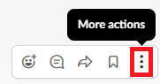
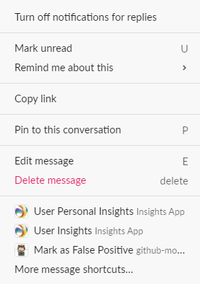

# Post a Slack comment as an update

You can add a Slack comment as an update to a specific project, task, or issue in Adobe Workfront.

## Access requirements

You must have the following:

<table style="table-layout:auto"> 
 <col> 
 </col> 
 <col> 
 </col> 
 <tbody> 
  <tr> 
   <td role="rowheader"><a href="https://www.workfront.com/plans" target="_blank">Adobe Workfront plan</a>*</td> 
   <td> 
Pro or higher
 </td> 
  </tr> 
 </tbody> 
</table>

&#42;To find out what plan, license type, or access you have, contact your Workfront administrator.\

## Prerequisites

Before you can post a Slack comment as an update, you must

* Configure Workfront for Slack  
  For instructions on configuring Workfront for Slack, see [Configure Adobe Workfront for Slack](../../workfront-integrations-and-apps/using-workfront-with-slack/configure-workfront-for-slack.md).

## Post a Slack comment as an update in Workfront

1. Hover over a comment you added in a Slack channel, then click the **More actions** icon.

   

1. Click **Post an update ... `<the name of your Workfront app>`**.&nbsp;

   >[!NOTE]
   >
   >You may need to click **More message shortcuts** and scroll down to locate the **Post an update** option.
   >
   >
   >
   
1. In the **Project, task or issue** box, start typing the name of a project, task, or issue where you want to add the update then click the name of the project, task, or issue when it appears on the list. You must have access to view an object before it appears in the list.&nbsp;
1. (Optional) In the **Include another user** box, start typing the name of a user you can view that you want to include in your update, then click it when it appears on the list.&nbsp;
1. Click **Submit**.  

   A confirmation displays in Slack to notify you that your update was posted.

1. (Optional) Click the name of the project, task, or issue where you posted the update to access it in Workfront. 

   There is an indication in Workfront that the update originated in Slack.&nbsp;

   
