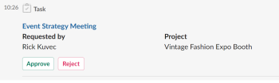

# Receive Adobe Workfront notifications in Slack

<!--

(NOTE: Alina: *** Linked to Accessing Workfront from Slack.***Some of this information is duplicating in Accessing Workfront from Slack (also screen shots))

-->

After you have installed Adobe Workfront for Slack, you can receive Workfront notifications in Slack.  
For information about installing Workfront for Slack, see [Configure Adobe Workfront for Slack](../../workfront-integrations-and-apps/using-workfront-with-slack/configure-workfront-for-slack.md).

You can enable a select number of notifications that appear in the notifications bubble in the Workfront interface, to also be delivered in Slack.

Email notifications work independently from Workfront interface notifications. You or your Workfront administrator can disable email notifications, whereas interface notifications cannot be disabled in Workfront.  
You can, however, disable Workfront notifications that you might receive in Slack, if you want to focus on those notifications only inside the Workfront interface.&nbsp;

## Access requirements

You must have the following:

<table style="table-layout:auto"> 
 <col> 
 </col> 
 <col> 
 </col> 
 <tbody> 
  <tr> 
   <td role="rowheader"><a href="https://www.workfront.com/plans" target="_blank">Adobe Workfront plan</a>*</td> 
   <td> 
Pro or higher
 </td> 
  </tr> 
 </tbody> 
</table>

&#42;To find out what plan, license type, or access you have, contact your Workfront administrator.\

## Prerequisites

Before you can receive Workfront notifications in Slack, you must

* Configure Workfront for Slack  
  For instructions on configuring Workfront for Slack, see [Configure Adobe Workfront for Slack](../../workfront-integrations-and-apps/using-workfront-with-slack/configure-workfront-for-slack.md).

## Configure Workfront notifications for Slack {#configure-workfront-notifications-for-slack}

1. (Conditional) After Workfront has been added to your Slack instance, log into Workfront from Slack.  
   For information about logging into Workfront from Slack, see [Access Adobe Workfront from Slack](../../workfront-integrations-and-apps/using-workfront-with-slack/access-workfront-from-slack.md).

1. From any channel, start typing one of the following commands in the message field:&nbsp;  

   `/workfront settings`
   
   Or  

   `/wf settings`
   
    

1. All notifications are enabled, by default.   
   Disable any of the following notifications:&nbsp;

   * I'm assigned to a new task or issue
   * My team is assigned to a new task or issue
   * I receive a new approval or access request
   * Someone includes me on a directed update
   * Someone comments on a thread I'm in
   * An update is made to a task, issue or project I am subscribed to
   * Someone comments on one of my work items
   * Someone comments on my help request.

   The changes you make to the notifications options take effect immediately.  
   The notifications you have enabled are delivered in the Workfront Slack channel. When you disable notifications here, they are only disabled for Slack, and not for the Workfront interface. You continue to receive them in the Workfront notifications bubble in the upper right of the interface.&nbsp;

## Manage Workfront notifications from Slack

You can receive and respond to Workfront notifications from Slack.&nbsp;

You can disable email notifications for notifications that you enable in Slack, to ensure that you do not receive duplicate notifications.  
For information about configuring your email notifications, see [Activate or deactivate your own event notifications](../../workfront-basics/using-notifications/activate-or-deactivate-your-own-event-notifications.md).

Enabling or disabling Workfront notifications in Slack does not affect the notifications you receive inside the Workfront interface.  
Notifications inside the Workfront interface cannot be disabled.&nbsp;

To manage your Workfront notifications for Slack:&nbsp;

1. Log in to Slack.
1. Log in to Workfront from Slack.  
   For information about logging in to Workfront from Slack, see the "Logging in to Workfront from Slack" section in [Access Adobe Workfront from Slack](../../workfront-integrations-and-apps/using-workfront-with-slack/access-workfront-from-slack.md).

1. Ensure that your Workfront notifications for Slack are enabled.  
   For more information about which Workfront notifications can be configured to also be sent to Slack, see [Configure Workfront notifications for Slack](#configure-workfront-notifications-for-slack).

1. Go to the **Workfront** channel to find your Workfront notifications.&nbsp;
1. (Conditional and optional) Do any of the following:&nbsp;

   * Click **Work on it** to accept to work on a task.

     <!--   
        
     -->

   * (Conditional and optional) Click **Reply in Workfront** to reply to a comment, type your reply, and click **Reply**.  
       
   
   * (Conditional and optional) Click **Approve** or **Reject** to approve or reject a task, issue, or project that are pending your approval.  
       
   
   * (Conditional and optional) Click **Approve**, **Changes**, or **Reject**, to approve, approve with changes, or reject a document.  
       
     You can also mouse over the thumbnail of the document and click the magnifying glass icon to view a larger preview of the document, before you approve it.  
     Only the approved Slack [file types](https://api.slack.com/types/file) can be previewed.&nbsp;
   
   * (Conditional and optional) Click **Grant** or **Ignore** to grant or ignore the request for more access from another user.  
       
     You receive a confirmation that your action has been completed in Workfront, for every decision you make within your notifications.&nbsp;&nbsp;
