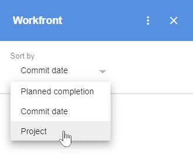

# Access [!DNL Adobe Workfront] Home content from G Suite

You can access your [!DNL Adobe Workfront] Home content, including all tasks, issues, approvals, and access requests assigned to you, without leaving G Suite.

## Access requirements

You must have the following access to perform the steps in this article:

<table style="table-layout:auto"> 
 <col> 
 <col> 
 <tbody> 
  <tr> 
   <td role="rowheader">[!DNL Adobe Workfront] plan*</td> 
   <td> 
Any
 </td> 
  </tr> 
  <tr> 
   <td role="rowheader">[!DNL Adobe Workfront] license*</td> 
   <td> 
[!UICONTROL Work], [!UICONTROL Plan]
 </td> 
  </tr> 
 </tbody> 
</table>

&#42;To find out what plan, license type, or access you have, contact your [!DNL Workfront] administrator.

## Prerequisites

Before you can access Home content from G Suite, you must

* Install [!DNL Workfront] for G suite\
   For instructions, see [Install Adobe Workfront for G Suite](../../workfront-integrations-and-apps/workfront-for-g-suite/install-workfront-for-gsuite.md).

## Access [!DNL Workfront] Home from G Suite

1. Make sure you are logged in to Workfront.
1. If the [!UICONTROL Workfront for G Suite] panel is not displayed, click the&nbsp;Workfront icon  in the G Suite add-ons sidebar at the far-right of the page.
1. If you see a left arrow at the top of Workfront for G&nbsp;Suite, click the arrow to go to the [!UICONTROL Home] area.

   

1. In the **[!UICONTROL Sort by]** area, click the expand arrow , then click an option to specify how you want to group your work items so you can find the one you want.

   

   When you sort by **Commit date** or **Planned completion** date, the oldest work items are at the top.

   When you sort by **Project**, work items appear in the order of their parent projects, listed alphabetically from A to Z. Work items without a parent project display under **No Project**.

1. Click the expand arrow  for the grouping you want to view.

   The number of items contained within each group displays in parenthesis. When you click the [!UICONTROL expand] arrow, all the work items in the group display.

   Work items appear as follows:

   *  **Tasks** display the parent project name, task name, and planned completion date.

   *  **Issues** display the parent project name, issue name, and planned completion date.

   *   **Approvals** display the requester's name, document name, and submission date.
   * **Access requests** display the requester's name, object name, and submission date. The icon for the object type displays on the left.

1. Click anywhere on a work item to see its details, updates, and documents.
