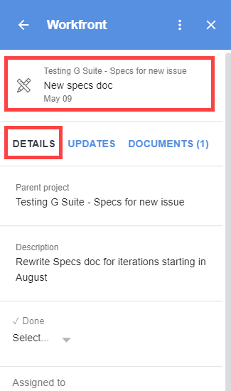

# View and manage Adobe Workfront object details from G Suite

You can view and manage the details of a work item without leaving G Suite. For example, you can read a task's description, view its parent object, change its status, and mark it as complete, all within Adobe Workfront for G&nbsp;Suite.

## Access requirements

You must have the following access to perform the steps in this article:

<table cellspacing="0"> 
 <col> 
 <col> 
 <tbody> 
  <tr> 
   <td role="rowheader">Adobe Workfront plan*</td> 
   <td> 
Any
 </td> 
  </tr> 
  <tr> 
   <td role="rowheader">Adobe Workfront license*</td> 
   <td> 
Work, Plan
 </td> 
  </tr> <!--
   <tr data-mc-conditions="QuicksilverOrClassic.Draft mode"> 
    <td role="rowheader">Access level configurations*</td> 
    <td> 
[Insert any access level configurations needed]
       <MadCap:conditionalText data-mc-conditions="QuicksilverOrClassic.Draft mode">
        Example: Edit access to Documents
       </MadCap:conditionalText>
      
 
Note: If you still don't have access, ask your Workfront administrator if they set additional restrictions in your access level. For information on how a Workfront administrator can modify your access level, see <a href="../../administration-and-setup/add-users/configure-and-grant-access/create-modify-access-levels.md" class="MCXref xref">Create or modify custom access levels</a>.
 
      
 You must be a Workfront administrator. For information on Workfront administrators, see <a href="../../administration-and-setup/add-users/configure-and-grant-access/grant-a-user-full-administrative-access.md" class="MCXref xref">Grant a user full administrative access</a>.

      
You must be a group administrator. For more information on group administrators, see <a href="../../administration-and-setup/manage-groups/group-roles/group-administrators.md" class="MCXref xref">Group administrators</a>.

     </td> 
   </tr>
   <tr data-mc-conditions="QuicksilverOrClassic.Draft mode"> 
    <td role="rowheader">Object permissions</td> 
    <td> 
[Insert permissions needed and specify the object]
       <MadCap:conditionalText data-mc-conditions="QuicksilverOrClassic.Draft mode">
        Example: View access or higher on Documents
       </MadCap:conditionalText>
      
 
For information on requesting additional access, see <a href="../../workfront-basics/grant-and-request-access-to-objects/request-access.md" class="MCXref xref">Request access to objects </a>.
 </td> 
   </tr>
  --> </tbody> 
</table>

&#42;To find out what plan, license type, or access you have, contact your Workfront administrator.

## Prerequisites

Before you can view and manage work item details in G Suite, you must

* Install Workfront for G suite  
  For instructions, see [Install Adobe Workfront for G Suite](../../workfront-integrations-and-apps/workfront-for-g-suite/install-workfront-for-gsuite.md).

## View and manage work item details in G Suite

1. If the Workfront for G Suite panel is not displayed, click the&nbsp;Workfront icon  in the G Suite add-ons sidebar at the far-right of the page. 
1. Go to the Workfront task or issue within G Suite, as described in [Access Adobe Workfront Home content from G Suite](../../workfront-integrations-and-apps/workfront-for-g-suite/access-wf-home-content-from-g-suite.md).

   When you select a task or issue, the **Details** tab is open. The area above the **Details** tab displays the name of the parent object, the name of the task or issue, and the Due date (if it's a task) or Priority date (if it's an issue).

   

   You can do various tasks on this tab without leaving G Suite, including the following:

   * View the object's **Description** and other details, such as the users assigned to the object, the **Priority**, the requester, the **Planned completion date**, and any custom fields and forms attached to the object.

     Custom forms display only fields where information has been added.
   
   * Click the **Parent project** area to view the details of the parent object.

     >[!TIP]
     >
     >This can be helpful when you have tasks and issues with the same name and you need to differentiate them.

   * Accept work assigned to you by clicking **Work on it**.
   * Edit various options, such as **Done** option, the **Status**, and the **Percent complete**.

     Under **Percent complete**, type numbers and (optionally) the percentage sign % to indicate your progress on an item.

     <!--   
     <li data-mc-conditions="QuicksilverOrClassic.Draft mode"><strong>Log time</strong> on a work item.</li>   
     -->   
   
   * View information about an approval request, including the owner, size, and any attachments. 
   * **Approve** or **Reject** approval requests and documents.
   
   * **Grant** or **Ignore** access requests.

1. (Optional) Click **View in Workfront** to go to the current work item in Workfront.

* For information about using the Updates tab in Workfront for G Suite, see [Update a Adobe Workfront object from G Suite](../../workfront-integrations-and-apps/workfront-for-g-suite/update-a-workfront-object-in-gsuite.md).
* For information about using the Documents tab in Workfront for G Suite, see [View and manage documents from G Suite](../../workfront-integrations-and-apps/workfront-for-g-suite/view-and-manage-documents-in-gsuite.md).
