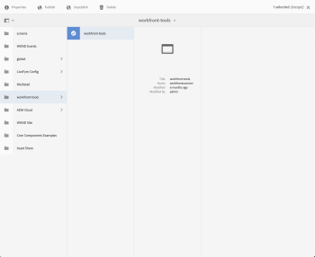
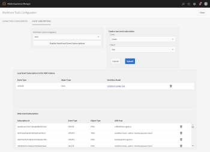
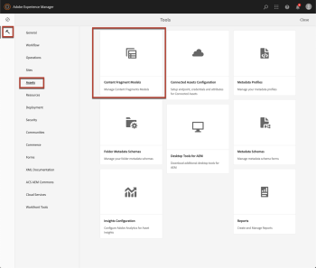
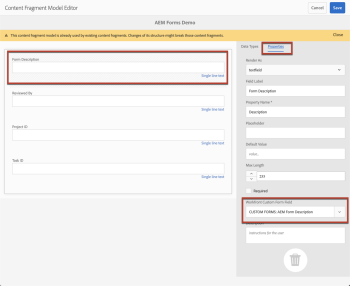

# `Workfront Tools for AEM User Guide : Content Fragments`

This workflow step will allow a user to map Adobe Workfront metadata fields to an AEM Content Fragment Model.

## Access requirements

You must have the following access to perform the steps in this article:

<table cellspacing="0"> 
 <col> 
 </col> 
 <col> 
 </col> 
 <tbody> 
  <tr> 
   <td role="rowheader">Adobe Workfront plan*</td> 
   <td> 
Pro or higher
 </td> 
  </tr> <!--
   Adobe Workfront license* Review or higher
  --> 
  <tr> 
   <td role="rowheader">Product</td> 
   <td>You must have a license to Adobe Experience Manager</td> 
  </tr> 
 </tbody> 
</table>

&#42;To find out what plan, license type, or access you have, contact your Workfront administrator.

## Prerequisites

* You must install Workfront Tools for Adobe Experience Manager before you can use it to map metadata.

  For instructions, see [Workfront Tools for AEM User Guide: Installation Guide 1.x.x](../../workfront-integrations-and-apps/workfront-integration-for-aem/installation-guide.md)

## Create the event subscription

1. Navigate to `Tools → Cloud Services → Workfront Tools Configuration`. Select the configuration and click `Properties`.

   

   

1. Select the `Event Subscriptions` tab. Under the `Create a new event subscription` menu, select `update`from the Event dropdown and under the Object dropdown select `task`if you want to create content fragments from a task custom form or select `issue`if you want to create content fragments from an issue custom form.

   

1. Next, navigate back to `Tools → Assets → Content Fragment Models`. Select an existing Content Fragment Model or create a new model.

   

1. Select an existing data field or add a new field. With the field selected, navigate to the Workfront Custom Form Field drop-down menu and select the custom form field you’d like to map.

   

1. After you’ve mapped your desired fields, return to the `Tools → Cloud Services → Workfront Tools Configuration`.

   

