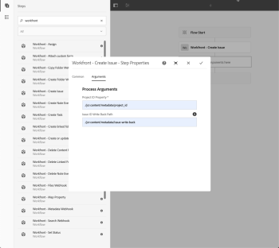
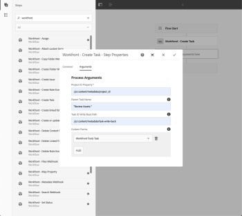

# ```Workfront Tools for AEM User Guide : Create Issues & Tasks```  {#title-heading}

There workflow steps that will allow a user to create an issue or task in a Adobe Workfront Project. The Workfront project both steps affect will be looked up using a relative path from the payload. The issue or task name is determined from the payload’s jcr:title property.

Each workflow step can be added to any new or existing AEM Workflow Model. Workflow models can be conditionally triggered using AEM’s Workflow Launchers. See additional information on [Administering AEM Workflows](https://docs.adobe.com/help/en/experience-manager-65/administering/operations/workflows.html) and [AEM Launchers](https://docs.adobe.com/content/help/en/experience-manager-65/administering/operations/workflows-starting.html).

## Access requirements

You must have the following access to perform the steps in this article:

<table cellspacing="0"> 
 <col> 
 </col> 
 <col> 
 </col> 
 <tbody> 
  <tr> 
   <td role="rowheader">Adobe Workfront plan*</td> 
   <td> <p>Pro or higher</p> </td> 
  </tr> <!--
   <tr data-mc-conditions="QuicksilverOrClassic.Draft mode"> 
    <td role="rowheader">Adobe Workfront license*</td> 
    <td> <p>Work or higher</p> </td> 
   </tr>
  --> 
  <tr> 
   <td role="rowheader">Product</td> 
   <td>You must have a license to Adobe Experience Manager</td> 
  </tr> 
  <tr> 
   <td role="rowheader">Access level configurations*</td> 
   <td> <p>Edit access to issues and tasks</p> <p>Note: If you still don't have access, ask your Workfront administrator if they set additional restrictions in your access level. For information on how a Workfront administrator can modify your access level, see <a href="../../administration-and-setup/add-users/configure-and-grant-access/create-modify-access-levels.md" class="MCXref xref">Create or modify custom access levels</a>.</p> </td> 
  </tr> 
  <tr> 
   <td role="rowheader">Object permissions</td> 
   <td> <p>View access to a project to create an issue</p> <p>Contribute access to a project to create a task</p> <p>For information on requesting additional access, see <a href="../../workfront-basics/grant-and-request-access-to-objects/request-access.md" class="MCXref xref">Request access to objects in Adobe Workfront</a>.</p> </td> 
  </tr> 
 </tbody> 
</table>

&#42;To find out what plan, license type, or access you have, contact your Workfront administrator.

## Prerequisites

* You must install Workfront Tools for Adobe Experience Manager before you can use it to create issues or tasks.

  For instructions, see [Workfront Tools for AEM User Guide: Installation Guide 1.x.x](../../workfront-integrations-and-apps/workfront-integration-for-aem/installation-guide.md)

## Create Issue {#createissues&tasks-createissue}



## Create Task {#createissues&tasks-createtask}



