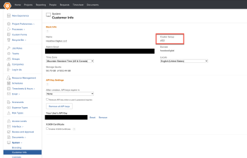
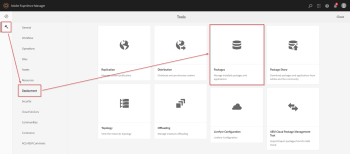
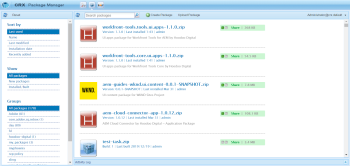
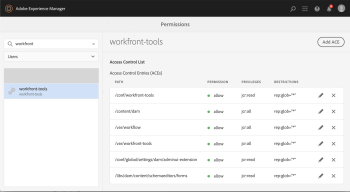
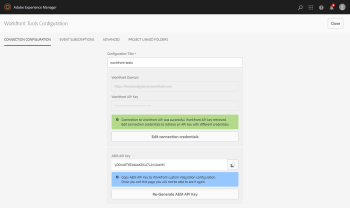
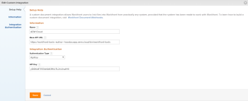

# ```Workfront Tools for AEM User Guide: Installation Guide 1.x.x```

## Access requirements

You must have the following access to perform the steps in this article:

<table cellspacing="0"> 
 <col> 
 </col> 
 <col> 
 </col> 
 <tbody> 
  <tr> 
   <td role="rowheader">Adobe Workfront plan*</td> 
   <td> <p>Pro or higher</p> </td> 
  </tr> <!--
   <tr data-mc-conditions="QuicksilverOrClassic.Draft mode"> 
    <td role="rowheader">Adobe Workfront license*</td> 
    <td> <p>Plan or higher</p> </td> 
   </tr>
  --> 
  <tr> 
   <td role="rowheader">Product</td> 
   <td>You must have a license to Adobe Experience Manager</td> 
  </tr> 
 </tbody> 
</table>

&#42;To find out what plan, license type, or access you have, contact your Workfront administrator.

# 1 - Prerequisites

Prior to installing/configuring the tools you’ll need to complete a few steps:

1. AEM Assets installed and configured, version 6.4 or later.

   1. For more information about installing AEM Assets, see the [Adobe Experience Manager documentation.](https://docs.adobe.com/content/help/en/experience-manager-65/deploying/deploying/deploy.html)

1. AEM Touch-Optimized User Interface activated.
1. Ensure your firewall is properly configured:

   1. [Configure your firewall](https://one.workfront.com/s/document-item?bundleId=workfront-classic&topicId=Content%2FAdministration_and_Setup%2FSet_up_Workfront%2FGet_started-WF_administration%2Fconfigure-your-firewall.html) 
   1. You can find your IP cluster in Workfront by going to ```Setup → System → Customer Info```.

      

1. If there is an AEM dispatcher in front of the AEM Author instance that will be communicating with Workfront, it will need to be configured to allow HTTP headers named ```authorization```, ```username```and ```apikey```. The dispatcher should allow GET, POST, and PUT to /bin/workfront-tools.
1. Lastly, before installing Workfront Tools for AEM, you should check that none of the following paths already exist on your AEM instance because the package includes files on these paths and they won’t get updated properly.

   * /apps/dam/gui/coral/components/admin/schemaforms/formbuilder
   * /apps/dam/gui/coral/components/admin/folderschemaforms/formbuilder
   * /apps/dam/gui/content/foldermetadataschemaeditor
   * /apps/dam/cfm/models/editor/components/datatypeproperties
   * /apps/settings/dam/cfm/models/formbuilderconfig

# 2 - Installation

```For AEMaaCS customers start below otherwise skip ahead to step 1```

```AEMaaCS:``` If you are installing the Workfront Tools connector on AEMaaCS please refer to [AEM as a Cloud Service Compatibility](https://hoodoodigital.atlassian.net/wiki/spaces/WTFAUG/pages/634978569/AEM+as+a+Cloud+Service+compatibility).

The Workfront Tools packages will need to be referenced as a dependency in the pom.xml, as provided by the vendor.

[Copy](javascript:void(0);) 
<pre><code><!-- Workfront Tools --><br><dependency><br>&nbsp;&nbsp;&nbsp;&nbsp;<groupId>digital.hoodoo</groupId><br>&nbsp;&nbsp;&nbsp;&nbsp;<artifactId>workfront-tools.tools.ui.apps</artifactId><br>&nbsp;&nbsp;&nbsp;&nbsp;<type>zip</type><br>&nbsp;&nbsp;&nbsp;&nbsp;<version>1.x.x</version><br></dependency></code></pre>
[Copy](javascript:void(0);) 
<pre><code><!-- Workfront Tools --><br><dependency><br>&nbsp;&nbsp;&nbsp;&nbsp;<groupId>digital.hoodoo</groupId><br>&nbsp;&nbsp;&nbsp;&nbsp;<artifactId>workfront-tools.core.ui.apps</artifactId><br>&nbsp;&nbsp;&nbsp;&nbsp;<type>zip</type><br>&nbsp;&nbsp;&nbsp;&nbsp;<version>1.x.x</version><br></dependency></code></pre>Include the below repository configuration in the pom.xml within adobe-public profile, so the connector dependencies (above) can be resolved at build time (both locally, and by Cloud Manager). Credentials for repository access will be provided upon the purchase of a license. The credentials will need to be added to the settings.xml file in the servers section.

[Copy](javascript:void(0);) 
<pre><code><repository><br>&nbsp;&nbsp;&nbsp;&nbsp;<id>hoodoo-maven</id><br>&nbsp;&nbsp;&nbsp;&nbsp;<name>Hoodoo Repository</name><br>&nbsp;&nbsp;&nbsp;&nbsp;<url>https://gitlab.com/api/v4/projects/12715200/packages/maven</url><br></repository></code></pre>Example settings.xml file

[Copy](javascript:void(0);) 
<pre><code><server><br>&nbsp;&nbsp;&nbsp;&nbsp;<id>hoodoo-maven</id><br>&nbsp;&nbsp;&nbsp;&nbsp;<configuration><br>&nbsp;&nbsp;&nbsp;&nbsp;&nbsp;&nbsp;&nbsp;&nbsp;<httpHeaders><br>&nbsp;&nbsp;&nbsp;&nbsp;&nbsp;&nbsp;&nbsp;&nbsp;&nbsp;&nbsp;&nbsp;&nbsp;<property><br>&nbsp;&nbsp;&nbsp;&nbsp;&nbsp;&nbsp;&nbsp;&nbsp;&nbsp;&nbsp;&nbsp;&nbsp;&nbsp;&nbsp;&nbsp;&nbsp;<name>Private-Token</name><br>&nbsp;&nbsp;&nbsp;&nbsp;&nbsp;&nbsp;&nbsp;&nbsp;&nbsp;&nbsp;&nbsp;&nbsp;&nbsp;&nbsp;&nbsp;&nbsp;<value>*********************</value><br>&nbsp;&nbsp;&nbsp;&nbsp;&nbsp;&nbsp;&nbsp;&nbsp;&nbsp;&nbsp;&nbsp;&nbsp;</property><br>&nbsp;&nbsp;&nbsp;&nbsp;&nbsp;&nbsp;&nbsp;&nbsp;</httpHeaders><br>&nbsp;&nbsp;&nbsp;&nbsp;</configuration><br></server></code></pre>The Workfront Tools packages will also need to be added to the embeddeds section of the pom.xml of your ```all```subproject like in the following example.

[Copy](javascript:void(0);) 
<pre><code><!-- Workfront Tools --><br><embedded><br>&nbsp;&nbsp;&nbsp;&nbsp;<groupId>digital.hoodoo</groupId><br>&nbsp;&nbsp;&nbsp;&nbsp;<artifactId>workfront-tools.tools.ui.apps</artifactId><br>&nbsp;&nbsp;&nbsp;&nbsp;<type>zip</type><br>&nbsp;&nbsp;&nbsp;&nbsp;<target>/apps/<path-to-project-install-folder>/install</target><br></embedded></code></pre>
[Copy](javascript:void(0);) 
<pre><code><!-- Workfront Tools --><br><embedded><br>&nbsp;&nbsp;&nbsp;&nbsp;<groupId>digital.hoodoo</groupId><br>&nbsp;&nbsp;&nbsp;&nbsp;<artifactId>workfront-tools.core.ui.apps</artifactId><br>&nbsp;&nbsp;&nbsp;&nbsp;<type>zip</type><br>&nbsp;&nbsp;&nbsp;&nbsp;<target>/apps/<path-to-project-install-folder>/install</target><br></embedded></code></pre>

1. The connector will be available for download from the creator, Hoodoo Digital. The format will be two zip files, workfront-tools.tools.ui.apps-1.1.0.zip and workfront-tools.core.ui.apps-1.1.0.zip.
1. Once the files are downloaded, log in to your AEM environment and navigate to ```Tools → Deployment → Packages```.

   

1. Upon clicking ```Packages```you will be taken to the CRX Package Manager.&nbsp;&nbsp;
1. Click the ```Upload Package``` button at the top of the screen. This will bring up an operating system prompt for your computer that will allow you to browse to the location where the ZIP files are located.&nbsp;
1. Select one of the packages and then repeat for the other one. Both packages will appear in the main list of other packages.&nbsp;&nbsp;

   

1. Click the Install button to begin the installation process for each of the packages.&nbsp;
1. Once the installation has been completed then you can close out the CRX Package Manager window.&nbsp;&nbsp;

To complete the setup process you will need to work with Hoodoo Digital to get all the necessary configurations in place.&nbsp; These may be different for each user based on your company's security and other setups.&nbsp;

<!--
<p data-mc-conditions="QuicksilverOrClassic.Draft mode">To arrange an installation session please contact Hoodoo Digital: help@hoodoo.digital or (801) 896-9667.&nbsp;</p>
-->

# 3 - Externalizer

Check that ```Day CQ Link Externalizer``` has been set properly. Day CQ Link Externalizer configuration can be found on AEM’s Web Console Configuration (<aem-server>/system/console/configMgr). Check that ```author```domain is set to your AEM’s author instance domain.


# 4 - System User Configuration

1. Workfront service user creation is added by the connector package using ACS AEM Commons or Apache Sling Repository Initialization (AEMaaCS), you should check that “workfront-tools” service user has been correctly created. Search for “workfront-tools” user on “AEM Security | Permissions” menu (<aem-server>/security/permissions.html/principal/workfront-tools) and check the users’ permissions.

   

1. ```workfront-tools``` user should have:

   * jcr:read privilege to /conf/workfront-tools
   * jcr:all privilege to /content/dam
   * jcr:all privilege to /var/workflow
   * jcr:all privilege to /var/workfront-tools
   * jcr:read privilege to /conf/global/settings/dam/adminui-extension (Take into account that this path might not exist in your AEM instance if there are no custom Asset Metadata Schemas. If that is the case, you’ll need to create the path manually.)
   * jcr:read privilege to /libs/dam/content/schemaeditors/forms

1. Create ```workfront-tools``` user manually ```(if applicable)```

   1. If you need to create ```workfront-tools``` system user manually. Click on ```User Administration``` on ```CRX Explorer``` menu (<aem-server>/crx/explorer/index.jsp). Click on ```Create System User```, enter ```workfront-tools``` as the system user’s ID and click on the green tick on the right hand side, then click on ```Close```.
   
   1. Search for ```workfront-tools``` user on ```AEM Security | Permissions``` menu (<aem-server>/security/permissions.html/principal/workfront-tools) and add the permissions described above.

# 5 - Cloud Services - Connection configuration

To create ```Workfront Tools``` Cloud Services configuration, from ```AEM Start``` page (<aem-server>/aem/start.html), click on ```Tools```, then ```Cloud Services``` on the left panel and click on ```Workfront Tools Configuration```.

With ```workfront-tools``` selected on the left panel, click on ```Create```button on the top-right corner.


```Workfront Connection``` dialog will automatically open. Enter your workfront domain, a valid workfront admin user and password. Click on ```Connect to Workfront```.


If the connection was successful, you will see a ```green success``` message. Copy ```AEM API Key```, this key will be configured in Workfront in the next step.



# 6 - Workfront Custom Integration Configuration

Create a new ```Custom Integration``` on Adobe Workfront. To do so, click on ```Setup```located on the top navigation, select ```Documents```on the left hand panel and click on ```Custom Integration```. Click on ```Add Custom Integration``` and fill in the fields with the information found in the following table:

<table data-layout="default" cellspacing="0"> 
 <colgroup> 
  <col> 
  <col> 
 </colgroup> 
 <tbody> 
  <tr> 
   <td role="rowheader"> <p>Name</p> </td> 
   <td> <p>The name that identifies this connection</p> </td> 
  </tr> 
  <tr> 
   <td role="rowheader"> <p>Base API URL</p> </td> 
   <td> <p>&lt;aem-server&gt;/bin/workfront-tools</p> </td> 
  </tr> 
  <tr> 
   <td role="rowheader"> <p>Authentication Type</p> </td> 
   <td> <p>ApiKey</p> </td> 
  </tr> 
  <tr> 
   <td role="rowheader"> <p>API Key</p> </td> 
   <td> <p>The API Key provided by AEM in the previous step</p> </td> 
  </tr> 
 </tbody> 
</table>



Authorize the new Document Provider by following these steps:

1. Open ```Documents```tab on a Workfront project.
1. Click on ```Add Document``` drop-down menu and select ```From <document-provider-name>``` (From AEM Cloud in the case of the above example).
1. You will see the list of AEM DAM assets/folders. This means that the connection from Workfront to AEM was successful.

<!--
<p data-mc-conditions="QuicksilverOrClassic.Draft mode">To complete the setup process you will need to work with Hoodoo Digital to get all the necessary configurations in place. These may be different for each user based on your company's security and other setups.</p>
-->

<!--
<p data-mc-conditions="QuicksilverOrClassic.Draft mode">To arrange an installation session please contact Hoodoo Digital: <a href="mailto:workfront-tools@hoodoo.digital" class="external-link" rel="nofollow">workfront-tools@hoodoo.digital</a> or (801) 896-9667.</p>
-->

