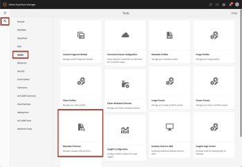
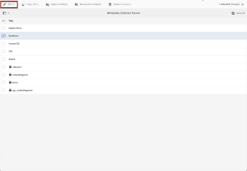
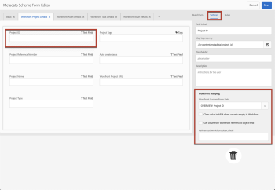
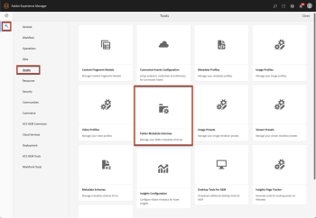

# ```Workfront Tools for AEM User Guide : Metadata Schema Mapping```

## Asset Metadata Mapping

Metadata mapping between Adobe Workfront Documents and AEM Assets is defined within AEM Metadata Schemas. Metadata Schemas should be created and configured as usual in AEM. Workfront Tools adds configuration options to the Settings configuration tab of each metadata schema form field. These options will allow you to specify to which Workfront field each AEM property should be mapped to.

## Access requirements

You must have the following access to perform the steps in this article:

<table cellspacing="0"> 
 <col> 
 </col> 
 <col> 
 </col> 
 <tbody> 
  <tr> 
   <td role="rowheader">Adobe Workfront plan*</td> 
   <td> <p>Pro or higher</p> </td> 
  </tr> <!--
   <tr data-mc-conditions="QuicksilverOrClassic.Draft mode"> 
    <td role="rowheader">Adobe Workfront license*</td> 
    <td> <p>Work or higher</p> </td> 
   </tr>
  --> 
  <tr> 
   <td role="rowheader">Product</td> 
   <td>You must have a license to Adobe Experience Manager</td> 
  </tr> 
 </tbody> 
</table>

&#42;To find out what plan, license type, or access you have, contact your Workfront administrator.

## Prerequisites

* You must install Workfront Tools for Adobe Experience Manager before you can map metadata schemas.

  For instructions, see [Workfront Tools for AEM User Guide: Installation Guide 1.x.x](../../workfront-integrations-and-apps/workfront-integration-for-aem/installation-guide.md)

## Configure metadata schema mappings

Follow these steps to configure the mappings:

1. Navigate to ```Tools → Assets → Metadata Schemas```.

   

1. Select the metadata schema form you wish to edit and click ```Edit```or create a new metadata schema from scratch.

   

1. Select the metadata schema form field you wish to edit and select ```Settings```tab on the right panel.
1. In ```Workfront Custom Form Field``` select the name of the Workfront field that you wish to map to the selected AEM property. Available options are:

  1. Document custom form fields
  1. Project custom form fields
  1. Issue custom form fields
  1. Task custom form fields
  1. Project Overview fields (ID, Name, Description or Reference Number)&nbsp;

1. In the case where the Workfront field selected in ```Workfront Custom Form Field``` is a Workfront User type-ahead field, it will be necessary to specify which Workfront User field you wish to map. To do so, check ```Get value from Workfront referenced object field``` and then specify the name of the Workfront User Custom Form Field from which to retrieve the value to be mapped.

   

## Folder Metadata Mapping

Metadata mapping between Workfront Projects and AEM Folders is defined within AEM Folder Metadata Schemas. Folder Metadata Schemas should be created and configured as usual in AEM. Workfront Tools adds an autocomplete dropdown to the Settings configuration tab of each folder metadata schema form field. This autocomplete drop-down menu will allow you to specify to which Workfront field each AEM folder property should be mapped to.

Follow these steps to configure the mappings:

1. Navigate to ```Tools → Assets → Folder Metadata Schemas```.

   

1. Select the folder metadata schema form you wish to edit and click ```Edit```.

   

1. Select the folder metadata schema form field you wish to edit and select ```Settings```tab on the right panel.
1. In ```Mapped from Workfront Field``` select the name of the Workfront field that you wish to map to the selected AEM folder property. Available options are:

  1. Project custom form fields
  1. Project Overview fields (ID, Name, Description, Reference Number, Planned Completion Date, Project Owner, Project Sponsor, Portfolio or Program)&nbsp;

   

