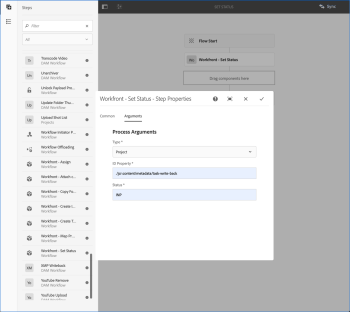

# `Workfront Tools for AEM User Guide : Set Status`

## Access requirements

You must have the following access to perform the steps in this article:

<table cellspacing="0"> 
 <col> 
 </col> 
 <col> 
 </col> 
 <tbody> 
  <tr> 
   <td role="rowheader">Adobe Workfront plan*</td> 
   <td> 
Pro or higher
 </td> 
  </tr> <!--
   Adobe Workfront license* Work or higher
  --> 
  <tr> 
   <td role="rowheader">Product</td> 
   <td>You must have a license to Adobe Experience Manager</td> 
  </tr> 
 </tbody> 
</table>

&#42;To find out what plan, license type, or access you have, contact your Workfront administrator.

## Prerequisites

* You must install Workfront Tools for Adobe Experience Manager before you can use it to set statuses.

  For instructions, see [Workfront Tools for AEM User Guide: Installation Guide 1.x.x](../../workfront-integrations-and-apps/workfront-integration-for-aem/installation-guide.md)

## Set Status

This workflow step will allow a user to set Adobe Workfront statuses on Projects, Tasks, and Issues. This workflow step can be added to any workflow model. The Workfront artifact this step affects will be looked up using a relative path from the payload. The status is statically defined in the dialog configuration.

