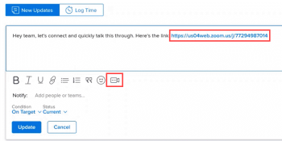

# [!DNL Zoom] integration overview

>[!IMPORTANT]
>
>The Zoom integration was deprecated with the 22.4 release (September 2022). This article will be removed November 2022.

If your [!DNL Adobe Workfront] administrator has enabled the [!DNL Zoom] integration, you can start a [!DNL Zoom] meeting with collaborators by inserting a [!DNL Zoom] link into an Update comment or a reply.

Anyone tagged in the comment or reply receives an instant notification containing the link, depending on their notification settings. They can click to join the meeting directly from the notification or from the [!UICONTROL Updates] area.

For more information about using the [!UICONTROL Updates] area, see the section [Add an update to a work item](../../workfront-basics/updating-work-items-and-viewing-updates/update-work.md#add) in the article [Update work](../../workfront-basics/updating-work-items-and-viewing-updates/update-work.md).

For information about how the [!DNL Workfront] administrator enables this integration, see [Install the [!DNL Zoom] integration](../../administration-and-setup/configure-integrations/enable-zoom-integration.md).

For information on how you can uninstall the [!DNL Zoom] integration in your personal Workfront instance, see [Uninstall the [!DNL Zoom] integration](../../workfront-integrations-and-apps/zoom-integration-with-wf/uninstall-zoom-integration.md).
