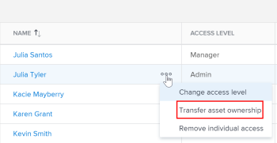

# Transfer ownership assets to another user

As a Workfront Library administrator, you can transfer all of the asset in a user's My Content area to a different user.

## Transfer all assets

To transfer all of a user's content:

1. In Workfront, click the **Main Menu** icon , then select **Library** to open Workfront Library in a new browser tab.
1. In the upper-left corner of Workfront Library, click the **Menu** icon.
1. In the left panel, click **Setup** > **Users**.

   On the Users screen, you can see a list of Workfront Library users.

1. (Optional) To locate a user that no longer has access to Workfront Library, click the **Filter** icon in the top-right corner and select **Deactivated users** from the drop-down list that appears.

   >[!NOTE]
   >
   >Only deactivated users that still own assets appear in this area. After you transfer assets from a deactivated user, they are removed from this list.

1. Hover over a user's row, click the More menu next to the user's name, and select **Transfer asset ownership** from the drop-down list that appears.

   

1. In the Transfer ownership dialog, click **Search recipient's name or email** and start typing the new owner's name or email, then select the name in the list that appears. After making a selection, the user's name replaces the search field.
1. Click **Transfer** to start transferring content to the new owner. When the content has finished transferring, it appears in the My Content area of the user that now owns this content.

## Transfer individual assets

To transfer a single asset:

1. In Workfront, click the **Main Menu** icon , then select **Library** to open Workfront Library in a new browser tab.
1. In the upper-left corner of Workfront Library, click the **Menu** icon .
1. Select **All Content** from the left menu.
1. (Optional) Filter to find the assets you want to transfer. To filter by Owner, see the [Filter by owner](../../../workfront-library/administration-and-setup/manage-assets/manage-assets-for-other-users.md#filter) section in [Manage assets for other users](../../../workfront-library/administration-and-setup/manage-assets/manage-assets-for-other-users.md). To filter by other facets, see [Filter content displayed in Workfront Library](../../../workfront-library/content-management/basics/filter-content-displayed.md).

1. (Conditional) If you are in the list view, click the **Show grid view** icon  to switch to the grid view.
1. Click on the asset that you want to transfer ownership of. To select more than one asset, hold the CTRL key as you click on the desired assets.

   >[!NOTE]
   >
   >You cannot transfer folders.

1. Click the **Asset Actions** icon , then click **Transfer asset ownership**.

1. In the Transfer asset ownership dialog box, begin typing the name of the user that you want to transfer assets to. Select the name when it appears in the drop-down list.
1. Click **Transfer**.

