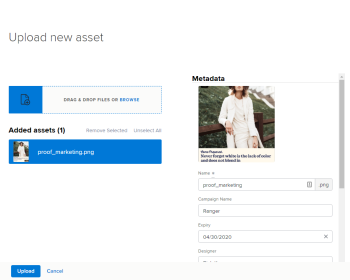

# Overview of metadata in Workfront Library

Metadata is information that describes the attributes and content of an asset and enhances its searchability. Even though your organization might have thousands of assets in Workfront Library, you can quickly locate the content you want using accurate and detailed metadata.

A Workfront Library administrator sets up the metadata to gather the types of information most useful for your organization. Workfront Library supports 2 types of metadata:

* **Taxonomy**: Information that describes or categorizes the attributes of an asset. For example, taxonomy might specify when an asset was created or the location of a photograph. For more information on taxonomy, see [Overview of taxonomy metadata in Workfront Library](../../../workfront-library/administration-and-setup/metadata/taxonomy-metadata-overview.md). 

* **Keywords**: Terms that describe an asset. For example, keywords for the following image might include: running, woman, athlete, running shoe, desert, Titan Running, outdoors, turquoise, and race.

  For more information on keywords, see [Overview of keyword metadata in Workfront Library](../../../workfront-library/administration-and-setup/metadata/keyword-metadata-overview.md)

When you upload an asset to Workfront Library, you specify the applicable metadata in the Metadata panel.

The metadata is then saved with the asset. When users search or filter for content, Workfront Library combs through metadata to identify assets with applicable metadata.

Additionally, documents sent to Workfront Library from Workfront, might include Workfront metadata, such as the project name, Planned Completion Date, and assigned team. For information on sending documents from Workfront, see [Configure document integrations](../../../administration-and-setup/configure-integrations/configure-document-integrations.md).

When you open an item in Workfront Library, you can view its metadata in the Details panel on the right.
