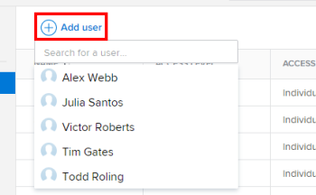

# Give users access to [!DNL Workfront Library]

Before users can open [!DNL Workfront Library], they must be given access. As a [!DNL Workfront Library] administrator, you can give your users the following types of access:

* **Individual**: Access that you grant to individual users
* **User grouping**: Access that users receive through their membership in a job role, team, group, or company that you've added to [!DNL Workfront Library]

When you add individual users and user groupings to [!DNL Workfront Library], you assign them an access level. This access level determines what actions users can take with the content that is shared with them. For information on [!DNL Workfront Library] access levels and permissions, see [Overview of user access to [!DNL Workfront Library]](../../../workfront-library/administration-and-setup/user-access/user-access-overview.md) and [Permissions in [!DNL Workfront Library]](../../../workfront-library/administration-and-setup/user-access/permissions-in-workfront-library.md).

Each access level grants specific permissions that affect what a user can do with the assets shared with them. 

>[!NOTE]
>
>Users must first have a profile in [!DNL Workfront] before you can give them access to [!UICONTROL Workfront Library]. For information on adding users to [!DNL Workfront], see [Add users](../../../administration-and-setup/add-users/create-and-manage-users/add-users.md).

## Give individual access

To get individual access to [!DNL Workfront Library], a user must be active in [!DNL Workfront]. You can also restore access for a user you have removed from [!DNL Workfront Library] previously.

1. In [!DNL Workfront], click the **[!UICONTROL Main Menu]** icon , then select **[!UICONTROL Library]** to open [!DNL Workfront Library] in a new browser tab.
1. In the upper-left corner of [!DNL Workfront Library], click the **[!UICONTROL Menu]** icon.
1. In the left panel, click **[!UICONTROL Setup]** > **[!UICONTROL Users]**.
1. Click **[!UICONTROL Add user]**.

   

1. In the **[!UICONTROL Search]** box that appears, enter text to locate the user.

   Or

   Scroll down the drop-down list until you've located the user.

1. In the drop-down list, select each user that you want to give access to.

   After selecting a name, the user appears in the table below.

   >[!NOTE]
   >
   >When you add a new user, they automatically have Viewer access to [!DNL Workfront Library]. To learn how to change a user's access level to [!UICONTROL Admin] or [!UICONTROL Manager], see [Change a user's access to [!DNL Workfront Library]](../../../workfront-library/administration-and-setup/user-access/change-user-access.md).

## Give access to a user grouping

To add a user grouping in [!DNL Workfront Library], it must already exist as a grouping in [!DNL Workfront]. To learn more, see [Overview of user access to Workfront Library](../../../workfront-library/administration-and-setup/user-access/user-access-overview.md).

To give access:

1. In [!DNL Workfront], click the **[!UICONTROL Main Menu]** icon , then select **[!UICONTROL Library]** to open [!DNL Workfront Library] in a new browser tab.
1. In the upper-left corner of [!DNL Workfront Library], click the **[!UICONTROL Menu]** icon.
1. In the left panel, click **[!UICONTROL Setup]**, then select the type of user grouping that you want to add:

   * **[!UICONTROL Job role]**
   * **[!UICONTROL Team]**
   * **[!UICONTROL Group]**
   * **[!UICONTROL Company]**

1. Click **[!UICONTROL Add]**.
1. In the **[!UICONTROL Search]** box that appears, enter text to locate the user grouping.

   Or

   Scroll down the drop-down list until you've located the user grouping.

1. In the drop-down list, select each user grouping that you want to give access to.
1. After selecting a user grouping, it appears in the table below. The new users receive an email with a link to [!DNL Workfront Library].
1. When you add a user grouping, each user in the group automatically has Viewer access to [!DNL Workfront Library]. To learn how to change the access level for the user grouping, see [Change a user's access to [!DNL Workfront Library]](../../../workfront-library/administration-and-setup/user-access/change-user-access.md).
