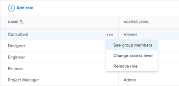

# Remove a user's access to [!DNL Workfront Library]

As a [!DNL Workfront Library] administrator, you can remove a user's access to [!DNL Workfront Library]. When you remove a user from [!DNL Workfront Library], only their access to [!DNL Workfront Library] is removed. Their [!DNL Workfront] account remains active. Any content that they owned in [!DNL Workfront Library] remains in [!DNL Workfront Library].

If a [!DNL Workfront] system administrator deactivates a user in [!DNL Workfront], they automatically lose access to [!DNL Workfront Library].

>[!TIP]
>
>Before deleting or deactivating a user in [!DNL Workfront] or in [!DNL Workfront Library], we recommend reassigning the content they own to another [!DNL Workfront Library] user. To access content owned by a deactivated user, users must have [!UICONTROL View] or [!UICONTROL Manage] access to the content. Only users with [!UICONTROL Manage] access can make changes to content owned by a deactivated user.\
>For information on changing the ownership of content, see [Transfer ownership assets to another user](../../../workfront-library/administration-and-setup/manage-assets/transfer-ownership-to-others.md).

A user might have multiple access levels assigned to them. For example, a user can have individual access to [!DNL Workfront Library] and access from any job role, team, group, or company that they are members of. For information on the differences between individual and user grouping access, see [Overview of user access to [!DNL Workfront Library]](../../../workfront-library/administration-and-setup/user-access/user-access-overview.md).

>[!NOTE]
>
>To determine how a user has access to [!DNL Workfront Library], you can open the Library menu and go to **[!UICONTROL Setup]** > **[!UICONTROL Access]** > **[!UICONTROL Users]**. In the Users area, you see a list of users and the type of access they have is listed in the [!UICONTROL Access Sources] column.\
>

* [Remove a user's individual access](#remove-a-user-s-individual-access)
* [Remove access for a user grouping](#remove-access-for-a-user-grouping)

## Remove a user's individual access {#remove-a-user-s-individual-access}

Removing a user's individual access to [!DNL Workfront Library] does not affect any other access sources that the user has.

To remove individual access:

1. In [!DNL Workfront], click the **[!UICONTROL Main Menu]** icon , then select **[!UICONTROL Library]** to open [!DNL Workfront Library] in a new browser tab.
1. In the upper-left corner of [!DNL Workfront Library], click the **[!UICONTROL Menu]** icon.

   >[!NOTE]
   >
   >To remove a user from a portal, click **[!UICONTROL Portals]** in the bottom-left panel.

1. In the left panel, click **[!UICONTROL Setup]** > **[!UICONTROL Users]**.
1. To locate the user you want to remove, click the **[!UICONTROL Search]** icon in the top-right corner, then enter the user's name and hit Enter.

   

   Or

   Scroll down until you've located the user's name.

1. Next to the user's name, click the [!UICONTROL More] menu, then select **[!UICONTROL Remove individual access]**.

   

1. (Optional) If the user owns assets and doesn't have access through a user grouping, you must select what you would like to do with the assets:

   * Transfer the assets to a different user
   * Delete the assets
   * Keep the assets without transfering them to a new owner

   >[!NOTE]
   >
   >If you choose to keep the assets assigned to the user that you're removing, you can transfer the assets later. If you select to transfer the assets now, you must select a new owner to assign them to. To learn more about transfering assets, see [Transfer ownership assets to another user](../../../workfront-library/administration-and-setup/manage-assets/transfer-ownership-to-others.md).

1. In the [!UICONTROL Remove individual access] dialog, click **[!UICONTROL Remove user]**.

   The user appears in the [!UICONTROL Deactivated users] list.

   >[!NOTE]
   >
   >If you want to restore access for an inactive user, you can locate them by clicking the [!UICONTROL Filter] icon, then selecting **[!UICONTROL Deactivated users]** from the menu. After finding the [!UICONTROL Deactivated users] list, you can select **[!UICONTROL Restore user access]** from the [!UICONTROL More] Menu.

## Remove access for a user grouping {#remove-access-for-a-user-grouping}

As a [!DNL Workfront Library] administrator, you can remove access to [!DNL Workfront Library] for an entire group of users based on their user groupings:

* [!UICONTROL Job role]
* [!UICONTROL Team]
* [!UICONTROL Group]
* [!UICONTROL Company]

Users who are members of the removed user grouping lose their access to [!DNL Workfront Library] and all the content shared with the grouping, unless they have individual access to [!DNL Workfront Library] or access through another user grouping in [!DNL Workfront Library]. For information on [!DNL Workfront Library] access levels and permissions, see [Overview of user access to [!DNL Workfront Library]](../../../workfront-library/administration-and-setup/user-access/user-access-overview.md)

>[!NOTE]
>
>If you don't want specific users to access [!DNL Workfront Library] through a job role, team, group, or company, you need to remove them from that specific user grouping in [!DNL Workfront]. To learn how to make these changes from the user profile, see [Edit a user's profile](../../../administration-and-setup/add-users/create-and-manage-users/edit-a-users-profile.md).\
>Alternatively, you can remove them from a user grouping by modifying the job role, team, group, or company that they are a member of. To learn more, see:
>
>* [Create and manage job roles](../../../administration-and-setup/set-up-workfront/organizational-setup/create-manage-job-roles.md)
>* [Edit team settings](../../../people-teams-and-groups/create-and-manage-teams/edit-team-settings.md)
>* [View and manage a group's memberships](../../../administration-and-setup/manage-groups/create-and-manage-groups/view-and-manage-a-groups-memberships.md)
>* [Create and edit companies](../../../administration-and-setup/set-up-workfront/organizational-setup/create-and-edit-companies.md)
>

To remove access for a user grouping in [!DNL Workfront Library]:

1. In [!DNL Workfront], click the **[!UICONTROL Main Menu]** icon , then select **[!UICONTROL Library]** to open [!DNL Workfront Library] in a new browser tab.
1. In the upper-left corner of [!DNL Workfront Library], click the **[!UICONTROL Menu]** icon.

   >[!NOTE]
   >
   >To remove a grouping from a portal, click **[!UICONTROL Portals]** in the bottom-left panel.

1. In the left panel, click **[!UICONTROL Setup]**, then select the type of user grouping you want to remove access for:

   * **[!UICONTROL Job role]**
   * **[!UICONTROL Team]**
   * **[!UICONTROL Group]**
   * **[!UICONTROL Company]**

   A list of the user groupings for the selected type displays in [!DNL Workfront Library].

1. Click the **[!UICONTROL More]** menu inline with the user grouping that you want to remove.

   

1. Click **[!UICONTROL Remove]**, then click **[!UICONTROL Remove]** to confirm.

   The user grouping is removed from [!DNL Workfront Library]. Removing a user grouping from [!DNL Workfront Library] does not delete the user grouping in [!DNL Workfront].

   >[!NOTE]
   >
   >To transfer assets owned by members of the grouping, you must go to the [!UICONTROL Deactivated users] list. To learn more about transfering assets, see [Transfer ownership assets to another user](../../../workfront-library/administration-and-setup/manage-assets/transfer-ownership-to-others.md).
