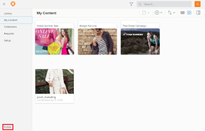
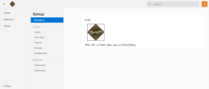
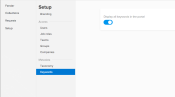

# Set up a portal in [!DNL Workfront] Library

Depending on the amount of content your organization stores in [!DNL Workfront Library], your users might find it beneficial to assemble all the items they need in one place.

## Workfront Library portals overview

As a [!DNL Workfront] Library administrator you can use a portal to gather related content and make it available to internal and external users.

Users with Manager access or higher to a portal can add or remove users from the portal. For more information on managing portal users, see [Give users access to a [!DNL Workfront] Library portal](../../../workfront-library/administration-and-setup/user-access/give-users-access-portal.md).

There is no limit on the number of [!DNL Workfront Library] portals your organization can have. Your [!DNL Workfront Library] package includes 10 portals. To purchase additional portals, contact your sales representative.

>[!IMPORTANT]
>
>You must contact [!DNL Customer] Success Manager or [!DNL Workfront Support] to create a portal.

## Set up a portal {#set-up-a-portal}

1. In [!DNL Workfront], click the **[!UICONTROL Main Menu]** icon , then select **[!UICONTROL Library]** to open [!DNL Workfront Library] in a new browser tab.
1. In the upper-left corner of [!DNL Workfront] Library, click the **[!UICONTROL Menu]** icon .
1. In the left panel, click **Portals**.

   

1. Select the portal you want to configure.
1. Click the **[!UICONTROL Menu]** icon in the upper-left corner of the portal, then click **[!UICONTROL Setup]**.

   You can continue with the portal set up in the following ways:

   * [Add your organization's branding to the portal](#add-your-organization-s-branding-to-the-portal)
   * [Select taxonomy for content in the portal](#select-taxonomy-for-content-in-the-portal)
   * [Enable searching for keywords in the portal](#enable-searching-for-keywords-in-the-portal)

### Add your organization's branding to the portal {#add-your-organization-s-branding-to-the-portal}

You can brand a portal with your company logo or another image.

1. Complete the steps 1-5 in [Set up a portal](#set-up-a-portal)
1. In the **[!UICONTROL Setup]** panel, click **[!UICONTROL Branding]**.

1. Hover over the **NO LOGO** box, then click **Select new image**.
1. Browse to the image you want to use for the branding, then click **[!UICONTROL Open]**.

   

   The image can be up to a 1,000 x 1,000 pixel image in one of following file formats:

   * JPG
   * GIF
   * PNG

   >[!TIP]
   >
   >If the image you want to use for your branding is in [!DNL Workfront] Library, but it doesn't meet the formatting requirements, you can download the image with a different file size and format. You can then upload the image and use it for branding the portal. For more information on downloading a file, see the "Download a single content file" section in the article [[!UICONTROL Download items] from Workfront Library](../../../workfront-library/content-management/basics/download-content-from-library.md)

1. Click **Save New Logo**.

   Refresh the browser page where you have [!DNL Workfront] Library to see the new logo.

### Select taxonomy for content in the portal {#select-taxonomy-for-content-in-the-portal}

Your portal users might not need to view all the taxonomy you collect on your organization's assets. To give portal users only the metadata they need, you can specify the taxonomy fields that display on content added to the portal.

1. Complete the steps 1-5 in [Set up a portal](#set-up-a-portal)
1. In the **Setup** panel, click **Taxonomy**.

   A list of your organization's taxonomy displays.

1. Enable the taxonomy fields you want displayed in the metadata for content in the portal.

   While in the portal, users see only the metadata you have enabled.

   For more information on taxonomy metadata, see [Overview of taxonomy metadata in [!DNL Workfront] Library](../../../workfront-library/administration-and-setup/metadata/taxonomy-metadata-overview.md).

### Enable searching for keywords in the portal {#enable-searching-for-keywords-in-the-portal}

You can allow keyword metadata to display for content in the portal. This enables users to search for and filter portal content. While in the portal, you cannot add or remove keywords from the keyword picklist. For more information on keyword metadata, see [Overview of keyword metadata in [!DNL Workfront] Library](../../../workfront-library/administration-and-setup/metadata/keyword-metadata-overview.md)

1. Complete the steps 1-5 in [Set up a portal](#set-up-a-portal)
1. In the **Setup** panel, click **Keywords**.
1. Enable **Display all keywords in the portal**.\
   
