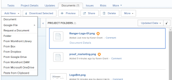

# Add a [!DNL Workfront Library] asset to [!DNL Workfront]

You can add a document that resides in your My Content area to a project, task, or issue in [!DNL Workfront]. In order to add a document to Workfront from Workfront Library, you must have the following permissions:

* Manage access to the document in [!DNL Workfront Library]
* Access to the [!DNL Workfront] object to which you want to add the document

When you add a document from [!DNL Workfront Library] to [!DNL Workfront], [!DNL Workfront] creates a copy of the document. This copy is not linked to the document in [!DNL Workfront Library], and changes made to one copy of the document are not updated in the other copy. Additionally, if you send a new version of a document that is already in [!DNL Workfront], the new version is uploaded as a separate file with the same name as the original version.

To learn how to send a document from [!DNL Workfront] to Workfront Library, see [Send documents from Workfront to Workfront Library](../../workfront-library/content-management/send-documents-from-wf-to-library.md).

1. In [!DNL Workfront], navigate to the [!UICONTROL Documents] tab of the object where you want to add a document from [!DNL Workfront Library].
1. Click **[!UICONTROL Add New]**.

   

1. In the drop-down menu, click **[!UICONTROL From Workfront Library]**.

   

1. In the **[!UICONTROL Link External Files and Folders]** dialog box, navigate to the document you want to add to [!DNL Workfront], and select it.
1. Repeat Step 4 to add multiple documents to a [!DNL Workfront] object.
1. Click **[!UICONTROL Link]**.

   Workfront adds the document to the Workfront object. On the [!UICONTROL Documents] tab for the [!DNL Workfront] object, any documents added from Workfront Library display the Workfront icon.
