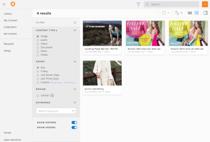
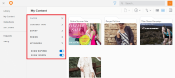
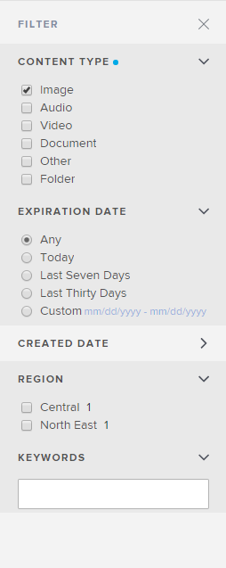

# Filter content displayed in [!DNL Workfront Library]

You can use filters to reduce the amount of content that displays in the [!UICONTROL Library] and [!UICONTROL My Content] areas. You can also use filters to narrow Search results. For information on using Search, see [Search for items in Workfront Library](../../../workfront-library/content-management/basics/search-for-items-in-workfront-library.md).

The available filters display in the Filter panel on the left side of the content area.

Each filter on the [!UICONTROL Filter] panel contains facets, which are filters that allow you to specify the exact content you want to view. A facet filters content based on the metadata attached to content files.

If your organization allows you to add keywords to uploaded content, you can enhance your filtering by selecting the keywords you want to filter for.

1. In [!DNL Workfront], click the **[!UICONTROL Main Menu]** icon , then select **[!DNL Library]** to open [!DNL Workfront Library] in a new browser tab.
1. In the upper-left corner of [!DNL Workfront Library], click the **[!UICONTROL Menu]** icon .
1. Select the area you want to filter.

   * If you have [!UICONTROL Manager] or higher access to [!DNL Workfront Library], you can filter the [!UICONTROL My Content] and [!UICONTROL Library] areas.
   * Users with [!UICONTROL Viewer] access can filter only the Library area.

1. Click the **[!UICONTROL Filter]** icon.

   

   The [!UICONTROL Filter] panel opens and displays the filters you can use.

   

1. Click the arrow for a filter you want to apply.

   The filter opens to reveal several filter facets.

   >[!NOTE]
   >
   >You cannot filter on custom text fields.

1. Select the facets you want to apply.

   

1. Repeat steps 5 and 6 until you have selected all the filters and facets you want to apply.
1. (Optional) To filter using keywords, click in the **[!UICONTROL Keywords]** box, then select the keywords you want to filter with.

   The filtered results display.

1. (Optional) To close the [!UICONTROL Filter] panel, click the **X** at the upper-right corner of the [!UICONTROL Filter] panel.
