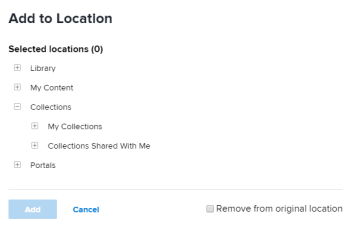
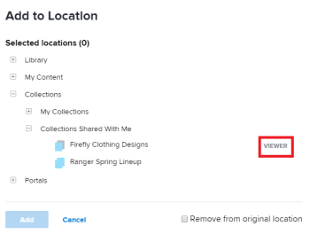

# Add items to a collection in [!DNL Workfront Library]

You can add content and folders to a collection that you create or that has been shared with you. When you add content to a collection, the content remains in its original location, and you simply create a link to the content file.

1. In the upper-left corner of [!DNL Workfront Library], click the **[!UICONTROL Menu]** icon .
1. Select the area where the item you want to add is located.

   If you have [!UICONTROL Manager] or higher access to [!DNL Workfront Library], you can choose content from either your [!UICONTROL Library] or [!UICONTROL My Content] areas. Users with [!UICONTROL Viewer] access can select items from their [!UICONTROL Library] area.

1. (Conditional) If you are in the list view, click the **[!UICONTROL Show grid view]** icon  to switch to the grid view.
1. Hover over the item you want to add, then click the **[!UICONTROL More]** icon in the upper-right corner of the item.
1. Select **[!UICONTROL Add to]** in the drop-down menu.

   

1. Click the plus sign next to **[!UICONTROL Collections]** to display the collections available to you.

   

   Depending on the collections you have access to, you might have the following Collection options:

   * **[!UICONTROL My Collections]:** Contains collections that you have created. For information on creating a collection, see [Create a collection in [!UICONTROL Workfront Library]](../../../workfront-library/content-management/collections/create-a-collection.md).

   * **C[!UICONTROL ollections Shared with Me]:** Contains collections that have been share with you by other users. Users with [!UICONTROL Viewer] access to [!DNL Workfront Library] can add items only to collections that they have created. Users with [!UICONTROL Manager] access and with [!UICONTROL View] permissions to a collection shared with them cannot add items to the collection.

      You can hover over a shared collection listed to view your permissions level.

      

      For information on access levels and permissions, see [Overview of user access to [!DNL Workfront Library]](../../../workfront-library/administration-and-setup/user-access/user-access-overview.md)

1. (Optional) Click **[!UICONTROL Remove from original location]** to remove the item from where you accessed it in Step 3.

   Only users with [!UICONTROL Manage] permissions to the item can remove it from its original location.

1. Click **[!UICONTROL Add]**.
