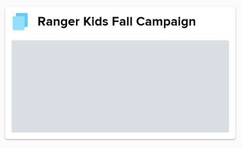
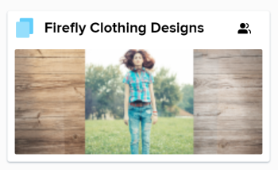

# Create a collection in Workfront Library

You can organize content by adding it to collections that you have created or that have been shared with you. For information on sharing collections, see [Share a Workfront Library item with other users](../../../workfront-library/content-management/share-an-asset-with-users.md).

When you create a collection, you have the option to select the image you want as the collection cover image. If you don't select a cover image, the collection thumbnail is gray as long as the collection remains empty. When you add content to the collection, Workfront Library randomly selects a cover image from the added content. If a collection contains only folders, the cover remains gray.

For information on changing the cover image, see [Change the cover image on an item in Workfront Library](../../../workfront-library/content-management/change-cover-image-of-folder.md).

You&nbsp;can create an unlimited number of collections.&nbsp;

1. In Workfront, click the Main Menu icon , then select Library to open Workfront Library in a new browser tab. 
1. In the upper-left corner of Workfront Library, click the `Menu` icon .
1. Click `Collections` in the left panel.

   

1. Click the `Add New` icon  in the upper right corner, then select `New Collection`.

   

1. In the `Name` box, type a name for the collection.
1. (Optional) In the `Description` box, type a description of the collection.
1. Click `Save`.
1. (Optional) Select a cover image for the collection:

  1. Hover over the collection you just created, click the `More` icon in the upper-right corner of the collection, then click `Select cover image` in the drop-down menu.
  
  1. Navigate to the image you want displayed on the collection cover.

     You can choose from content in your Library, My Content, or Collections areas. You cannot use an expired or hidden item as a cover image.

     >[!NOTE]
     >
     >The image you select remains as the cover image, even if the asset is updated with a new version or is deleted from Workfront Library. For information on changing a cover image, see [Change the cover image on an item in Workfront Library](../../../workfront-library/content-management/change-cover-image-of-folder.md).

  1. Select the image, then click `Save`.

     The image displays on the collection cover. You might need to refresh your browser tab to see the collection cover.

     

     You can now add assets to the collection. For information on adding assets, see [Add items to a collection in Workfront Library](../../../workfront-library/content-management/collections/add-items-to-a-collection.md).

