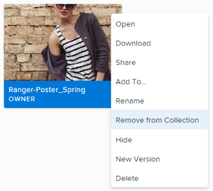

# Remove items from a collection in Workfront Library

You can remove assets and folders from any collection to which you have Manage permissions.

1. In Workfront, click the **Main Menu** icon , then select **Library** to open Workfront Library in a new browser tab. 

1. In the upper-left corner of Workfront Library, click the **Menu** icon .
1. Click **Collections**, then open the collection from which you want to remove an item.

   (Conditional) If you are in the list view, click the **Show grid view** icon  to switch to the grid view.

1. Hover over the item you want to remove, click the **More** icon in the upper-right corner of the item, then select **Remove from Collection** in the drop-down menu.

   

   >[!TIP]
   >
   >When you use the Remove from Collection option, the item is removed from the collection, but remains in Workfront Library. Only a Workfront Library administrator can delete content from Workfront Library. For information on deleting assets, see [Delete items from Workfront Library](../../../workfront-library/content-management/delete-items.md)

1. Click **Remove** to confirm you want to remove the item.

   The item is removed from the collection.

   If the item you removed was used for the cover image on the collection, it remains as the cover image even though the item is no longer in the collection.

