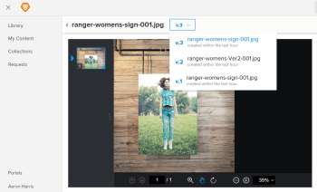

# Overview of content versioning in [!DNL Workfront Library]

As a user with [!DNL Manage] permission to content, you can use [!DNL Workfront Library] to view and download all iterations of content through the versioning feature. [Access older versions of content in [!DNL Workfront Library]](../../../workfront-library/content-management/content-versioning/view-older-versions-of-content-library.md)

When you update active (or current) content with a new version, all the versions of the content are treated as a "package" and remain together.

Metadata for the previous version becomes sealed and cannot be edited or deleted. Users who can access the older versions can see the metadata for each version.

Once a you upload a new version, the content package takes on the file name of the new version. You can still see the file names of the older versions when you view the version list. Users can search only on the file name of the active version. For information on viewing other versions of content, see [Access older versions of content in [!DNL Workfront Library]](../../../workfront-library/content-management/content-versioning/view-older-versions-of-content-library.md).

When you share content with another user, the entire content package is shared with that user. Users with [!UICONTROL Manage] permission to the content can view all its versions, while users with [!UICONTROL View] permission can see only the active version. For more information on sharing content, see [Share a [!DNL Workfront Library] item with other users](../../../workfront-library/content-management/share-an-asset-with-users.md).

An external links to the content package remain active when you upload a new version, allowing users to view the new version. External users can view only the active version of content.

[!DNL Workfront Library] users with access the content are notified of a new version via an in-app notification.
