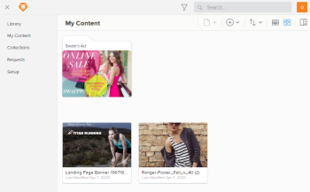

# Upload a new version of content in [!DNL Workfront Library]

If you have [!UICONTROL Manage] permissions to content, you can upload new versions. For information on managing multiple versions of content, see [Overview of content versioning in [!DNL Workfront Library]](../../../workfront-library/content-management/content-versioning/content-versioning-overview.md) .

You cannot upload new versions of content in bulk. Each version must be uploaded individually.

1. In [!DNL Workfront], click the **[!UICONTROL Main Menu]** icon , then select **[!DNL Library]** to open [!DNL Workfront Library] in a new browser tab.
1. In the upper-left corner of [!DNL Workfront Library], click the **[!UICONTROL Menu]** icon .
1. Select the area where the active (or current) version is located.

   You can choose [!UICONTROL Library], [!UICONTROL My Content], or [!UICONTROL Collections].

   

1. (Conditional) If you are in the list view, click the **[!UICONTROL Show grid view]** icon  to switch to the grid view.
1. Navigate to the thumbnail for the active content.
1. Hover over the thumbnail, click the **[!UICONTROL More]** icon in the upper-right corner of the thumbnail, then select **[!UICONTROL New Version]** in the drop-down menu.

   The file uploading area displays.

1. Add the file you want to upload.

   * To drag and drop a file located on your workstation, select the file you want to upload, then drag and drop it into the file uploading area.

      >[!NOTE]
      >
      >If you are using [!DNL Internet Explorer] as your browser application, you cannot use the drag-and-drop functionality.

   * To browse for the file, click **[!UICONTROL Browse]** in the file uploading area, browse to and select the file you want to upload, then click **[!UICONTROL Open].**

   Depending on how your taxonomy is configured, the [!UICONTROL Metadata] panel for the file you are uploading might display some pre-filled metadata from the active version along with any applicable EXIF, XMP, and file attributes. For information on content metadata, see [Set up taxonomy metadata for Workfront Library](../../../workfront-library/administration-and-setup/metadata/set-up-taxonomy-metadata.md).

   Only metadata from the active version of the content is applied to the file you are uploading.

   By default, the name of the file you are uploading becomes the name for the content package, regardless of the names of previous versions. You can change the file name to match an older version.

   When searching for the content, users can search only for the most current file name. File names of previous versions are not searchable.

1. (Optional) To update the metadata for the new version, including the file name, edit the taxonomy fields in the **[!UICONTROL Details]** panel.
1. Click **[!UICONTROL Upload New Version]**.

   Once the upload is complete, the version number is added to the name of the content.

   An in-app notification announcing the newly-uploaded version is sent to all users with access to previous versions.
