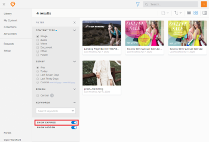

# Filter for expired content in [!DNL Workfront Library]

Depending on how your Workfront Library administrator setup the Expiration feature, you might be able to view expired content by enabling the [!UICONTROL Show Expired] filter. For more information on expired content, see [Set up content expiration in Workfront Library](../../../workfront-library/administration-and-setup/workfront-library-setup/set-up-content-expiration-in-library.md).

1. In [!DNL Workfront], click the **[!UICONTROL Main Menu]** icon , then select **[!UICONTROL Library]** to open [!DNL Workfront Library] in a new browser tab.
1. Click the **Filter** icon.\
   

   >[!TIP]
   >
   >Depending on the view you have activated, the name displayed on the Content View drop-down menu can be either Name, Relevant, or Last Modified.

1. In the **Filter** menu, enable the **[!UICONTROL Show Expired]** toggle.

   

   You can now view expired content. The [!UICONTROL Show Expired] filter affects only your instance of [!DNL Workfront Library] and does not make expired items visible for other users.
