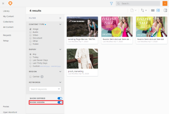

# Filter for hidden content in Workfront Library

As a user with Manager or higher access to Workfront Library, you can enable a filter to display hidden content to which you have Manage permission. Users with Viewer access to Workfront Library cannot view hidden content.

This filter affects only your instance of Workfront Library and does not make hidden items visible for other users.

1. In Workfront, click the **Main Menu** icon , then select **Library** to open Workfront Library in a new browser tab.
1. Click the **Filter** icon.  
   

   >[!TIP]
   >
   >Depending on the view you have activated, the name displayed on the Content View drop-down menu could be either Name, Relevant, or Last Modified.

1. In the **Filter** menu, enable the **Show Hidden** toggle.

   

   You can now view hidden content. The Show Hidden filter affects only your instance of Workfront Library and does not make hidden items visible for other users.

