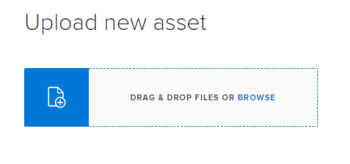

# Upload content to [!DNL Workfront Library]

If you have [!UICONTROL Manager] or higher access to [!DNL Workfront Library], you can upload new content.

## Understand uploading content to [!DNL Workfront Library]

When you upload new content, [!DNL Workfront Library] designates you as the owner of that content and uploads it to your [!UICONTROL My Content] area. Initially, only you and users with Admin access to [!DNL Workfront Library] can access the content. You can give others access to the content by sharing it with them. For information on sharing items, see [&#128279;](../../workfront-library/content-management/share-an-asset-with-users.md) [Share a [!DNL Workfront Library] item with other users](../../workfront-library/content-management/share-an-asset-with-users.md).

You can upload a single file or a batch of files.&nbsp;While there is no limit&nbsp;on the number of files you can batch upload, performance is significantly affected when you upload 10 or more files.

Before being uploaded, each file is processed to extract any Exif and XMP metadata embedded on the file. For information about metadata, see [Overview of metadata in [!DNL Workfront Library]](../../workfront-library/administration-and-setup/metadata/metadata-overview.md).

You can enter additional metadata for each file individually or for multiple files. Before a file can be uploaded to [!DNL Workfront Library], all the required metadata fields must be filled in.

You can also add documents that are uploaded to projects, tasks, or issues in [!DNL Workfront] to [!DNL Workfront Library]. For information on adding documents from [!DNL Workfront], see [Send documents from [!DNL Workfront] to [!DNL Workfront Library]](../../workfront-library/content-management/send-documents-from-wf-to-library.md).

There is no restriction on the file size or types of files that can be uploaded to [!DNL Workfront Library].

You cannot upload a file using third-party applications such as [!DNL Google Drive] and [!DNL SharePoint].

>[!NOTE]
>
>[!DNL Workfront Library] does not prevent duplicate filenames. If you upload a file that has the same filename of a file already in [!DNL Workfront Library], you will have two files with the same filename.

## Upload content to [!DNL Workfront Library]

1. In [!DNL Workfront], click the **[!UICONTROL Main Menu]** icon , then select **[!DNL Library]** to open [!DNL Workfront Library] in a new browser tab.
1. In the upper-left corner of [!DNL Workfront Library], click the **[!UICONTROL Menu]** icon .
1. Select **[!UICONTROL My Content]** in the left panel.
1. (Optional) To upload content to a folder, navigate to and open the desired folder.
1. Click the **[!UICONTROL Add New]** icon in the upper-right corner, then select **[!UICONTROL Upload File]**.

   The file uploading area displays

   

1. Select the files you want to upload.

   * To drag and drop files located on your workstation, select the file or files you want to upload, then drag and drop the files into the [!UICONTROL file uploading] area.

      >[!NOTE]
      >
      >If you are using [!DNL Internet Explorer] as your browser application, you cannot use the drag-and-drop functionality.

   * To browse for files, click the **[!UICONTROL Browse]** link, browse to and select the file or files you want to upload, then click **[!UICONTROL Open]**.

   The Upload new asset area opens

   A list the files you are uploading display on the left. Before the files are uploaded, [!DNL Workfront Library] processes the files, identifies whether there is embedded metadata for each file, and creates thumbnails.

   In the [!UICONTROL Metadata] panel on the right, you can view pre-filled metadata for each file and enter additional metadata information for the items you are uploading.

1. Add metadata to the processed files.

   * To add metadata to an individual file: Select the file to which you want to add metadata, then add the metadata information to the fields in the [!UICONTROL Metadata] panel.
   * To bulk-add metadata to multiple files: Select the files to which you want to add metadata, then add metadata information to the fields in the [!UICONTROL Metadata] panel.

      The metadata is added to the selected files.
   >[!NOTE]
   >
   >Before the files can be uploaded to [!DNL Workfront Library], all required metadata fields must be completed for all the content being uploaded.

1. Click the **[!UICONTROL Keywords]** drop-down arrow, select the applicable keywords.

   Or

   Begin typing the desired keyword, then select it when it displays in the drop-down list.

   A drop-down arrow displays next to keywords with child keywords. You can view and select child keywords by clicking the drop-down arrow.

1. Click **[!UICONTROL Upload]**.

   The files upload to [!DNL Workfront Library]. You can now share the uploaded items with others.

   For information on giving others access to the item, see [Share a [!DNL Workfront Library] item with other users](../../workfront-library/content-management/share-an-asset-with-users.md).
