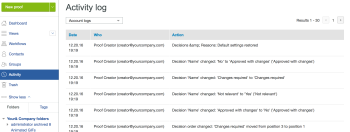

# Configure approval decision options in [!DNL Workfront Proof]

>[!IMPORTANT]
>
>This article refers to functionality in the standalone product [!DNL Workfront Proof]. For information on proofing inside [!DNL Adobe Workfront], see [Proofing](../../../review-and-approve-work/proofing/proofing.md).

As a [!DNL Workfront Proof] administrator using a Select or Premium edition plan, you can configure approval decision options in the following ways for all proofs created by [!DNL Workfront Proof] users in your organization:

* Change the name of the decision
* Change the order of the decisions shown in the proofing viewer
* Decide which decisions should display

This article explains the following:

## Configuring Decision Settings

1. Click **[!UICONTROL Account Settings]**.
1. Open the **[!UICONTROL Decisions]** tab.
1. Make any of the following changes:

   * To hide a decision, click **[!UICONTROL Hide]** to the right of the decision you do not need.
   * To rename a decision, click the decision name, edit it, then click outside of the box (or press Enter). [!DNL Workfront Proof] updates the name of the decision on all existing proofs in your system.

      >[!IMPORTANT]
      >
      >Retain the logic for a decision when you rename it. For example, the default decision "Rejected" could be changed to "New version required," but it should not be changed to "Send to Printers").

      If you would like to go back to the [!DNL Workfront Proof] defaults, you can click Restore default decisions.

>[!NOTE]
>
>* The logic behind the decisions is used to calculate the overall status of a proof workflow if there are multiple decisions of various levels.
>* The decisions "Approved" and "Approved with changes" trigger the next stage in an automatic workflows.
>* If you rename a decision and you would like to verify the logic, you can click **[!UICONTROL Activity]** in the left navigation panel and check your Activity log where the original decisions display in brackets.
>
>  >

## Creating Decision Reasons

Decision reasons are a good way of capturing additional decision information about a proof.

1. Click **[!UICONTROL Settings]** > **[!UICONTROL Account Settings]**.

1. Open the **[!UICONTROL Decisions]** tab.
   By default, reasons are available to all decision makers on your proofs, but you can restrict that to Primary decision makers only.
   Depending on your requirements, you can allow multiple reasons to be selected or you can make it a single choice list. You can also make reasons mandatory, which means that reviewers will have to pick a reason before they are allowed to save their decision on a proof.
   

1. In the **[!UICONTROL Reasons]** section, click **[!UICONTROL New reason]**.
   

1. Type a title for the reasons section in the box that appears under **[!UICONTROL Reason]**.
1. If you want to include a text box, select **[!UICONTROL Include text box]**.
1. Click **[!UICONTROL Save]**.
   
   The most important step is selecting the decisions that reasons should display on. If you forget to do that, the reasons are not going to show on your proofs.

1. Check the boxes in the **[!UICONTROL Display reasons]** column in the decisions list at the top of the page. You can select one or more decisions for your reasons.
   

## Creating a Post Decision Message

You can create a post decision message to display after a reviewer saves their decision on the proof.

1. Click **[!UICONTROL Settings]** > **[!UICONTROL Account Settings]**.

1. Open the **[!UICONTROL Decisions]** tab.
1. In the **[!UICONTROL Post decision message]** section, click **[!UICONTROL Edit]** at the end of the **[!UICONTROL Message]** row.
   You can also decide if you want the message to be displayed to all decision makers or if you want to limit it to the Primary decision maker.
   

1. In the **[!UICONTROL Display message]** column, specify the decisions this message should be displayed on.
   If you do not select at least one decision, the message will not show on your proofs. Be sure to check at least one box in this column.
   
