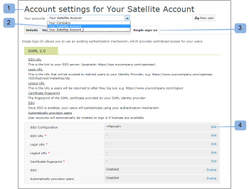
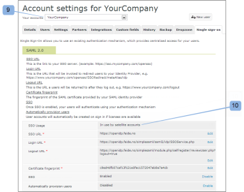
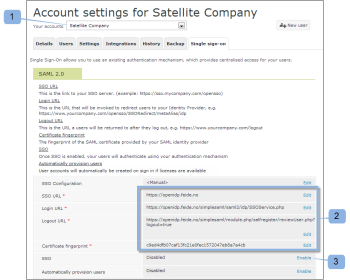
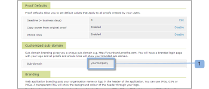

# Configure Single Sign-On for [!DNL Workfront Proof] users

>[!IMPORTANT]
>
>This article refers to functionality in the standalone product [!DNL Workfront Proof]. For information on proofing inside [!DNL Adobe Workfront], see [Proofing](../../../review-and-approve-work/proofing/proofing.md).

If you have the Select or Premium plan, you can provide Single Sign-On (SSO) capability that allows you to use your existing organization's username and password to access your [!DNL Workfront Proof] account.

This means that you will authenticate against your own log in system, not against the [!DNL Workfront Proof] login page.

>[!NOTE]
>
>You must have a custom sub-domain or domain set up on your [!DNL Workfront Proof] account to enable SAML. Custom sub-domains are free to set up. See [Branding](https://support.workfront.com/hc/en-us/sections/115000921208-Branding) for more information.You can read more about fully customized domains on our [Brand the [!DNL Workfront Proof] site - advanced](../../../workfront-proof/wp-acct-admin/branding/brand-wp-site-advanced.md).

## Enabling SSO Within [!DNL Workfront Proof]

The Single Sign-On functionality can be enabled on the [!UICONTROL Single sign-on] tab of your [!UICONTROL Account settings], and it will apply to all the users on your [!DNL Workfront Proof] account. See [Account Settings](https://support.workfront.com/hc/en-us/sections/115000912147-Account-settings) for more information.

## Entity ID

As a Service Provider we have published our Entity ID here:

[https://yoursubdomain.proofhq.com/saml/module.php/saml/sp/metadata.php/phq](https://yoursubdomain.proofhq.com/saml/module.php/saml/sp/metadata.php/phq) (where "yoursubdomain" is your account's sub domain)

[!DNL Workfront Proof] requires the user's email address as their unique identifier, which can be passed as one of the following attributes:

* urn:mace:dir:attribute-def:emailAddress
* http://schemas.xmlsoap.org/ws/2005/05/identity/claims/emailaddress
* http://schemas.xmlsoap.org/claims/EmailAddress
* urn:oid:0.9.2342.19200300.100.1.3
* http://axschema.org/contact/email
* openid.sreg.email
* mail
* email
* emailAddress

To configure SSO:

1. Open the **[!UICONTROL Single Sign-On]** tab (1).
1. Enter the **SSO URL** (2).
   This is the link to your SSO server (for example, **https://sso.mycompany.com/opensso**).

1. Enter the **Login URL** (3).
   This is the URL that will be invoked to redirect the users to your Identity Provider.

   This is not an actual URL you enter in the browser, but rather an endpoint which will process the information we send it in order to present the Login screen.

1. Enter the **Logout URL** (4).
This is the URL you will be returned to after you log out, for example

   **https://www.yourcompany.com/services/logout.asp**

1. Enter the **Certificate fingerprint** (5).
1. The SHA1 fingerprint of the SAML certificate provided by your SAML Identity Provider.
1. Make sure to include the Key Info by setting this on your Identity Provider.
1. Switch **SSO** to **[!UICONTROL Enabled]** (6).
   Once SSO is enabled, you and other users on your account will log in using your own authentication mechanism. What this means is that when the users accesses your [!DNL Workfront Proof] account login screen (for example, **yourcompany.proofhq.com/login**), they will be prompted with the transfer window to your own authentication login page.

1. (Optional) Enable **Automatically provision users** (7).
   Once this option is enabled the user accounts will be automatically created for people who do not have their own [!DNL Workfront Proof] profiles, but will access your [!DNL Workfront Proof] account using their Single Sign-On credentials. This will be actioned only when the user limit is not yet reached on your account.

1. New provisioned users will have the Manager profile permissions assigned by default. If you need more information, see [Proof Permissions Profiles in [!DNL Workfront Proof]](../../../workfront-proof/wp-acct-admin/account-settings/proof-perm-profiles-in-wp.md).

## Enabling SSO for Satellite Accounts

When you have satellite accounts connected to your hub account, you can administer them from the hub account level.

Single Sign-On is a Select and Premium feature so Single Sign-On can only be enabled on satellites that are on Select and Premium plans.

1. Click **[!UICONTROL Settings]** > **[!UICONTROL Account settings]** (1).

1. Click the satellite account in the drop down menu (2).
1. Open the **[!UICONTROL Single Sign-On]** tab (3).
1. Start editing the SSO configuration (4).
1. 
   Here you will have two methods (5) of configuration:

1. **Inherited:** SSO with the configuration taken from your hub account.
   If a user accesses [!DNL Workfront Proof] through the **default login page** ([https://www.proofhq.com/login](https://www.proofhq.com/login)) there will be **two levels of authorization**: First a user is asked to log in using [!DNL Workfront Proof] access data (email and password); then the user is transferred through an SSO window to the SSO login page.
   Therefore, with SSO service enabled, we recommend to log in through your own [!DNL Workfront Proof] sub-domain/domain.

   >[!NOTE]
   >
   >At this time, when Single Sign-On is enabled on your [!DNL Workfront Proof] account, you will not be able to log in to the iPhone app with those credentials.

   1. **Manual** (default): SSO with a different configuration (for example, pointing to another Identity Provider).

      >[!NOTE]
      >
      >If the satellite account is inheriting the SSO configuration from the hub account, the login screen will be that of the hub account. When the satellite account user enters their SSO login details on this page, they will be re-directed back to the satellite account.

      

   1. Click **[!UICONTROL Save]** (6).

## SSO Settings Inherited from a Hub Account

When you choose to inherit the settings from your hub account you'll notice that all the fields are now populated with the data from your hub account (7) and that Single Sign-On is automatically Enabled/Disabled(8) as on your main account. There are also no edit links in the fields anymore, as the whole SSO configuration for the Satellite Account is now set and managed from your hub account.

In your hub account (9) the [!UICONTROL SSO Usage] field shows that this configuration is in use by satellite accounts (10).\

## SSO Configured Manually

If Manual SSO configuration has been chosen for a satellite account (1), you need to manually enter the data for the Single Sign-On.

1. Click **[!UICONTROL Settings]** > **[!UICONTROL Account settings]** (1).

1. Open the **[!UICONTROL Single sign-on]** tab.
1. Click **[!UICONTROL Edit],** populate the field and then click **[!UICONTROL Save]** (2).

1. On the **[!UICONTROL SSO]** row, click **[!UICONTROL Enabled]** (3).

## SSO Log In

1. Click **[!UICONTROL Settings]** > **[!UICONTROL Account settings]** (1).

1. Open the **[!UICONTROL Single sign-on]** tab.
1. Make sure that your [!DNL Workfront Proof] domain/sub-domain (1) is set up and that your users access your [!DNL Workfront Proof] account through this customized domain/sub-domain.
   
   With your Single Sign-On enabled, your sub-domain login URL (e.g. yourcompany.proofhq.com/login) displays a transfer screen (2) that takes you directly to your SSO login page.
   

1. If a user accesses [!DNL Workfront Proof] through the **default log in page** ([https://www.proofhq.com/login](https://www.proofhq.com/login)) there will be **two levels of authorization**. First a user is asked to log in using [!DNL Workfront Proof] access data (email and password). Then, the user is transferred through an SSO window (2) to the SSO login page.\
   Therefore, with SSO service enabled, we recommend to log in through your own [!DNL Workfront Proof] sub-domain/domain.

1. At this time, when Single Sign-On is enabled on your Workfront Proof account, you will not be able to log in to the iPhone app with those credentials.

## About Adding a New User

When the Single Sign-On functionality is enabled on your [!DNL Workfront Proof] account, new users will not receive any confirmation emails as their accounts will be automatically activated and ready to use.

From your [!DNL Workfront Proof] log in page, after clicking the [!UICONTROL Login] button, users are taken to your SSO login page and asked to enter your Single Sign-On login credentials.

>[!IMPORTANT]
>
>Users are identified through an email address during the authentication process, which means the email account used for your SSO login must be the email address of the user registered within your account.

## Active Directory Federation Services (AD FS)

The Active Directory Federation Services (AD FS) is a [!DNL Microsoft] software component that can be installed on Windows Server operating systems to provide users with Single Sign-On access to systems and applications located across organizational boundaries. For more information, see "Active Directory Federation Services" on the Microsoft Developer Network website.

The [!DNL Workfront Proof] system supports SAML 2.0 and is only compatible with AD FS version 2.0 or greater.

See [Single Sign-On in [!DNL Workfront Proof]: AD FS configuration](../../../workfront-proof/wp-acct-admin/account-settings/sso-in-wp-adfs-configuration.md) for detailed instructions.
