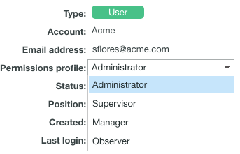

# Proof Permissions Profiles in [!DNL Workfront Proof]

>[!IMPORTANT]
>
>This article refers to functionality in the standalone product [!DNL Workfront Proof]. For information on proofing inside [!DNL Adobe Workfront], see [Proofing](../../../review-and-approve-work/proofing/proofing.md).

As a [!DNL Workfront] administrator or [!DNL Workfront Proof] administrator, you can assign a Proof Permissions Profile to a user to specify the proofing capabilities that user will have for all proofs in the system. For information about configuring a user's Proof Permission Profile, see [Configure a user's Proof Permission Profile in [!DNL Workfront Proof]](../../../workfront-proof/wp-acct-admin/account-settings/config-user-pref-in-wp.md).

>[!NOTE]
>
>You can also do the following:
>
>* Grant users specific roles on individual proofs. For more information about proof roles, see [Manage Proof Roles in [!DNL Workfront Proof]](../../../workfront-proof/wp-work-proofsfiles/share-proofs-and-files/manage-proof-roles.md).
>* Create custom profiles for users in your organization. For more information, see [Configure custom profiles in [!DNL Workfront Proof]](../../../workfront-proof/wp-acct-admin/account-settings/configure-custom-profiles.md).
>

The following table displays the permissions available with each Proof Permissions Profile.

| **Own Items** |||||**Other Users' Items** |||**Admin** |**Billing** |
|---|---|---|---|---|---|---|---|---|---|
|   |**Add** |**View** |**Edit** |**Delete** |**View** |**Edit** |**Delete** |**Edit and Delete** |**Edit** |
| Billing Admin | | | | | | | | | |
| Admin | | | | | | | | |&nbsp; |
| Supervisor | | | | | | | |&nbsp; |&nbsp; |
| Manager | | | | |&nbsp; |&nbsp; |&nbsp; |&nbsp; |&nbsp; |
| Observer |&nbsp; | |&nbsp; |&nbsp; |&nbsp; |&nbsp; |&nbsp; |&nbsp; |&nbsp; |
| Visitor |&nbsp; | |&nbsp; |&nbsp; |&nbsp; |&nbsp; |&nbsp; |&nbsp; |&nbsp; |

{style="table-layout:auto"}

Consider the following about roles and permissions:

* Assigned profile permissions relate only to the users and items in your own account. The exception is in the case of Satellite accounts, where the Administrator and Billing Administrator for the main (hub) accounts can access and manage the account settings and billing of those accounts from the hub account level.
* Billing Administrators and Administrators can delete users. This can only be done in Account settings.
* When Billing Administrators and Administrators view proofs that are owned by other users in their account, they view them with the role of a Reviewer.
* Using the Read Only role, Billing Administrators and Administrators can access proofs in folders shared with them or in folders created by them.

The following sections describe each profile and the permissions associated with the profile in a standard [!DNL Workfront Proof] setup:

* [Billing Administrator](#billing-administrator) 
* [Administrator](#administrator) 
* [Supervisor](#supervisor) 
* [Manager](#manager) 
* [Observer](#observer) 
* [Visitor](#visitor) 
* [Guest](#guest)

## Billing Administrator {#billing-administrator}

Billing Administrators have access to [Account settings in [!DNL Workfront Proof]](../../../workfront-proof/wp-acct-admin/account-settings/account-settings.md) and [The [!DNL Workfront Proof] Billing Page](../../../workfront-proof/wp-billingsettings/manage-your-billing/wp-billing-page.md), and have the following permissions:

Can generate proofs, upload files, and create folders. For more information, see [Generate Proofs in [!DNL Workfront Proof]](../../../workfront-proof/wp-work-proofsfiles/create-proofs-and-files/generate-proofs.md), [Upload Files and Web Content to [!DNL Workfront Proof]](../../../workfront-proof/wp-work-proofsfiles/create-proofs-and-files/upload-files-web-content.md), and [Create Folders in [!DNL Workfront Proof]](../../../workfront-proof/wp-work-proofsfiles/organize-your-work/create-folders.md).

Can view, edit, and delete own proofs and files they create.

Can view, edit, and delete proofs and files created by all users in the organization.

Can delete the public folders of other users. For more information, see [Manage Folders in [!DNL Workfront Proof]](../../../workfront-proof/wp-work-proofsfiles/organize-your-work/manage-folders.md).

Has edit rights on all proofs created in the account.

Can be set as the Dropzone owner. For more information, see [Configure the dropzone in [!DNL Workfront Proof]](../../../workfront-proof/wp-acct-admin/account-settings/configure-dropzone-in-wp.md).

Can access the billing page and edit the billing details. For more information, see [The [!DNL Workfront Proof] Billing Page](../../../workfront-proof/wp-billingsettings/manage-your-billing/wp-billing-page.md).

Can access the Account Settings page and edit the account details. For more information, see [Account settings in [!DNL Workfront Proof]](../../../workfront-proof/wp-acct-admin/account-settings/account-settings.md).

Can empty the trash. For more information, see [Restore and Empty the Trash in [!DNL Workfront Proof]](../../../workfront-proof/wp-work-proofsfiles/manage-your-work/restore-and-empty-trash.md).

Can add, edit, and delete users.

Can create groups and add new contacts.

Can delete contacts.

Can edit proofs if there are no replies on them.

Cannot edit proof replies.

Cannot delete the private folders of other Users. For more information, see [Manage Folders in [!DNL Workfront Proof]](../../../workfront-proof/wp-work-proofsfiles/organize-your-work/manage-folders.md).

For information on Account settings, see [Account settings in [!DNL Workfront Proof]](../../../workfront-proof/wp-acct-admin/account-settings/account-settings.md).

For information on Billing, see [The [!DNL Workfront Proof] Billing Page](../../../workfront-proof/wp-billingsettings/manage-your-billing/wp-billing-page.md).

### Administrator {#administrator}

Administrators have access to [Account settings](https://support.workfront.com/hc/en-us/sections/115000912147-Account-Settings)and have the following permissions:

Can create proofs, upload files, and create folders. For more information, see [Generate Proofs in [!DNL Workfront Proof]](../../../workfront-proof/wp-work-proofsfiles/create-proofs-and-files/generate-proofs.md), [Upload Files and Web Content to [!DNL Workfront Proof]](../../../workfront-proof/wp-work-proofsfiles/create-proofs-and-files/upload-files-web-content.md), and [Create Folders in [!DNL Workfront Proof]](../../../workfront-proof/wp-work-proofsfiles/organize-your-work/create-folders.md).

Can view, edit, and delete proofs and files they created.

Can view, edit, and delete proofs and files created by all users in the organization.

Can delete the public folders of other Users. For more information, see [Manage Folders in [!DNL Workfront Proof]](../../../workfront-proof/wp-work-proofsfiles/organize-your-work/manage-folders.md).

Has edit rights on all proofs created in the account.

Can be set as the Dropzone owner. For more information, see [Configure the dropzone in [!DNL Workfront Proof]](../../../workfront-proof/wp-acct-admin/account-settings/configure-dropzone-in-wp.md).

Can access the Account Settings page and edit the account details. For more information, see [Account settings in [!DNL Workfront Proof]](../../../workfront-proof/wp-acct-admin/account-settings/account-settings.md).

Can empty the trash. For more information, see [Restore and Empty the Trash in [!DNL Workfront Proof]](../../../workfront-proof/wp-work-proofsfiles/manage-your-work/restore-and-empty-trash.md).

Can add, edit, and delete users.

Can create groups and add new contacts.

Can delete contacts.

Can edit proofs if there are no replies on them.

Cannot edit proof replies.

Cannot delete the private folders of other Users. For more information, see [Manage Folders in [!DNL Workfront Proof]](../../../workfront-proof/wp-work-proofsfiles/organize-your-work/manage-folders.md).

Cannot access the Billing pageor edit the billing details. For more information, see [The [!DNL Workfront Proof] Billing Page](../../../workfront-proof/wp-billingsettings/manage-your-billing/wp-billing-page.md).

### Supervisor {#supervisor}

Supervisors have the following permissions:

Can create proofs, upload files, and create folders. For more information, see [Generate Proofs in [!DNL Workfront Proof]](../../../workfront-proof/wp-work-proofsfiles/create-proofs-and-files/generate-proofs.md), [Upload Files and Web Content to [!DNL Workfront Proof]](../../../workfront-proof/wp-work-proofsfiles/create-proofs-and-files/upload-files-web-content.md), and [Create Folders in [!DNL Workfront Proof]](../../../workfront-proof/wp-work-proofsfiles/organize-your-work/create-folders.md).

Can view, edit, and delete own proofs and files they created.

Can view, edit, and delete proofs and files created by all users in the organization.

Can delete the public folders of other Users. For more information, see [Manage Folders in [!DNL Workfront Proof]](../../../workfront-proof/wp-work-proofsfiles/organize-your-work/manage-folders.md).

Has edit rights on all proofs created in the account.

Can be set as the Dropzone owner. For more information, see [Configure the dropzone in [!DNL Workfront Proof]](../../../workfront-proof/wp-acct-admin/account-settings/configure-dropzone-in-wp.md).

Can create groups and add new contacts.

Can delete contacts.

Can edit proofs if there are no replies on them.

Cannot edit proof replies.

Cannot delete the private folders of other Users. For more information, see [Folders in [!DNL Workfront Proof]](../../../workfront-proof/wp-work-proofsfiles/organize-your-work/folders.md).

Cannot access the Billing page or Account settings. For more information, see [The [!DNL Workfront Proof] Billing Page](../../../workfront-proof/wp-billingsettings/manage-your-billing/wp-billing-page.md) and [Account settings in [!DNL Workfront Proof]](../../../workfront-proof/wp-acct-admin/account-settings/account-settings.md).

Cannot add, edit, or delete users.

Cannot empty the trash. For more information, see [Restore and Empty the Trash in [!DNL Workfront Proof]](../../../workfront-proof/wp-work-proofsfiles/manage-your-work/restore-and-empty-trash.md).

### Manager {#manager}

Managers have the following permissions:

Can create proofs, upload files, and create folders. For more information, see [Generate Proofs in [!DNL Workfront Proof]](../../../workfront-proof/wp-work-proofsfiles/create-proofs-and-files/generate-proofs.md), [Upload Files and Web Content to [!DNL Workfront Proof]](../../../workfront-proof/wp-work-proofsfiles/create-proofs-and-files/upload-files-web-content.md), and [Create Folders in [!DNL Workfront Proof]](../../../workfront-proof/wp-work-proofsfiles/organize-your-work/create-folders.md).

Can view, edit, and delete own proofs and files they create or own.

Can see, review, and approve proofs of other users that are explicitly shared with them (Read-only rights to everything in a shared folder). For more information, see [Manage Proof Roles in [!DNL Workfront Proof]](../../../workfront-proof/wp-work-proofsfiles/share-proofs-and-files/manage-proof-roles.md).

Can create groups and add a new contact.

Cannot view, edit, or delete proofs and files created by other users in the organization.

Cannot edit proofs or replies.

Cannot delete the private folders of other Users. For more information, see [Manage Folders in [!DNL Workfront Proof]](../../../workfront-proof/wp-work-proofsfiles/organize-your-work/manage-folders.md).

Cannot delete the public folders of other Users. For more information, see [Manage Folders in [!DNL Workfront Proof]](../../../workfront-proof/wp-work-proofsfiles/organize-your-work/manage-folders.md).

Cannot access the Billing page or Account settings. For more information, see [The [!DNL Workfront Proof] Billing Page](../../../workfront-proof/wp-billingsettings/manage-your-billing/wp-billing-page.md) and [Account settings in [!DNL Workfront Proof]](../../../workfront-proof/wp-acct-admin/account-settings/account-settings.md).

Cannot be set as the Dropzone owner. For more information, see [Configure the dropzone in [!DNL Workfront Proof]](../../../workfront-proof/wp-acct-admin/account-settings/configure-dropzone-in-wp.md).

Cannot empty the trash. For more information, see [Restore and Empty the Trash in [!DNL Workfront Proof]](../../../workfront-proof/wp-work-proofsfiles/manage-your-work/restore-and-empty-trash.md).

Cannot add, edit, or delete users.

Cannot delete contacts. 

### Observer {#observer}

Observers have the following permissions:

Can see, review, and approve proofs of other users that are explicitly shared with them (Read-onlyrights to everything in a shared folder). For more information, see [Manage Proof Roles in [!DNL Workfront Proof]](../../../workfront-proof/wp-work-proofsfiles/share-proofs-and-files/manage-proof-roles.md).

Can view files that are explicitly shared with them.

 Can view contacts and groups

Cannot create proofs, upload files, and create folders. For more information, see [Upload Files and Web Content to [!DNL Workfront Proof]](../../../workfront-proof/wp-work-proofsfiles/create-proofs-and-files/upload-files-web-content.md).

Cannot view, edit, or delete proofs and files created by other users in the organization.

Cannot edit proofs or replies.

Cannot delete any items created in the organization.

Cannot access the Billing page or Account settings. For more information, see [The [!DNL Workfront Proof] Billing Page](../../../workfront-proof/wp-billingsettings/manage-your-billing/wp-billing-page.md) and [Account settings in [!DNL Workfront Proof]](../../../workfront-proof/wp-acct-admin/account-settings/account-settings.md).

Cannot be set as the Dropzone owner. For more information, see [Configure the dropzone in [!DNL Workfront Proof]](../../../workfront-proof/wp-acct-admin/account-settings/configure-dropzone-in-wp.md).

Cannot empty the trash. For more information, see [Restore and Empty the Trash in [!DNL Workfront Proof]](../../../workfront-proof/wp-work-proofsfiles/manage-your-work/restore-and-empty-trash.md).

Cannot add, edit, or delete users.

Cannot create groups or add new contacts.

Cannot delete contacts.

>[!NOTE]
>
>Menus and functions available to Observers are limited.
>
>* Observers do not see the Header menu or the green New menu in their Dashboard
>* Observers do not see the following links in their Settings: Account settings, Billing 
>

### Visitor {#visitor}

Visitors have the following permissions:

Can see, review, and approve proofs of other users that are explicitly shared with them (Read-only rights to everything in a shared folder). For more information, see [Manage Proof Roles in [!DNL Workfront Proof]](../../../workfront-proof/wp-work-proofsfiles/share-proofs-and-files/manage-proof-roles.md).

Can view files that are explicitly shared with them.

 Cannot view contacts and groups

Cannot create proofs, upload files, and create folders. For more information, see [Upload Files and Web Content to [!DNL Workfront Proof]](../../../workfront-proof/wp-work-proofsfiles/create-proofs-and-files/upload-files-web-content.md).

Cannot view, edit, or delete proofs and files created by other users in the organization.

Cannot edit proofs or replies.

Cannot delete any items created in the organization.

Cannot access the Billing page or Account settings. For more information, see [The [!DNL Workfront Proof] Billing Page](../../../workfront-proof/wp-billingsettings/manage-your-billing/wp-billing-page.md) and [Account settings in [!DNL Workfront Proof]](../../../workfront-proof/wp-acct-admin/account-settings/account-settings.md).

Cannot be set as the Dropzone owner. For more information, see [Configure the dropzone in [!DNL Workfront Proof]](../../../workfront-proof/wp-acct-admin/account-settings/configure-dropzone-in-wp.md).

Cannot empty the trash. For more information, see [Restore and Empty the Trash in [!DNL Workfront Proof]](../../../workfront-proof/wp-work-proofsfiles/manage-your-work/restore-and-empty-trash.md).

Cannot add, edit, or delete users.

Cannot create groups or add new contacts.

Cannot delete contacts.

>[!NOTE]
>
>Menus and functions available to Visitors are limited.
>
>* Visitors do not see the Header menu or the green New menu in their Dashboard
>* Visitors do not see the following links in their Settings: Account settings, Billing 
>

### Guest {#guest}

The Guest profile is used to give access to proofs for reviewers who do not have their own Workfront Proof account. Guests can access proofs shared with them directly via their personal email notifications.

Can view, review, and approve proofs that are explicitly shared with them.

Can view files that are explicitly shared with them.

Cannot access the Dashboard.

Cannot have folders shared with them. For more information, see [Manage Folders in [!DNL Workfront Proof]](../../../workfront-proof/wp-work-proofsfiles/organize-your-work/manage-folders.md).

Cannot be added as Authors or Moderators to the proofs. For more information, see [Manage Proof Roles in [!DNL Workfront Proof]](../../../workfront-proof/wp-work-proofsfiles/share-proofs-and-files/manage-proof-roles.md).

>[!NOTE]
>
>Guests are not Workfront Proof users, so they cannot see all the proofs shared with them in their own Dashboard.

## Edit a user's Proof Permission Profile

Administrators and Billing Administrators can edit the permission profiles of all users in the account.

1. To find the user to edit, do one of the following:

   * Navigate to **[!UICONTROL Account Settings]**, then click the **[!UICONTROL Users]** tab.
   
   * Go to the **[!UICONTROL Contacts]** page.

1. Click the user's name whose permissions you want to edit. 

1. Click the **[!UICONTROL Permissions profile]** drop-down menu and select a new permission profile. :

   

   Permission profiles are Administrator, Supervisor, Manager, and Observer.

1. Click anywhere outside of the menu to save.

>[!NOTE]
>
>Administrators cannot assign the Billing Administrator profile. You can find a list of Profile changes in the following logs: 
>
>* The Account activity logs 
>* The User's profile log (accessible only to that User) 
>

For more information on activity logs, see [Understanding the [!DNL Workfront Proof] Activity Audit Trail](../../../workfront-proof/wp-work-proofsfiles/basic-features/activity-audit-trail.md).
