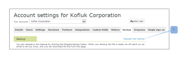

# Request a new data backup in Workfront Proof

>[!IMPORTANT]
>
>This article refers to functionality in the standalone product Workfront Proof. For information on proofing inside Adobe Workfront, see [Proofing](../../../review-and-approve-work/proofing/proofing.md).

After requesting a backup of proofing data, you can request that a new backup of the data be created. For more information about data backups, see [Back Up Your Workfront Proof Data](../../../workfront-proof/wp-work-proofsfiles/organize-your-work/back-up-data.md).

1. In the top-right corner of the window, click **Settings**.
1. Click **Account Settings** from the drop-down menu, then open the&nbsp;**Backup** tab.

1. Click **Request New Backup**.  
     
   The data is sent to you as a zip file. &nbsp;

