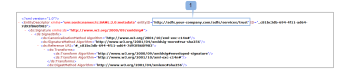
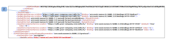

# Single Sign-On in [!DNL Workfront] Proof: AD FS configuration

>[!IMPORTANT]
>
>This article refers to functionality in the standalone product [!DNL Workfront] Proof. For information on proofing inside [!DNL Adobe Workfront], see [Proofing](../../../review-and-approve-work/proofing/proofing.md).

If you are an administrator on your AD server, you can install and configure AD FS.

## Installing and Configuring AD FS

1. Download [AD FS 2.0](http://www.microsoft.com/en-us/download/details.aspx?id=10909)&nbsp;to your computer.&nbsp;
1. Open&nbsp;the downloaded AdfsSetup.exe file to start the ADFS (Active Directory Federation Services) Installation Wizard.
1. On the Server Role screen, select one of the options&nbsp;(you need at a minimum a Federation Server).
1. &nbsp;If you do not want&nbsp;to expose IIS on your AD server to the internet (ports 80 and 443 for HTTP and HTTPS), you can first set up a Federation Server behind the firewall, then build a second Federation Server Proxy&nbsp;that passes requests through the firewall to the Federation Server.
1. Once you complete the&nbsp;AD FS setup, select **[!UICONTROL Start the AD] FS 2.0 Management snap-in**&nbsp;, then click **Finish.**&#x200B;Once this is completed, the AD FS 2.0 Management window should open right away. If not, you can open it from&nbsp;**Start** > **Administrative Tools** > **AD FS 2.0 Management**. This is&nbsp;the main AD FS control application.

1. Begin by clicking AD FS 2.0 Federation Server Configuration Wizard.\
   This will help you to configure&nbsp;AD FS and connect it&nbsp;to both the Internet via IIS and to AD.
1. If you are configuring a new AD FS server, select **[!UICONTROL Create a new Federation Service]**.
1. Select **Stand-alone federation server**&nbsp;(for testing and evaluation purposes).

1. &nbsp;For high availability and load balancing, click New federation server farm.&nbsp;
1. Specify your Federation Service name.\
   By default the&nbsp;configuration&nbsp;wizard retrieves the SSL certificate bound to the Default Web Site in IIS&nbsp;and will use the subject name specified there. If you use a wildcard certificate you will need to enter the Federation Service name.\
   If there is no SSL certificate configured in IIS, then the configuration wizard will search in the local computer certificate store for any valid certificates. These display in the SSL certificate drop-down. If there are no certificates found, you can&nbsp;use the&nbsp;Server Certificate Generator in IIS&nbsp;to create one.

1. Continue with the configuration, and click **[!UICONTROL Close]** once it is complete.

## Configuring [!DNL Workfront] Proof Single Sign-On

If you are a Workfront Proof administrator, you can configure Single Sign-On on the Workfront Proof side.&nbsp;For more information, see [Single Sign-On in Workfront Proof](../../../workfront-proof/wp-acct-admin/managing-security/single-sign-on-overview.md).

1. Click **[!UICONTROL Settings]** > **[!UICONTROL Account Settings]**, then open the&nbsp;**[!UICONTROL Single sign-on]** tab.

1. In the&nbsp;**SSO URL**&#x200B;box, paste your Entity ID.\
   The following is an example of an Entity ID:\
   http://*<adfs.your-company.com>*/adfs/services/trust\
   Your Entity ID can be found in your Federation Metadata XML file.\
   

1. &nbsp;Federation Metadata is&nbsp;found in the AD FS 2.0 snap-in > Service > Endpoints folder. In the Metadata section, locate the one with the Federation Metadata type. To view metadata, paste this endpoint in your browser. You can also go to this link directly:&nbsp;https://*<adfs.your-company.com>*/FederationMetadata/2007-06/FederationMetadata.xml after replacing the {adfs.your-company.com}&nbsp;with your own details.
1. In the **[!UICONTROL Login URL]** box, paste your SSO login.
1. The following is an example of an SSO login:
1. http://*<adfs.your-company.com>*/adfs/ls.
1. This link&nbsp;can be located&nbsp;in the Federation Metadata XML file.\
   

1. In the&nbsp;**Logout URL** box, enter&nbsp;the link and save.\
   The following is an example of a Logout URL:\
   https://*<adfs.your-company.com>*/adfs/ls/?wa=wsignout1.0

   1. Go to your AD FS manager >&nbsp;Trust Relationships >&nbsp;Relying Party Trusts - ProofHQ&nbsp;properties.
   1. Under the Endpoints, click [!UICONTROL Add and entry] with the following details:

      * Endpoint Type = SAML Logout
      * Binding = POST
      * URL = https://*<adfs.your-company.com*>/adfs/ls/?wa=wsignout1.0
      * This step can be completed after configuring the Relying Party Trust (see below) in your AD FS.
   1. In the **[!UICONTROL Certificate fingerprint]** box, enter the data from your certificate.
   1. Go to your&nbsp;ADFS 2.0 snap-in&nbsp;navigate to Service > Certificates > Token-signing.
   1. Right-click on this entry to view the certificate.
   1. From the [!UICONTROL Certificate Details] tab copy the Thumbprint, and paste it in the **[!UICONTROL Workfront Proof Single Sign-On]** configuration tab.

   1. &nbsp;The fingerprint characters can be separated with colons or spaces, but we do recommend removing these. If you have any troubles with your Single Sign-On configuration, please contact the Customer Support team.

## Adding a Relying Party Trust

Once configuration is complete, you need to work in the&nbsp;Relying Party Trusts section in your AD FS.

1. Navigate to **[!UICONTROL Trust Relationships]** > **[!UICONTROL Relying Party Trusts]**&nbsp;folder, then click **[!UICONTROL Add a Relying Party Trust]** to&nbsp;start the configuration wizard.

1. Select your data source.\
   All metadata for your [!DNL ProofHQ] account is located under a link like this:\
   https://`<yoursubdomain*>`.proofhq.com/saml/module.php/saml/sp/metadata.php/phq\
   This will configures most of the Relying Party Trust.

   >[!NOTE]
   >
   >* If you're having any troubles with establishing the connection from the URL, save the metadata as a file and choose to import data from a file.
   >* When you have a full Custom domain (e.g., www.your-proofing.com) configured on your [!DNL ProofHQ] account replace the whole "{yoursubdomain}.proofhq.com" part with your own domain to create your [!DNL ProofHQ] metadata link.

## Configuring Claim Rules

Once your Relying Party Trust configuration is complete, you are ready to configure the claim rules to complete the set up. You will configure two claim rules for ProofHQ: E-mail and Name ID.

1. Open the **[!UICONTROL Edit Claim Rules]** dialog box.
1. Go to **[!UICONTROL ProofHQ Relying Party Trust]**, then click **Edit Claim Rules**&nbsp;(1).\
   The pop-up should automatically open if you selected this option at the end of configuring the trust.

1. Click **[!UICONTROL Add Rule]** (2) to open the claim configuration window.

   * E-mail (Send LDAP Attributes as Claims rule template)
   * NameID (Transform an Incoming Claim rule template)
