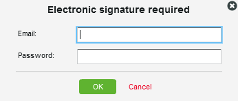

# Understanding electronic signatures in [!DNL Workfront Proof]

>[!IMPORTANT]
>
>This article refers to functionality in the standalone product [!DNL Workfront Proof]. For information on proofing inside [!DNL Adobe Workfront], see [Proofing](../../../review-and-approve-work/proofing/proofing.md).

Electronic signatures allow you to enhance security on your proofs and comply with industry standards such as ISO.

This setting can be made mandatory or non-mandatory at the account level. If it is mandatory by default, it is enabled on all proofs created in your account and cannot be disabled at proof level. If this setting is non-mandatory by default, you will be able to enable/disable it at a proof level.

For more information, see .

When the electronic-signature setting is enabled on a proof, an electronic-signature box prompts any reviewer who makes a decision on the proof to provide their email and password.

## Electronic Signatures on the [!UICONTROL Proof Details] Page

If a reviewer makes their decision by selecting their decision on the [!UICONTROL Proof details] page (1) an [!UICONTROL Electronic Signature] pop up box will appear asking them to input their details (2) and to confirm their decision (3).

The pop-up will display the default message set (if any) and the reviewer will be required to input their email and password.

The [!UICONTROL Electronic Signature] pop up will show up in the proofing viewer and also on the [!UICONTROL Proof details] page if the reviewer decides to make their decision from that level.

If the [!UICONTROL Single Sign-On] option is enabled on the proof, the email and password details will not be displayed in the [!UICONTROL Electronic Signature] pop up when making a decision.

Instead, after clicking the [!UICONTROL Confirm] (4) button on this pop up the reviewer will be redirected to the [!UICONTROL Single Sign-On] page.

After entering their SSO credentials the reviewer will automatically be re-directed back to the [!UICONTROL Proof details] page (or back to the [!UICONTROL Proof Viewer] if the decision is made from there).

>[!NOTE]
>
> If the decision is electronically signed, the **[!UICONTROL signature icon]** (5) appears next to the decision in the [!UICONTROL Workflow] section on the [!UICONTROL Proof details] page. If the decision is changed not by the reviewer but by another person who has edit rights on the proof, that person will not be asked to electronically sign the decision and there will be no signature icon next to the decision (6).

For information single sign-on, see [Single Sign-On in Workfront Proof](../../../workfront-proof/wp-acct-admin/managing-security/single-sign-on-overview.md).

For information about the Proof details page, see [Manage Proof Details in [!DNL Workfront] Proof](../../../workfront-proof/wp-work-proofsfiles/manage-your-work/manage-proof-details.md). 
