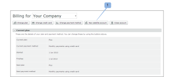

# Configure a satellite account in Workfront Proof

>[!IMPORTANT]
>
>This article refers to functionality in the standalone product Workfront Proof. For information on proofing inside Adobe Workfront, see [Proofing](../../../review-and-approve-work/proofing/proofing.md).

Satellite accounts are paid accounts that&nbsp;you configure and manage from within your own Workfront Proof account. For more information, see " [Satellite accounts in Workfront Proof](../../../workfront-proof/wp-acct-admin/satellite-accounts/sat-accts-in-wp.md).

Any Billing Administrator can create a Satellite account. For information about Billing Administrators, see [Proof Permissions Profiles in Workfront Proof](../../../workfront-proof/wp-acct-admin/account-settings/proof-perm-profiles-in-wp.md).

>[!NOTE]
>
>&nbsp;Satellite accounts must be set on one of our Standard or higher plans.

## Creating a Satellite account {#creating-a-satellite-account}

To create a Satellite account:

1. Go to the Billing page.  
   For more information about the billing page, see&nbsp; [The Workfront Proof Billing Page](../../../workfront-proof/wp-billingsettings/manage-your-billing/wp-billing-page.md).

1. Click the **New Satellite** account button. (1)

   A pop-up window appears.

   

1. Enter the details of your client, including any relevant promo codes.
1. Click **Save**The Satellite account appears automatically within the Accounts drop-down menu at the top of the Billing page.
1. Select the new Satellite account from the drop-down menu.
1. Continue with [Selecting a plan for your Satellite account](#selecting-a-plan-for-your-satellite-account) to upgrade your Satellite account.

## Selecting a plan for your Satellite account {#selecting-a-plan-for-your-satellite-account}

After you have set up the Satellite account as described in [Creating a Satellite account](#creating-a-satellite-account), you need to upgrade it to the desired plan.

1. Go to the Billing page.  
   For more information about the billing page, see&nbsp; [The Workfront Proof Billing Page](../../../workfront-proof/wp-billingsettings/manage-your-billing/wp-billing-page.md).

1. In the **Your accounts** drop-down menu at the top of the page (1), choose the relevant Satellite account.

   The billing page for the Satellite account appears, and the billing contact details from your account are automatically replicated.

   

1. Click the **Change Plan** button in the upper-right of the page. (2)  
   Or  
   Open the pop-up by clicking your current or next plan name. (3)

1. Upgrade or downgrade your plan.

## Adding users to your Satellite account

After you have upgraded the Satellite account to your chosen plan, you need to add users to the account.

1. Log in to Workfront Proof as the Workfront Proof administrator.
1. Click **Account Settings**.&nbsp;
1. In the drop-down menu at the top of the page, select the relevant Satellite account. (1)  
   The account settings page for the Satellite account appears.
1. Click the **New user** button in the upper-right of the page. (2)  
   The New User page displays.

1. Enter the user's details, then click **Save**.  
   The user receives an email notification giving them access to the account.

Users added to the Satellite account appear as members in the contact list of the hub account.

Similarly, users in the hub account appear as members in the contacts of the Satellite account.

To see a full list of all users in the Satellite account, click the **Users** tab.

 

## Linking existing separate accounts to your hub account

If you previously created other separate accounts for your clients, these can be converted to Satellite accounts.

We will take care of this for you by linking them to your Workfront Proof account (making it a hub account).

All you need to do is provide us with the following details:

* The name of your Workfront Proof account and the email address you used to set it up
* The names of the separate accounts you want linked to your account and the email addresses used to set up the separate accounts.

