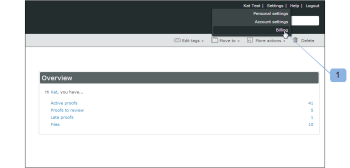
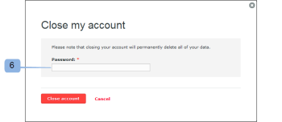

# Close your [!DNL Workfront Proof] account

>[!IMPORTANT]
>
>This article refers to functionality in the standalone product [!DNL Workfront Proof]. For information on proofing inside [!DNL Adobe Workfront], see [Proofing](../../../review-and-approve-work/proofing/proofing.md).

 After completing the steps in this section, your account will be closed immediately. All data in your account will be deleted and cannot be restored.

We are continuously trying to improve our product. If you do wish to close your account, we would be grateful if you could take a few minutes and let us know how we can improve.

You can contact us at [!DNL support@proofhq.com] with your comments; all feedback is welcome.

1. Open the [!UICONTROL Billing] page in your account by opening the [!UICONTROL Settings] menu and choosing **[!UICONTROL Billing]** (1).

   For more information about the Billing page, see [The [!DNL Workfront] Proof Billing Page](../../../workfront-proof/wp-billingsettings/manage-your-billing/wp-billing-page.md).

   

1. Click the **[!UICONTROL Close account]** button (3).

   

1. Select your reason for closing the account. (4)
1. Confirm your decision by clicking **[!UICONTROL Save]**. (5)

   

1. Enter your password to close your account. (6)

   
