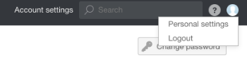
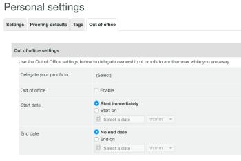

# Designating Temporary Proof Owners in [!DNL Workfront Proof]

>[!IMPORTANT]
>
>This article refers to functionality in the standalone product [!DNL Workfront Proof]. For information on proofing inside [!DNL Adobe Workfront], see [Proofing](../../../review-and-approve-work/proofing/proofing.md).

If you are going to be out of the office for an extended period of time, you can delegate ownership of your proofs to another user in your account. 

>[!NOTE]
>
>This function is available only in [!DNL Workfront Proof]. 

To designate temporary ownership of your proofs: 

1. Within [!DNL Workfront Proof], go to **[!UICONTROL Personal settings]**.\
   

1. Click the **[!UICONTROL Out of office]** tab. The following settings are available:

   * **[!UICONTROL Delegate your proofs to]** another user in your account.
   * Enable and disable the **[!UICONTROL Out of office]** function by checking or unchecking the checkbox.
   * Select the **[!UICONTROL Start date]**.

      If the **[!UICONTROL Start immediately]** option is chosen, ownership of the proofs will be delegated to the selected user immediately after you activate the feature.

      If a specific start date and time are set, the feature will be activated on the selected day and at the chosen time.

   * Select the **[!UICONTROL End date]**.

      If no end date is chosen, the ownership of the proofs will be delegated until the feature is manually disabled.

      If a specific end date and time are set, the feature will be disabled on the selected day and at the chosen time.

      

1. When proofs are delegated, the delegated owner is shown in the **[!UICONTROL Details]** section of the proof details page. The ownership delegation note appears in the **[!UICONTROL Activity]** section of the proof details page.

   

   An [!UICONTROL Out of Office] notification is also shown in the original proof owner's account during the time the feature is enabled. This acts as a reminder to the original owner and also allows them to end the delegation immediately or go to [!UICONTROL Personal settings] to adjust this.

   

   When ownership of your proofs is taken back by the original owner, the delegated owner disappears from the [!UICONTROL Details] section of the proof details page and the [!UICONTROL Out of Office] notification is no longer displayed in the original proof owner's account. A note showing that proof ownership has been reverted appears in the [!UICONTROL Activity] section of the proof details page.

   >[!NOTE]
   >
   >The delegated owner remains on the proof workflow unless you manually remove them.

   ![[!UICONTROL activity-section-taken-back].png](assets/activity-section-taken-back-350x99.png)
