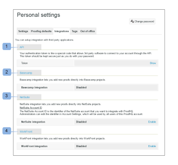

# Integrations - User Setup

>[!IMPORTANT]
>
>This article refers to functionality in the standalone product [!DNL Workfront Proof]. For information on proofing inside [!DNL Adobe Workfront], see [Proofing](../../../review-and-approve-work/proofing/proofing.md).

This section shows you the options you have for setting up pre-built integration links with third-party applications.

This is also where you can find your authentication token that allows third party software to connect to your account through the API.

Current integration points are available for the following:

* Public API (1) - See our dedicated [API help page](https://api.proofhq.com/) 
* [!DNL Basecamp] (2) - See our dedicated [[!DNL Basecamp]](https://support.workfront.com/hc/en-us/sections/115000911927-Basecamp) and [[!DNL Basecamp Classic]](https://support.workfront.com/hc/en-us/categories/115000588707-Basecamp-Classic) help pages

* [!DNL NetSuite] (3)
* [!DNL WorkFront] (4)

