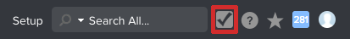

# Preview Sandbox Testing Environment- [!DNL Workfront Proof]

>[!IMPORTANT]
>
>This article refers to functionality in the standalone product [!DNL Workfront Proof]. For information on proofing inside [!DNL Adobe Workfront], see [Proofing](../../../review-and-approve-work/proofing/proofing.md).

The Preview Sandbox is a testing environment that serves as a replica of your live environment and is refreshed each weekend by [!DNL Workfront Proof]. 

## Understanding the Preview Sandbox

The Preview Sandbox serves as an environment where users in your organization can safely test and work with data from the Production environment without affecting the Production environment. It is ideal for running training sessions, testing out new features, and determining setup functionality. 

Also, new product features are uploaded to the Preview Sandbox environment before they are delivered to the Production environment. Your users can try out new functionality there without affecting their usual workflow in the Production environment.

The Preview Sandbox contains your actual production data. Data flows from Production to Preview, and not in reverse. It refreshes every weekend, so the data can be up to one week behind the Production environment. Items created since the last refresh time are in the Preview Sandbox environment until the following refresh.

## Accessing the Preview Sandbox

By default, as a system administrator, you have access to the Preview Sandbox environment. If you cannot access the Preview Sandbox environment as described in this section, contact your [!DNL Workfront] administrator or our Support team.

* [Accessing the Preview Sandbox as a Stand-Alone [!DNL Workfront Proof] Customer](#accessing-the-preview-sandbox-as-a-stand-alone-workfront-proof-customer)
* [Accessing the Preview Sandbox as a [!DNL Workfront]+[!DNL Workfront Proof] Customer](#accessing-the-preview-sandbox-as-a-workfrontworkfront-proof-customer)

### Accessing the Preview Sandbox as a Stand-Alone [!DNL Workfront Proof] Customer 

1. Navigate to this URL:  `https://preview.proofhq.com`.
1. Log in using your Preview credentials.\
   Your Preview credentials should be the same as your Production credentials unless you changed them in Production after the Preview refresh happened. The logins are synchronized only when a refresh occurs, which takes place every weekend. They do not synchronize automatically.

### Accessing the Preview Sandbox as a [!DNL Workfront+Workfront] Proof Customer 

As a system administrator, you can access the [!DNL Workfront Proof] Preview Sandbox via the [!DNL Workfront] interface. 

To access the [!DNL Workfront Proof] Preview Sandbox:

1. Log in to your [!DNL Workfront] environment.
1. Click **[!UICONTROL Setup]** in the Global Navigation bar.
1. Click **[!UICONTROL System]** >**[!UICONTROL Preferences]**.

1. In the **[!UICONTROL Test Environments]** section, click **[!UICONTROL Sandbox Preview]**.

1. Log in with your Preview credentials.\
   Your Preview credentials should be the same as your Production credential unless you changed them in Production after the Preview refresh happened. The logins are synchronized only when a refresh occurs. They do not synchronize automatically.
1. Click the [!DNL Workfront Proof] icon in the Global Navigation Bar.\
   \
   The [!DNL Workfront Proof] Preview environment displays.

## Receiving Emails from the Preview Sandbox

Email notifications are never triggered from the [!DNL Workfront Proof] Preview environment. 
