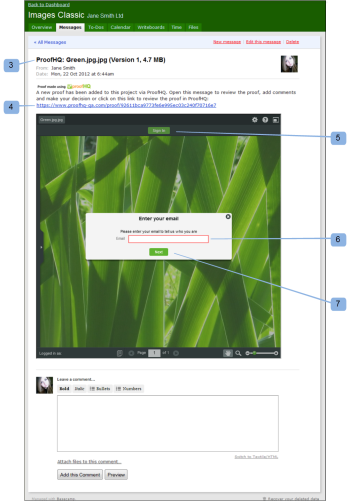

# Review a Proof in Basecamp Classic

>[!IMPORTANT]
>
>This article refers to functionality in the standalone product Workfront Proof. For information on proofing inside Adobe Workfront, see [Proofing](../../../review-and-approve-work/proofing/proofing.md).

Basecamp is an online project management tool developed by 37signals. If you use Basecamp for project management you can offer your project team richer review and approval tools using Workfront Proof.

## Understanding Proof Reviews in Basecamp Classic

When integrated with Workfront Proof, Basecamp allows users to do the following with proofs:

* Users can review and approve proofs within Basecamp Classic.
* Users have review tools readily available.
* Project review teams receive a message in Basecamp with a mini proof for review and approval.
* Users can switch to a full-page proof for review and approval.
* Users can add comments and markups to both mini- and full-sized proofs.  
* Once a comment has been replied to, it cannot be edited/deleted. For information about comments, see [Comment on a proof](../../../review-and-approve-work/proofing/reviewing-proofs-within-workfront/comment-on-a-proof/comment-on-proof.md).
* Reviewers can respond to the and markups made by other reviewers. For information about comments, see [Comment on a proof](../../../review-and-approve-work/proofing/reviewing-proofs-within-workfront/comment-on-a-proof/comment-on-proof.md).
* Users are alerted when a new version of proof is available.
* Users who are not Workfront Proof users can work on a proof in Basecamp.

## Viewing a Proof via the Notification Email

If you link a proof to Basecamp, Workfront Proof sends a proof notification email (1) to all reviewers, containing the following information:

* `Proof details` (2): Displays information about the proof. The information that displays depends on how your Workfront administrator has configured Basecamp.
* `Go to Proof link` (3): Opens the proof in Workfront.&nbsp;
* `Basecamp URL` (4): Opens the proof in Basecamp. If non-Basecamp reviewers are added to the proof, their email notification does not include the Basecamp link.
* `Proof progress` (5): Lists the stages of approval and displays the Proof progress indicators.
* `Stage` (6): Lists the reviewers and their individual progress.

To open the proof from the email notification:

1. To open the proof in Workfront Proof, click `Go To Proof`.  
   For information on reviewing a proof in Workfront Proof, see [Reviewing a Proof in the Legacy Proofing Viewer](../../../review-and-approve-work/proofing/reviewing-proofs-within-workfront/review-proof-in-legacy-proofing-viewer.md).  
   Or  
   To open the proof in Basecamp, click the URL listed in the `Basecamp URL` field.  
   For information on reviewing a proof in Basecamp Classic, see [Reviewing a Proof in Basecamp](#reviewing-your-proof-in-basecamp) in this article.

## Viewing the Proof via the Basecamp Classic Message

You can access a proof from a Basecamp Classic message.&nbsp;

1. In Basecamp, go to your project page (1).  
   

1. Click the message for the proof you want to open. (2)  
   The message for the proof opens, displaying a mini proof. The name of the proof displays at the top of the message window (3).  
   You can either view the thumbnail proof in Basecamp Classic or in Workfront Proof.  
   

1. To view the proof in full-screen mode in Workfront proof, click the URL listed above the proof (4).
1. (Conditional) If you are not logged into your Workfront Proof account in one of your browser windows, log to review the proof:

  1. Click `Sign In`&nbsp;(5) above the proof.
  1. Type your email address (6).  
     You must use the same email address that was used when you were added to the proof.
  1. Click `Next`.
  1. Type your Workfront Proof password (7).  
     Or  
     If you do not have a Workfront Proof account, type a public name to display.   
     You can select "remember me" so you only have to input your details once.

1. To review the proof, continue with [Reviewing a Proof in Basecamp](#reviewing-your-proof-in-basecamp).

>[!NOTE]
>
>&nbsp;The comment box shown below the mini proof on the message page applies only to the message itself. To submit review comments, you must use the comments icon button at the top of the mini proof or the larger Comments button at the top of the full-page proof. For more information, see Reviewing a [Reviewing a Proof in Basecamp](#reviewing-your-proof-in-basecamp).

## Reviewing a Proof in Basecamp

The mini proof in Basecamp provides you with the tools you need to add and to make [Make a decision on a proof in the proofing viewer](../../../review-and-approve-work/proofing/reviewing-proofs-within-workfront/make-a-decision-on-a-proof/make-decisions-on-proof.md) on the proof. All users assigned to the project see your markups and comments and can respond with their own comments in a real time.

When you open the proof, the proof displays in the proofing window (1) and the name of the proof and version number displays in the upper-left corner (2).

To review the proof:

1. To add a comment, click Comment&nbsp;(3) at the top of the proof, and type your comment.  
   There is no need to send a response to the Basecamp message, as the comments and [Make a decision on a proof in the proofing viewer](../../../review-and-approve-work/proofing/reviewing-proofs-within-workfront/make-a-decision-on-a-proof/make-decisions-on-proof.md) saved to the proof (similar to reviewing a proof within Workfront Proof).

1. To add a decision, click&nbsp;Decision&nbsp;(3)&nbsp;at the top of the proof, and select your approval decision.  
   For more information on making decisions on a proof, see [Make a decision on a proof in the proofing viewer](../../../review-and-approve-work/proofing/reviewing-proofs-within-workfront/make-a-decision-on-a-proof/make-decisions-on-proof.md#making-a-decision-on-a-proof).

Other features on the proof window include:

* `Action menus` (4): Allows you to select settings for the proof.
* `Full-screen button` (5): Allows you to toggle between full-screen and mini-proof.
* `Sidebar` (6): Allows you to expand or shrink view of proof.
* `Username` (7): Displays your username if you are logged into Workfront.
* `Zoom tools` (8): Allows you to magnify an area of the proof.
* `Page navigation tools` (9): Allows you to scroll to other pages within the proof.

For more information on reviewing proofs, see [Legacy proofing viewer Overview](../../../workfront-proof/wp-work-proofsfiles/review-proofs-lpv/legacy-proofing-viewer.md).
