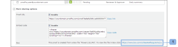

# View a Proof's Original File in Box

>[!IMPORTANT]
>
>This article refers to functionality in the standalone product [!DNL Workfront Proof]. For information on proofing inside [!DNL Adobe Workfront], see [Proofing](../../../review-and-approve-work/proofing/proofing.md).

If you are using the [!DNL Workfront Proof] - [!DNL Box] integration, in Box, you can view the original file used to create a proof. You can do this in two ways:

## Viewing the File in [!DNL Box] via Proof Email Notification

When a new proof or a new version is created from a [!DNL Box] file, the creator and reviewers receive an email notification that contains a link to the file in your [!DNL Box] account (1).\

## Viewing the File in [!DNL Box] via the [!UICONTROL Proof Details] Page

The [!UICONTROL More sharing options] section of the [!UICONTROL Proof details] page of the proof you created from a [!DNL Box] file includes a link to the file in your [!DNL Box] account (1).

