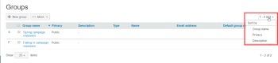

# Manage Groups using [!DNL Workfront Proof]

>[!IMPORTANT]
>
>This article refers to functionality in the standalone product [!DNL Workfront Proof]. For information on proofing inside [!DNL Adobe Workfront], see [Proofing](../../../review-and-approve-work/proofing/proofing.md).

As a [!DNL Workfront Proof] administrator, you can manage your public and private Groups on the Groups page.

## Opening the Groups Page

1. Click **[!UICONTROL Groups]** in the left navigation sidebar.
   On the [!UICONTROL Groups] page, you can:

   * View all your public and private Groups.
   * Create a new Group. For more information, see [Create Proofing Groups using [!DNL Workfront Proof]](../../../workfront-proof/wp-mnguserscontacts/groups/create-proofing-groups.md).
   * Export Groups to CSV file.
   * Filter and sort Groups.
   * After you select one or more Groups the following additional options are available:

      * Add people to the selected Groups.

         

      * Make the selected Groups private or public, as described in [Make Groups Private using [!DNL Workfront Proof]](../../../workfront-proof/wp-mnguserscontacts/groups/make-groups-private.md)
      * Private Groups are visible only to their creators.
      * Delete the selected Groups.

         
   * You can perform actions on Groups also on each Group separately from their own **[!UICONTROL More]** (three dot) menu:

      

      * View Group details.

         You can also view Group details by clicking on the Group name.
      * Add people.
      * Make a Group public/private.
      * Delete a Group.

## Sorting Groups

You can Sort Groups by Group name, privacy status, and description.

1. Click the column heading you want to sort by.
   Or
   Select a sorting option from the Sort menu.
   
   The triangle on a column heading indicates sorting order. Pointed upward, it indicates ascending order; pointing downward indicates descending order.

## Filtering Groups

1. Click the **[!UICONTROL Filter]** icon to the far-right of the column headings to display the filtering options below the column headings.
   

1. Select [!UICONTROL filtering options] from the dropdown menus and type in the filtering boxes that appear below each column header, then click the **[!UICONTROL Filter]** icon again to apply the options.
   Or\
   Select the first letter in the Group name.
   

## Viewing and Editing Group Details

1. Click the **[!UICONTROL More]** button to the far-right of the Group name, then click **[!UICONTROL View group details]** in the drop-down menu.
   On the page that appears, you can view all the people currently in the Group, along with their default roles and email alerts for the Group.

1. Do any of the following the edit the Group details:

   * Edit the Group name and Description by clicking it and typing. Clicking anywhere outside the field saves your changes.
   * Click **[!UICONTROL Privacy]** to change the Group privacy setting in the drop-down menu.
   * Click **[!UICONTROL Add to group]** to add new people to the Group.

      

   * Click **[!UICONTROL Delete group]** in the upper-right corner to delete the group.\

      

   * Click the checkbox at the beginning of a Group member's row and use any of the options that appear just above the list.
   * Click the **[!UICONTROL More]** icon at the end of a Group member's row and use any of the options in the drop-down menu.

      

## Adding Contacts to Groups

1. Click **[!UICONTROL Contacts]** in the left navigation panel to go to the **[!UICONTROL Contacts]** page.

1. Select the check boxes next to the name or names of the contacts you want to add to a group.
1. Click the **[!UICONTROL Add to group]** button.
   
   The **[!UICONTROL Add to group]** dialogue box appears.

1. In the **[!UICONTROL People]** section:

   1. Use the drop-down menus to change a member's **Role** or **Email alerts**. For more information, see [Manage Proof Roles in [!DNL Workfront Proof]](../../../workfront-proof/wp-work-proofsfiles/share-proofs-and-files/manage-proof-roles.md) and  [Configure email notification settings in [!DNL Workfront Proof]](../../../workfront-proof/wp-emailsntfctns/email-alerts/config-email-notification-settings-wp.md).

   1. Use the **[!UICONTROL Enter a contact name]** or **[!UICONTROL email address]** field to add additional contacts to the group.

1. In the **[!UICONTROL Groups]** section, select the group to which you want to add the contact or contacts.
1. Click **[!UICONTROL Add to group]**.
