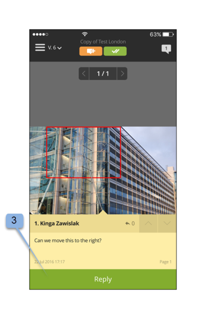
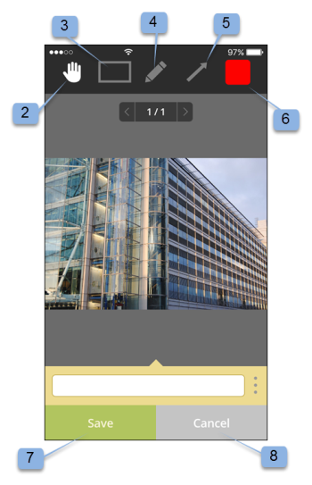
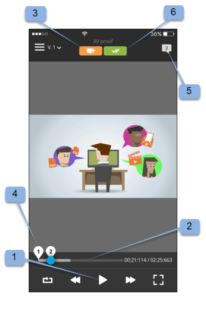

# Workfront Proof mobile app

>[!IMPORTANT]
>
>This article refers to functionality in the standalone product [!DNL Workfront Proof]. For information on proofing inside [!DNL Adobe Workfront], see [Proofing](../../../review-and-approve-work/proofing/proofing.md).

Download the [!DNL Workfront Proof] app from the Apple App Store or Google Store to be productive wherever you are. The [!DNL Workfront Proof] app has the following features on the iPhone and iPod Touch:

* View, review, and approve both static and audio-visual proofs
* View, add, and reply to comments
* Manage your proofs via your dashboard and views

You do not need to be a user of [!DNL Workfront Proof] (i.e., have your own login credentials) to review and approve a proof via the iOS app. As long as you download the app to your iOS device and access your personal URL via your iOS email app, then you can review and approve on the go.

## Device requirements

Requires iOS 7.0 or later. Android 4.0 and up. Compatible with iPhone, iPad, and iPod touch.

## Download and install the app

>[!IMPORTANT]
>
>The Workfront Proof mobile app is no longer supported and is available as-is.  Any issues in the app will not be fixed.

Download our [!DNL Workfront Proof] Mobile App directly from the [Apple App Store](https://itunes.apple.com/us/app/workfront-proof/id1030372728?mt=8) or the [Google Play Store](https://play.google.com/store/apps/details?id=com.proofhq.tabletapp).

For iOS devices, make sure to uninstall the previous [!DNL Workfront Proof] app for iOS devices before installing the new app.

The [!DNL Workfront Proof] app automatically detects what type of device you are using. If you would like to use the app on your tablet, see [[!DNL Workfront Proof] mobile app for tablets](../../../workfront-proof/wp-mobile/wp-mobile-apps/wp-mobile-app-tablet.md).

>[!NOTE]
>
>It is not possible to review SWF files or Audio files, such as MP3 on iOS devices, due to the software limitations of mobile devices. If you would like to review a proof created from a SWF file or an Audio file on a mobile device, please convert it to a supported format before uploading to [!DNL Workfront Proof].

## Getting started with the app

You do not have to be a [!DNL Workfront Proof] user to start using the app. Simply install the app on your device and click a **[!UICONTROL Go To Proof]** link in your email notification. The app automatically starts and loads the proof.

If you are a [!DNL Workfront Proof] user you can log in to the app before opening any proofs. The app allows you to browse all the proofs shared with you and to easily switch between them.

1. Open the app.
1. Enter your email and password and tap **[!UICONTROL Login]**.

   Or

   Use Single Sign-On, if it's configured on your [!DNL Workfront Proof] account.

   You can use the **[!UICONTROL Forgot password]** option if you don't remember your password.

## The Dashboard

After you log into your [!DNL Workfront Proof] account, the Dashboard appears. Here you can easily access your proofs. You can open one of the available views, My proofs, and All proofs. Alternatively you can tap the name of one of your recent proofs to go directly to the proofing viewer.

By default, the Dashboard will open the Total proofs view. This view shows all the proofs that you are the owner of or that were shared with you. You can change the view by tapping the bar at the top of the page to open a drop-down menu containing the [!UICONTROL On time], [!UICONTROL At risk], [!UICONTROL Late] and [!UICONTROL Recent] options. To open a proof from any view, scroll down the list to find the proof you want, then tap its name to go to the proofing viewer.

| **On Time View** | Shows you all active proofs in your account that you have permission to see and that have no deadline or there is more than 24 hours until the deadline. |
|---|---|
| **At Risk View** | Displays all proofs for which the deadline is less than 24 hours. |
| **Late View** | Lists all proofs in which not all actions are completed for which the deadline is already breached. |
| **Recent view** | Includes the proofs that have been recently accessed by you and that you own, have permissions to see as per your profile permissions and that were shared with you. This view shows only the proofs that you yourself have opened (either via the [!DNL Workfront Proof] Viewer or via the Proof details page). |
| **Email link** | To open a proof from your email, simply open the email in your email app, click on the [!UICONTROL Go to proof] button link in the email (1) and you will be taken to the proof in the [!DNL Workfront Proof] app. |

{style="table-layout:auto"}

## Review a static proof in the app

When you open a proof in the mobile app, you can do the following:

* Read and reply to comments left by other reviewers (1 - the digit visible in the icon indicates numbers of comments left on the proof, if no comments were left on the proof, this button will show 0 and will be grayed out).
* Add comments and markups (2).
* The visibility of the Comment and Decision button depends on your proof role.
* Make a decision (3).
* Go to the menu (4).
* Scale the proof by pinching the screen.
   

## Add comments and replies

1. When you have opened a proof, tap the **[!UICONTROL Add comment]** button (1).

   

1. Type your comment (2).

   

1. Click **[!UICONTROL Save]**.

## Read and reply to comments

1. Open the proof, then tap the callout icon in the right upper corner to view the comments list (1) and choose the comment that you want to review.
1. Tap the pin to open the comment associated with it (2).

   

1. Do any of the following:

   * To reply to a comment, tap the **[!UICONTROL Reply]** button (3).
   * To go back to the proof image, tap the [!UICONTROL callout] icon.
   * To view the full comment and its replies, tap on the comment itself.

      

   * To apply an action on a comment:

      1. Open a comment.
      1. Tap **[!UICONTROL Reply]**.
      1. Open the [!UICONTROL actions] menu on the right side of the text field (1).
      1. Tap **[!UICONTROL Add action]** (2).

         

         For more information about actions, see [Use actions on proof comments](../../../review-and-approve-work/proofing/reviewing-proofs-within-workfront/comment-on-a-proof/use-actions-on-comments-in-viewer.md).

## Add markups

You can add a markup (such as a box highlighting an area on the proof) and type a comment that is attached to the markup. You can also make a comment without adding a mark-up. And you can add multiple mark-ups to a single comment.

1. On a proof you have opened, tap **Add comment** (1).

   

1. Choose between the [!UICONTROL pan mode] (2), [!UICONTROL rectangle tool] (3), [!UICONTROL freehand drawing] (4), or the [!UICONTROL arrow] tool (5).

   You can also change the line color of the markup (6).

1. To draw a markup on the proof, touch the screen and then move your finger across the proof.

   You don't have to add text to save your markup (7).

1. Tap **[!UICONTROL Cancel]** (8) if you want to discard your markup .

   

   Marking up an area on the proof automatically opens the comment field. You can remove created markup by tapping the cross next to the markup shape (9).

   

## Make decisions on a proof

1. Open the proof in the Proof Viewer and tap the [!UICONTROL Decision] button (1).

   

1. Tap the decision you would like to submit (2).
1. Tap **[!UICONTROL Save]** to submit your decision.

   

   >[!NOTE]
   >
   >* If an on decision pop-up message is set on the account in which the proof was created, it will also appear in the iOS app when a decision is made on a proof.
   >* If you set up decision reasons, they will display on the [!UICONTROL Submit your decision] screen for you to choose.

   If you have already submitted a decision and you want to change it or remove it, you can easily do so. After sumitting a decision, a new option, **[!UICONTROL Remove my decision]** (6), appears on the [!UICONTROL Submit your decision] screen.

   

## Review an audio or video proof in the app

Reviewing an audio-video proof in the iOS app is just as simple as reviewing a static file:

1. Tap on the [!UICONTROL play/pause] button to play or pause the video (1).
1. To navigate the video, tap the [!UICONTROL navigation] bar (2).
1. To leave a comment, tap the **[!UICONTROL Comment]** button (3), then follow the instructions described above.

   Any comments or markups left on the proof will be marked by pins along the navigation bar (4).

1. If you would like to review the comments left on the proof, tap the **[!UICONTROL Comments]** button (5), then follow the instructions described above.
1. To make a decision, tap the **[!UICONTROL Decision]** button (6), then follow the instructions above.

   
