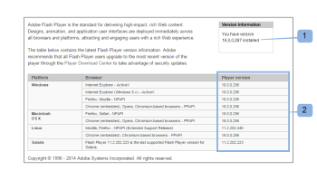
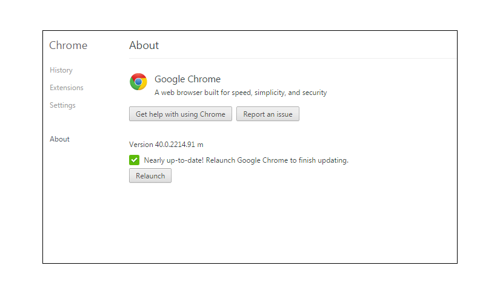
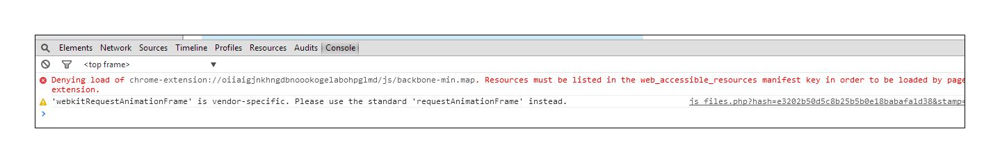

# Troubleshooting - [!DNL Workfront Proof] proofing viewer

<!-- Audited: 01/2024 -->

>[!IMPORTANT]
>
>This article refers to functionality in the standalone product [!DNL Workfront Proof]. For information on proofing inside [!DNL Adobe Workfront], see [Proofing](../../../review-and-approve-work/proofing/proofing.md).

If your proof content is not loading and you can only see an empty proofing viewer, it's most likely because something is blocking this action locally. Try the possible solutions below.

## Ensure your browser <!--and [!DNL Flash Player]--> version is up-to-date

All developers constantly work on their applications and they regularly release new features and fixes for their products. This is to improve user experience and maintain security level so it's the best practice to use only the newest versions. This also helps avoiding conflicts between the applications.

<!--
### [!DNL Flash Player] Plugin Version

To check your current [!DNL Flash Player] version visit the [[!DNL Adobe] website](http://www.adobe.com/software/flash/about/).

If your version number differs from the one listed for your platform go to the [[!DNL Flash Player] download page](http://get.adobe.com/flashplayer/otherversions/) and get the latest version.

Please note: we do recommend using the original [!DNL Adobe] plugin, so if your browser uses a built-in solution deactivate it and install the [!DNL Adobe] solution.
-->

### Browser version

Usually most browsers update automatically, but if you're experiencing any troubles it's worth checking what version you're using and perform an update, if needed.

In your browser, go to [!UICONTROL Menu] and locate the [!UICONTROL About] option (in some cases this may be visible under a [!UICONTROL Help] menu). In the [!UICONTROL About] pop-up, you'll find information about the current browser version and also an option to update/check for updates.

For example, in Chrome:

Once your have the latest browser version installed, try to re-open your proof and see if the issue is resolved.

<!--
## Ensure Your Local [!DNL Flash] Storage is Available

Our [!DNL Workfront Proof] Viewer is based on Flash, and we store some data about the proofs (i.e., comments, proof tiles, [!DNL Workfront Proof] Viewer settings) on your computer using [!DNL Flash Player]. If the [!DNL Workfront Proof] Viewer opens, but there is no content inside you will want to make sure that the Flash Storage is available on your machine and that [!DNL Workfront Proof] is allowed to use it.

If there is some storage allocated, but you're working with the bigger proofs with multiple pages and comments try to increase the [!DNL Flash] Storage and re-load your proof.

Please see [Problems With Viewing Proofs - [!DNL Flash] Shared Objects Explained](../../../workfront-proof/wp-tech-corner/troubleshooting/view-proof-flash-shared-object.md) for the detailed instructions.
-->

## Identify Where the Problem Is

* Are the proofs opening in a different browser? 
* If you're using one browser on a daily basis and you're having trouble with viewing the proofs there, try to open the same proof in a different browser on your computer. To do this, simply copy the proof link from the URL bar of your main browser and paste it into a different browser. If the proof opens there, review your main browser configuration, plugins, and extensions as these may be interfering.
* We do not have any preferred browser, but if you're having any performance issues in your current browser, we would advise switching to a different one.
* Are the proofs opening on a different machine in your location?
   If your proof is not opening in any browser on your machine, try to open it on a different computer in your location and/or outside your location. This will allow you to determine if an issue on your particular machine or if the issue is in your local network.
   If your security level is higher, your connections to [!DNL Workfront Proof] may be blocked by:

   * Your local AV software
   * Your network security solution
   * DNS, firewall, or proxy configuration
   * These are the settings that are beyond our control. There are various security solutions available and we are not able to tell which are implemented in your network and which may be blocking connections to [!DNL Workfront Proof]. It is also not up to [!DNL Workfront Proof] to decide on your internal security configuration. If you're having problems with opening the proofs on the multiple machines in your location/network, we would recommend you get in touch with your IT team so they could check the network settings and authorize or add the [!DNL Workfront Proof] to the allowlist, if needed.

* Are the connections to [!DNL Workfront Proof] allowed in your network?
   Inside the Proof Viewer we load the tiles - fragments of the pages. If this content does not load properly at your end, it may be that some connections to [!DNL Workfront Proof] are blocked in your network. You will want to make sure that all connections and all content from *.proofhq.com is added to the allowlist. Your IT team should be able to help with verifying this.

## Review plugins

If your browser is up-to-date and your network is not blocking the connections to [!DNL Workfront Proof], there may be something in your browser that is affecting viewing the proofs. There are often multiple plugins and extensions available in your browser, and some of them could interfere or be in conflict with the others.

The best practice is to remove all the unknown add-ons and keep only the ones that you use and that you trust. Each browser should give you options to check/modify/delete the plugins and extensions. We use JavaScript to load the [!DNL Workfront Proof] viewer so you will want to especially review the plugins that could affect that.

If there is any particular add-on interfering with loading the proofs, you can try checking the details in the browser's console.

In most of the newer browsers there are some additional Developers tools available, and they can be used for more advanced troubleshooting.

If you're having troubles with viewing the proofs:

* Open your browser's console and re-load the proof.
* Check if there are any alerts or messages in the console. These details can help identifying what's the root cause of the issues.
* Have your IT team to analyze the results. They should be able to advise and help resolving the local problem.
* Share the results with our Support team. We will be happy to assist.

## Check mixed content settings

All of the connections to [!DNL Workfront Proof] are over HTTPS. However, in the [!DNL Workfront Proof] Viewer we load the tiles over HTTP and the data is secured with the tokens. This creates Mixed Content that some of the browsers or security solutions may be blocking (by default or by manual configuration).

If this is the reason why the proofs are not opening on your computer (you should be able to see the relevant alerts in the browser's console), authorize such connections for [!DNL Workfront Proof] or amend your settings to allow passive mixed content on your machine. The mixed content may be blocked by your browser, AV software, or network configuration to determine the exact cause. You should get in touch with your IT team/network administrators. They should also be able to help with enabling the mixed content on your machine.

