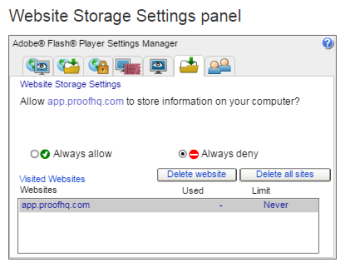
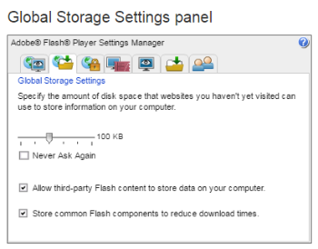

# Problems With Viewing Proofs - [!DNL Flash] Shared Objects Explained

>[!IMPORTANT]
>
>This article refers to functionality in the standalone product [!DNL Workfront Proof]. For information on proofing inside [!DNL Adobe Workfront], see [Proofing](../../../review-and-approve-work/proofing/proofing.md).

>[!NOTE]
>
>The information in this article refers to functionality that is currently deprecated and will be removed from [!DNL Workfront] in 2018. We recommend that you use the new Web Proofing Viewer (as described in [Reviewing Proofs in the Web Proofing Viewer](https://support.workfront.com/hc/en-us/sections/115000275214-Reviewing-Proofs-in-the-Web-Proofing-Viewer)) or the Desktop Proofing Viewer (as described in [Reviewing Proofs in the Desktop Proofing Viewer](https://support.workfront.com/hc/en-us/sections/360000686434-Reviewing-Proofs-in-the-Desktop-Proofing-Viewer)).

## [!DNL Flash] Shared Objects

A local sared object, sometimes called a "[!DNL Flash] cookie," is a data file that can be created on your computer by the sites you visit. Shared objects are most often used to enhance your web-browsing experience. A [!DNL Flash] cookie is a message used in [!DNL Adobe Flash] that is sent from a Web server to a Web browser and is then stored as a data file in the browser.

Since the [!DNL Workfront Proof] Viewer is based on [!DNL Flash], it would be worth to check what storage is allowed for [!DNL Flash] applications on your computer.

## [!DNL Flash] Shared Objects - known issues

If the [!DNL Flash] storage is set to 0 KB or has another setting that blocks [!DNL Flash] applications from saving the data locally, it may cause some known issues in the [!DNL Workfront Proof] Viewer:

* The 'Getting started' tour pop-up keeps appearing although the option to not show it again was chosen
* [!DNL Workfront Proof] Viewer performance slows down due to to the increasing number of comments added to the proofs
* Proofs are not loading and you get the 'grey screen' instead of an actual image

## Allowing [!DNL Flash] Shared Objects

Make sure that storing [!DNL Flash] Shared Objects is allowed on the computer and that the storage limit is not 0.

To check if the Shared Objects are allowed:

1. Right click in the [!DNL Workfront Proof] Viewer.
1. Select **[!UICONTROL Global Settings]** from the context menu.
1. Go to the **[!UICONTROL Storage]** tab.
1. Make sure that **[!UICONTROL Allow sites to save information on this computer]** is selected (1).
1. 

## Increasing [!DNL Flash] storage

By default [!DNL Flash] applications may store up to 100 KB of data on the user's drive, but this can be easily modified by the users. The solution for the many [!DNL Flash] related issues is to increase internal [!DNL Flash] storage. This can be done directly from the [!DNL Workfront Proof] Viewer:

1. Open a proof.
1. Open the right-click menu on the proof.
1. Click **[!UICONTROL Settings]** to open the [!DNL Flash] settings pop-up.
1. Go to the **[!UICONTROL Local]** storage tab.
1. Increase the storage up to e.g. 100 KB (1).
1. Close the settings pop-up and re-open the proof . 

