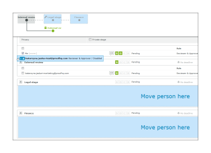

# Manage a proof configured with an Automated Workflow in Workfront Proof

>[!IMPORTANT]
>
>This article refers to functionality in the standalone product Workfront Proof. For information on proofing inside Adobe Workfront, see [Proofing](../../../review-and-approve-work/proofing/proofing.md).

You can conveniently track the progress of your Automated Workflow proofs in the Workflow section of the Proof details page. You can view the work done on each stage and modify, add, start and lock the stages on your proof.

## View an Automated Workflow

You can view your Automated Workflow in three main ways:

* [View a stage in detail](#view-a-stage-in-detail) 
* [View all stages](#view-all-stages) 
* [View all stages in detail](#view-all-stages-in-detail)

### View a stage in detail {#view-a-stage-in-detail}

1. Click on the button at the top of the section (1).

   You can switch between stages using the diagram. The stage you are viewing is highlighted in grey (2).

1. To view a different stage, select it on the diagram.

### View all stages {#view-all-stages}

To view all stages in an Automated Workflow:

1. Click the button at the top of the page (3).

   All of the stages of the Automated Workflow are listed in the section, however the details are hidden.

1. To view the details of a stage, click the plus icon next to the name of each stage (4).

### View all stages in detail {#view-all-stages-in-detail}

To view all stages of your Automated Workflow in detail:

1. Click the button at the top of the page (5).

   This will show you all stages of your Automated Workflow with the details of each stage expanded.

   You can hide the details of each stage by clicking on the minus icon (6).

## Use the Automated Workflow diagram

The diagram of your Automated Workflow is displayed at the top of the Workflow section.

To hide the diagram

1. Click the **Hide** button (1).

The stages on the diagram are marked as follows:

- an active stage

- an inactive stage  
&nbsp; - a private stage

&nbsp; - a locked stage

The lines between the stages depict the dependencies between the stages. The lines leading to inactive stages are dotted until the stage is activated.

Hovering over a stage in the diagram will show you the progress of the stage. If the stage is not active and you have edit rights on the stage, you will be able to start the stage from the pop up using the Start stage button. Similarly, the option to Lock an active stage will be displayed.

To find out more about the Progress bar, see&nbsp; [View the Progress and Status of a Proof in Workfront Proof](../../../workfront-proof/wp-work-proofsfiles/manage-your-work/view-progress-and-status-of-proof.md).

## Add a new stage

You can add a new stage to your Automated Workflow from the Proof details page.

1. Click the **New stage** button (1).

In the **New stage** box that appears, you can populate the stage details and settings.

## Manage stage settings

On the page details you can modify the settings for each stage (if you have edit rights):

* Change, add or remove the deadline for the stage (1)
* Lock the stage (2) - this option will come up if the stage is active; for inactive stages you will see the option to Start the stage
* Modify the settings by in-line editing (3)
* Enable or disable Only one decision required on the stage (4)
* Change the privacy of the stage (5)

You can also move the reviewers between stages by simply dragging an dropping them from one stage to another. The available stages will be highlighted in blue with the drop areas for each stage clearly marked.

## Stage options

The Actions menu (1) for each stage has the following options:

* Message all (2) - you can send a reminder email to all reviewers on the stage
* Share (3) - you can add new reviewers to the stage
* Delete stage (4) - if the proof owner is on that stage, you will be asked to pick a new stage for them  
