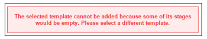

# Set up a proof with an Automated Workflow in Workfront Proof

>[!IMPORTANT]
>
>This article refers to functionality in the standalone product Workfront Proof. For information on proofing inside Adobe Workfront, see [Proofing](../../../review-and-approve-work/proofing/proofing.md).

<!--

This repeats information found in Configuring proofs in Workfront. Consolidate here or there. Maybe better here.

-->

Automated Workflow&nbsp;makes it easier for you to manage content review and approval when you have complex review processes, or if you send content for review to the same groups of people regularly.&nbsp;

You create the proof, then it&nbsp;moves from stage to stage&nbsp;until final approval. The relevant users are notified any time they are required to make an approval.

You can add an automated workflow to a proof when uploading the document, or after the document is uploaded.

## Create a proof with Automated Workflow

1. Begin creating the proof.
1. In the **Share** section, click **Use Automated Workflow**.

   You can deselect this option to switch back to a standard workflow.

1. (Optional)&nbsp;If you want to use an Automated Workflow template that your Workfront administrator configured and shared with you, select it in the **Select a Workflow template** drop-down menu.

   >[!NOTE]
   >
   >Your ability to modify the template depends on the template settings configured by the Workfront administrator. If the ability to modify the template is disabled, only the owner of the template can modify&nbsp;it.

   If you are a Workfront administrator and you want to create a new Automated Workflow template, you can do so as described in 

1. Specify the following information to configure&nbsp;the first stage of the Automated Workflow:

   * **Name:** The stage name appears on the Workflow diagram and is included in the email notifications sent to reviewers.
   * **Deadline:**The functionality of this field differs depending on what option you select in the **Deadline calculated from** drop-down list.
   
   * **From proof creation:**Select the deadline date for the proof.
   * **From stage activation:**Select the number of business days that will be added to the stage activation date to automatically set a deadline on the proof.
   * **Activate stage:**For each stage of your Workflow, you can decide when it should be activated. For your first stage, the following options are available.

      * On proof creation
      * On a specific time and date
      * Manually  
        Additional options are available for subsequent stages. These options require a parent stage. They are:
      * After previous deadline is reached
      * All decisions are Approved or Approved with changes
      * All decisions are Approved
      * All decisions are made

   * **Deadline calculated from:**The option you select in this drop-down list affects what options are available in the&nbsp;**Deadline**field.
   
   * **Proof creation:**In the&nbsp;**Deadline**field, select the deadline date for the proof.
   
   * **Stage activation:**In the&nbsp;**Deadline**field, select the number of business days that will be added to the stage activation date to automatically set a deadline on the proof.
   
   * **Lock stage:**Select when the stage can be locked. 
   * **Primary decision maker:**Select the Primary decision maker on the stage. Decision makers are available&nbsp;in the drop-down list only after you add&nbsp;reviewers to the stage.
   * **Only one decision required:**Select this option for the review to be&nbsp;completed after one of the decision makers makes their decision.  
     This option is not available if you designated a user in the&nbsp;**Primary decision maker**drop-down menu.
   
   * **Private stage:**When this option is selected,&nbsp;comments and decisions are not visible to people who are not added to this stage or are not Supervisors, Administrators, or Billing Administrators in the account

1. (Optional) Add reviewers to the stage.
1. Consider the following when&nbsp;adding reviewers:

   * A&nbsp;reviewer can be added to a proof only once. (You cannot add the same person to more than one stage on the proof.)
   * Reviewers who are added to a private stage can see only the stage they are added to on the proof and&nbsp;comments made in that stage.
   * By default, adding a user&nbsp;to a stage grants&nbsp;that user access to view the proof from the moment the proof is created.  
     The system administrator can configure the proofing system to restrict users from accessing the proof until the workflow enters the stage where the user was added. For more information, see&nbsp;

1. (Optional) Click **New stage**, then repeat Step 4 and Step 5 to add multiple stages to the automated workflow.
1. Continue creating the proof by specifying the necessary information in the Organize and More settings sections on the New Proof page, as described in

## Automated Workflow diagrams

While setting up the workflow for your proof, you will notice a diagram being created. Every stage you add to your proof will appear in the diagram, clearly indicating the dependencies between the stages. Private stages are marked with a key icon.

The diagram floats, which means that it will remain visible even if you scroll down the page.

If you don't need to see the diagram, you can hide it (1).

## Add a stage

You can add an additional stage to a workflow you are creating or modifying.

1. If you are adding a stage to an existing proof, go to the Proof details page, as described on [Manage Proof Details in Workfront Proof](../../../workfront-proof/wp-work-proofsfiles/manage-your-work/manage-proof-details.md).
1. In the **Workflow** section, click&nbsp;**New stage**.  

1. Specify information for the stage as in step 4 under the Creating a Proof with an Automated Workflow section in this article. 
1. Click **Add stage**, then click&nbsp;**Done**.

## Delete a stage

1. Click the trash icon available in the top right corner of the stage (1).   
   The icon appears when you hover over the stage.  
   

## Stage settings

* **Stage name**: Appears on the Workflow diagram and is included in the email notifications sent to reviewers.
* **Activate stage**: For each stage of your Workflow, you can decide when it should be activated. For your first stage, the following options will be available:

   * On proof creation&nbsp;
   * On a specific time and date&nbsp;
   * Manually&nbsp;  
   * Only these three options are available for your first stage. The other options will become available when you add a second stage; they require you to select a parent stage.&nbsp;
   * After previous deadline is reached (requires picking a parent stage)
   * All decisions are Approved or Approved with changes (requires picking a parent stage)
   * All decisions are Approved (requires picking a parent stage)
   * All decisions are made (requires picking a parent stage)

* **Deadline:** You can decide how the deadline should be calculated on each stage of a workflow. The options are:

   * From proof creation: In the deadline field (9) you can select the deadline date for the proof.
   * From stage activation: In the deadline dropdown you select the number of business days that will be added to the stage activation date to automatically set a deadline on the proof.

* **Lock:** There are a number of options that determine when a stage can be locked. The options include:

   * Manual lock
   * Never&nbsp;
   * When the next stage starts&nbsp;
   * When all decisions are made

**Primary decision maker**: You set the Primary decision maker on the stage. The available decision makers appear in the list only after you've added the reviewers to the stage.

>[!NOTE]
>
>If you pick a Primary decision maker, only one decision required option will no longer be available on this stage.

* **Only one decision required**: You can enable this option on a stage. This means that the review will be completed once one of the decision makers makes their decision.
* **Privacy:** Each stage can be made private. If a stage is private, the comments and decisions won't be visible to people who are not added to this stage or are not Supervisors, Administrators or Billing Administrators in the account. For more information, see [Automated Workflow overview](../../../review-and-approve-work/proofing/proofing-overview/automated-workflow.md) .

## Add reviewers to a stage

1. Enter a contact name or email address in the field at the bottom of each stage.
1. Click on the green plus icon to add them.
1. Set the role on the proof.
1. Set the email alert.
1. When setting up the first stage, you also have the option to change the Owner of the proof.

   >[!NOTE]
   >
   >
   >   
   >   
   >   * A reviewer can be added to a proof only once. You cannot add the same person to more than one stage on the proof.
   >   * Reviewers who are not added to a private stage cannot see the stage on the proof or comments made in that stage.
   >   
   >

## Convert a proofto an Automated Workflow

You can convert a basic proof to Automated Workflow.

1. Click **Convert to Automated Workflow** on the Proof details page.  
   After&nbsp;the proof is reworked to Automated Workflow, all stages are active, public and their Lock stage option is set to Manual by default. All stages remain with users and their settings.

   * Activate stage is set to On proof creation in every stage.
   * Deadline calculated from option is set to Proof creation in every stage.
   * If only one decision option was selected on the basic proof, all stages have it selected.
   * If on basic proof Primary decision maker was selected then stages with that recipient are set to them and all other have it set to None.
   * Stage name remains the same.

## Add an additional template to an existing Automated Workflow

After a basic proof is converted to Automated Workflow, you can add additional template to it.

1. On the Proof details page, in the Workflow section, click **Add template.**
1.

   * Template settings determine&nbsp;what can be done with a proof to which this template was added. For example, if the template has the Add a stage and Add people to stages options disabled, buttons to add stage and share proof will not be visible. 
   * If Add a stage option is disabled&nbsp;in the given&nbsp;template, after adding it the Add template button are not visible. 
   * When a person is added to a stage in an Automated Workflow template, but also already present on the proof then if this template is applied, the system will remove this person from the stage automatically. If there is no one else added to this particular stage, the following error will be shown, as the system will not allow to add an empty stage to the workflow.

     <![CDATA[                    ]]>

