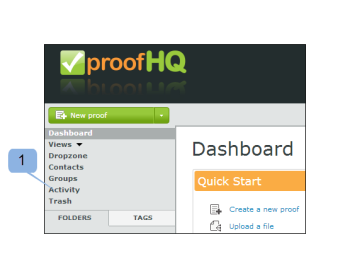

# Understanding the Workfront Proof Activity Audit Trail

>[!IMPORTANT]
>
>This article refers to functionality in the standalone product Workfront Proof. For information on proofing inside Adobe Workfront, see [Proofing](../../../review-and-approve-work/proofing/proofing.md).

The Activity Audit Trail page provides you with a complete list of all activity that has taken&nbsp;place in your account.

To access the Activity page:

1. In the left sidebar, click **Activity**.  
     
   The Activity Audit Trail page displays.  
   

1. In the View drop-down menu, select the view you want to display.  
   You can choose from the following views:

   * **Proofs and media logs**: Displays&nbsp;all the activity on proofs and files in your account.
   * **Folders logs:** Displays all the activity on folders in your account.
   * **Profile log:** Displays all the changes that have been made in your personal profile.
   * **Account log:** Displays all the changes in account settings. This view is available only to users with Administrator rights.
   * **Authentication log:** Displays all the login activity on the account, showing both successful and unsuccessful attempts.
   * **Billing log:** Displays the billing history on your account. This view is available only to users with Billing Administrator rights.
   * **Email log:** Displays all the emails sent from your account.&nbsp;

