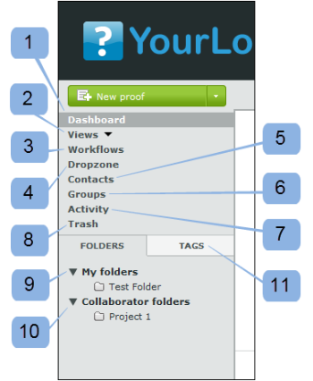
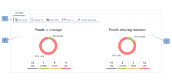

# The Dashboard in [!DNL Workfront Proof]

>[!IMPORTANT]
>
>This article refers to functionality in the standalone product [!DNL Workfront Proof]. For information on proofing inside [!DNL Adobe Workfront], see [Proofing](../../../review-and-approve-work/proofing/proofing.md).

The Dashboard is the first page you see when you log in to your [!DNL Workfront Proof] account. It summarizes the activity in your [!DNL Workfront Proof] account and provides quick links to other sections and functions within [!DNL Workfront Proof].

The dashboard contains the following:

* Organization logo (1)
* Top Navigation (2)
* Search (3)

* Header menu (4)
* New Menu (5)
* Sidebar (6)
* Welcome section (7)
* Overview (8)
* Recently accessed items (9)
* Recent activity (10)

>[!NOTE]
>
>The menus and links you are able to see and use on your Dashboard will depend on your user profile and permissions.

You can brand your account to show your own organization's logo, colors, custom links, and more. For more information, see [Brand the [!DNL Workfront Proof] site](../../../workfront-proof/wp-acct-admin/branding/brand-wp-site.md)."

If you don't brand your account, the [!DNL Workfront Proof] logo and standard colors appear.

## Header menu

### The user name

The user name (2) you've chosen will appear here. It can be changed in Personal settings.

### Settings

Here (3) you can access your:

* Personal settings
* Account settings
* Billing

>[!NOTE]
>
>The visibility of the above menus depends on your profile. Please see User profiles and permissions for more information.

### Help

Here (4) you can access:

* Help Articles
* Demo movies

>[!NOTE]
>
>With our Select and Premium plans you can configure the Help options to point your users to your own content. Please see our Advanced branding options for more details.

### Logout

Click here to log out of your account.

## The new menu

To open the New menu,

1. Click the dropdown arrow (7).

   The **[!UICONTROL New]** menu has the following options:

   * New Proof (8)
   * Upload file (9)
   * New folder (10)
   * New guest (11)
   * New user (12)
   * New group (13)

## The Dashboard menu

The Dashboard menu contains the following menus:

* Edit tags
* Move to
* More actions
* Delete

## Edit tags

The [!UICONTROL Edit tags] menu (1) lets you:

* Apply a tag to an item or items
* Create new tags
* Manage tags (2)

## Move to

This function lets you move proofs and files to one of your folders. To do this:

1. Select the tick box for the relevant item(s).
1. Click **[!UICONTROL Move to]** (3) and choose the relevant folder (4).
1. Click **[!UICONTROL Save]** (5).

   

### More actions

In the [!UICONTROL More actions] menu (6) you can perform the following actions:

* Lock (proofs only)
* Activate
* Archive (proofs only)
* Unarchive (proofs only)
* Change owner

### Delete

To delete items:

1. Select the tick box to the left of the item(s) and click **[!UICONTROL Delete]** (7).

1. In the confirmation screen that appears, check the details and confirm by clicking **[!UICONTROL Yes]** (8).

### The Sidebar

The sidebar has links to the following pages:

* Dashboard (1)
* Views (2)
* Workflows (3) (Premium plans only)
* Dropzone (4) (Select and Premium plans)
* Contacts (5)
* Groups (6)
* Activity (7)
* Trash (8)
* My folders (9) (you can also access each individual folder from the sidebar)
* Other Organizations' folders (10) (where you can find items that other organizations shared with you)
* Tags (11)

The Sidebar is described in more detail on the Sidebar help page.

### [!UICONTROL Welcome] section

The [!UICONTROL Welcome] section has the following useful links:

* Watch our demo movies (1)
* Help pages (2)
* Support contact details (3)
* "Don't show me the Welcome section again" link (4)

### Overview

In this section you'll find the quick links to:

* Create a new proof Upload a file
* Create a new folder
* Add a new user
* Change your password

The overview section also displays pre-filtered information. These are:

* Proofs to manage - total number of active proofs owned by you and delegated to you
* Proofs awaiting decision - total number of active proofs that require your decisions

   

Here you can see right away how many proofs require immediate action from you or from your reviewers:

* Total
* On time - proofs that have no deadline or there is more than 24 hours until the deadline
* At risk - proofs with the deadline less than 24 hours
* Late - proofs with not all actions completed and passed deadline

>[!NOTE]
>
>The charts values are clickable - you can easily Go to the detailed list of the items.

### Recently accessed items

The [!UICONTROL Recently accessed items] section shows you the items that have been recently accessed by you. This includes the items you own, the items you have permissions to see as per your profile permissions and the items that were shared with you. This section will include only the items that you yourself have opened (either via the [!DNL Workfront Proof] Viewer or via the Proof details page).

The [!UICONTROL Recently accessed items] section shows you the following information about recent proofs and files:

* Name
* Progress
* Status
* Decision
* Owner

Summary (this information will be collapsed by default - click the expand/collapse button to the left of the relevant proof to open the proof summary)

Actions menu

See Page layouts for the different layout options available for this section.

>[!NOTE]
>
>Clicking on the proof name in [!UICONTROL Recently accessed items] section will take you straight to the proof in the Proof Viewer.

To access the Proof details page:

1. Click on the **[!UICONTROL Actions]** menu (1) available to the right of the proof name.
1. Select **[!UICONTROL View proof details]** (2) from the menu.

### Recent activity

This section shows you the following details about recent activity in your account:

* Date and time Proof/File name
* Action
* Details

You can also go to an item's Details page by clicking opening the item's Actions menu and choosing to View details. To see more information about activity in your account, see Activity audit trail.

>[!NOTE]
>
>Clicking on the name of the proof in the [!UICONTROL Recent Activity] section will open the proof in the Proof Viewer.

To go to the Proof details page of that proof:

1. Click on the **[!UICONTROL Actions]** menu (1).
1. Select **[!UICONTROL View proof details]** (2) from the dropdown menu.

   
