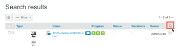

# Searching [!DNL Workfront] Proof

>[!IMPORTANT]
>
>This article refers to functionality in the standalone product [!DNL Workfront Proof]. For information on proofing inside [!DNL Adobe Workfront], see [Proofing](../../../review-and-approve-work/proofing/proofing.md).

You can search for the following types of content across the [!DNL Workfront Proof] site:

* Proofs (including archived proofs)
* Files
* Folders
* Tags
* Proof Subject
* Proof Message
* Custom fields
* Creator name
* Items that have been shared with you

To search the [!DNL Workfront Proof] site:

1. Type the text you want to search for, then press **[!UICONTROL Enter]**.\
   Note the following about search results:

   * The search tool finds items that contains all of the keywords you type. In order to minimize search results and maximize search accuracy, ensure that you spell the keywords correctly and add spaces between them.
   * Search results are sorted by relevance.
   * You can reduce the search results by adding more keywords into the search field (separated by a space), then searching again. The new search is carried out only on the items already displayed in the search results.
   * If you enter the name of a previous proof version into the search field, the most recent version of that proof appears in the search results.
   * Parent folders and subfolders are listed separately.

1. (Optional) In the Search results that appear, sort by column by clicking the header at the top of a column. (Optional) Add filtering to your results results by clicking the [!UICONTROL search] icon at the end of the header row. 

This adds dropdown menus in which you can select filters to narrow your search.
1. 

1. (Optional) Narrow your search by opening the [!UICONTROL Tags] tab and clicking a tag in the navigation sidebar on the left. Items associated with that tag appear in the Search results.\
   \
   The tag name appears in the search field in the upper-right corner of Workfront Proof. You can refine your search by selecting additional tags or by typing further keywords into the search field. You can remove a tag from the search field by clicking the x icon next to the tag name.

For information about searching for text within proof content, see [Search content within a proof](../../../review-and-approve-work/proofing/reviewing-proofs-within-workfront/review-a-proof/search-in-a-proof.md).
